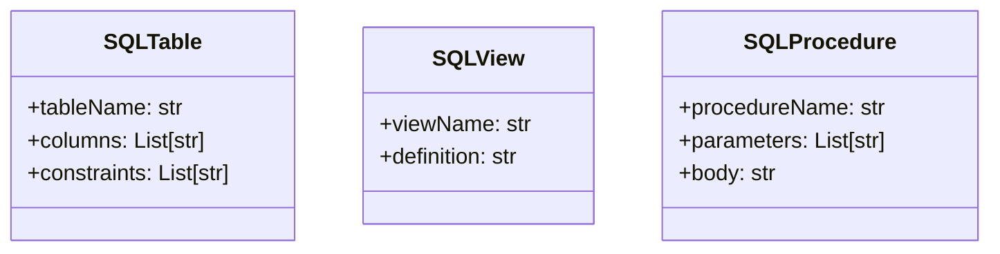
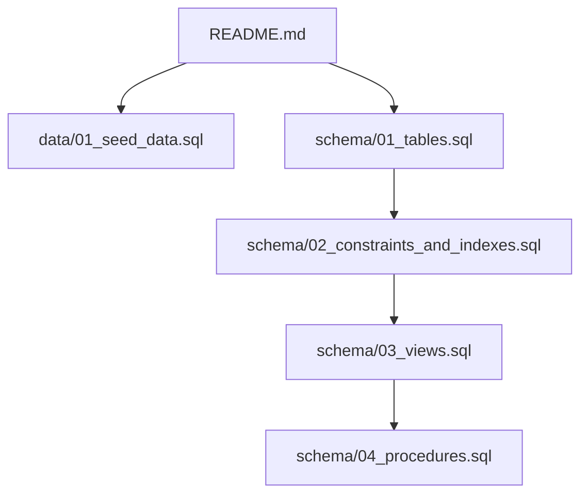
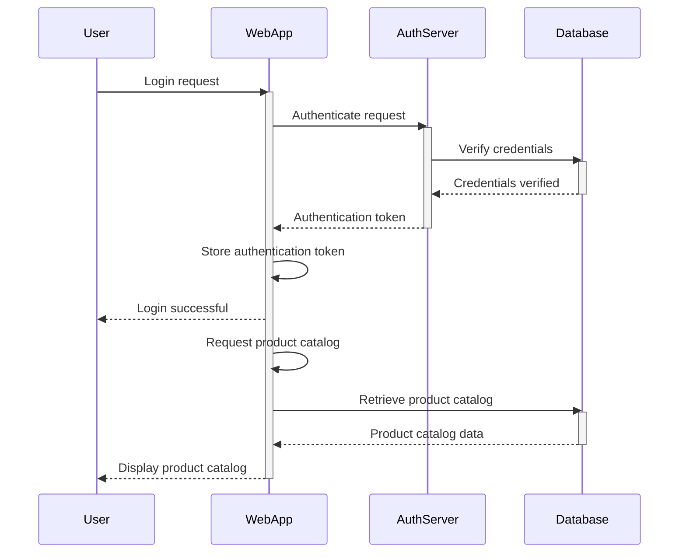
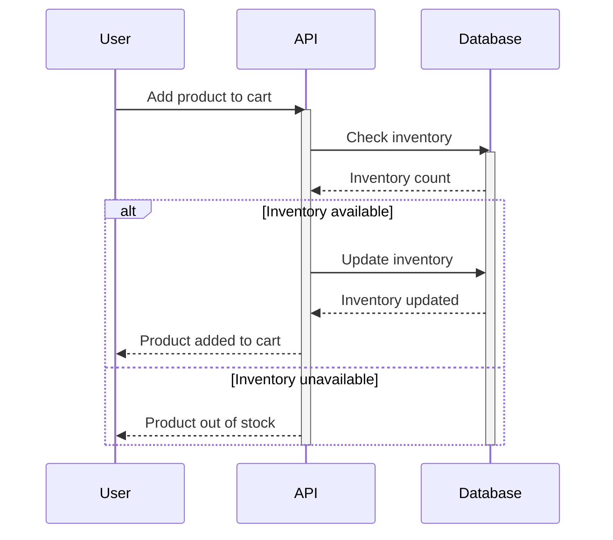
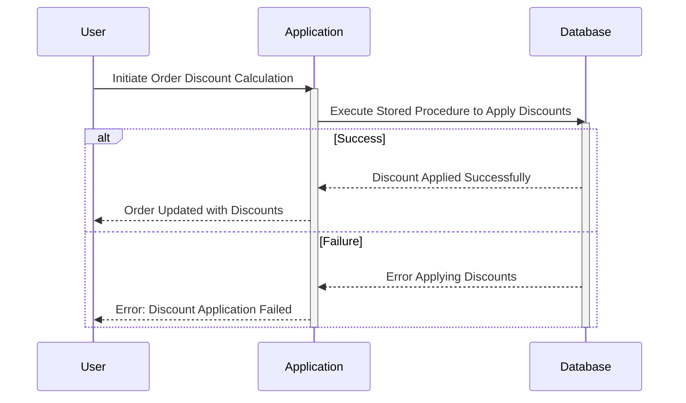
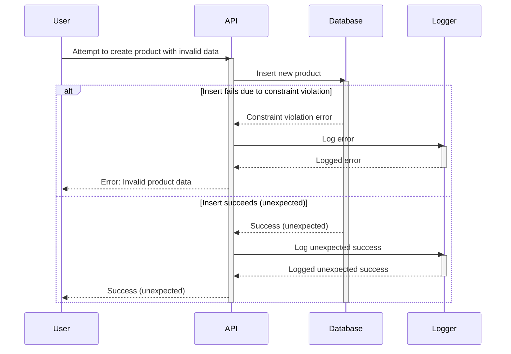
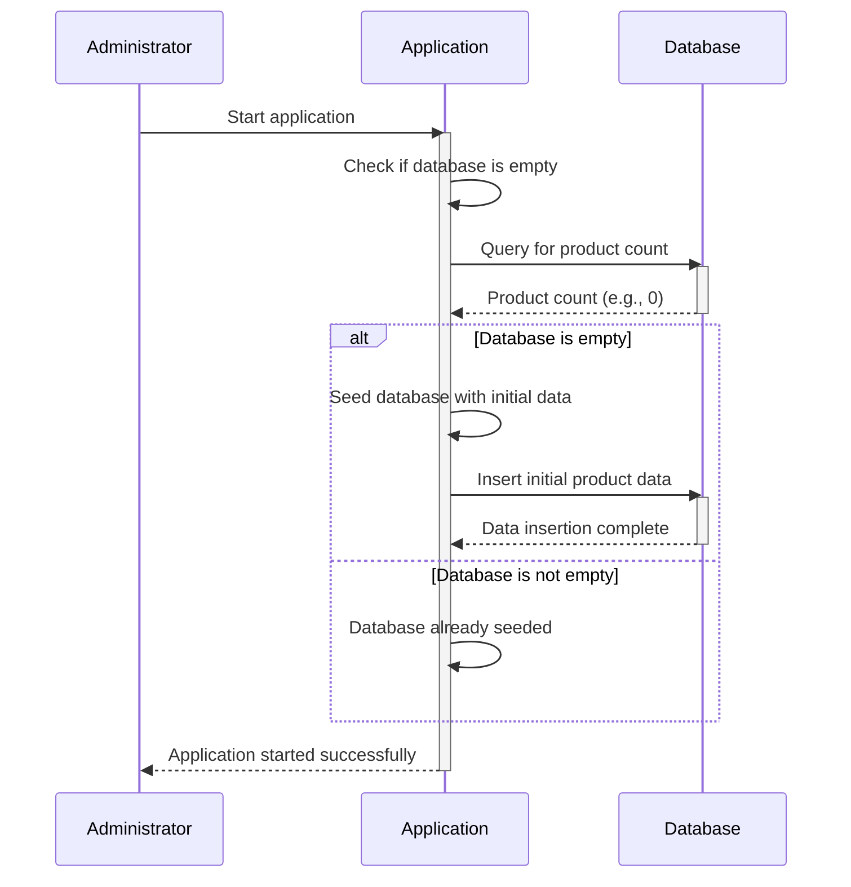

> Previously, we looked at [Views](09_views.md).

# Chapter 10: Architecture Diagrams
## Class Diagram
Key classes and their relationships in **20250707_1716_code-sql-db-sample-project**.

## Package Dependencies
High-level module and package structure of **20250707_1716_code-sql-db-sample-project**.

## Sequence Diagrams
These diagrams illustrate various interaction scenarios, showcasing operations between components for specific use cases.
### User logs in, authenticates against the database, and views the product catalog.

### User adds a product to their shopping cart, triggering database updates for inventory.

### A stored procedure is executed to calculate and apply discounts to an order.

### The system attempts to insert a new product with invalid data, violating database constraints.

### An administrator seeds the database with initial product catalog data upon application startup.

> Next, we will examine [Code Inventory](11_code_inventory.md).

---

*Generated by [SourceLens AI](https://github.com/openXFlow/sourceLensAI) using LLM: `gemini` (cloud) - model: `gemini-2.0-flash` | Language Profile: `Python`*