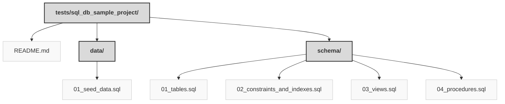

> Previously, we looked at [Architecture Diagrams](10_diagrams.md).

# Chapter 11: Code Inventory
## File Structure

## File Descriptions Summary
*   **`README.md`**: E-commerce Platform Database Schema
*   **`01_seed_data.sql`**: -- 01_seed_data.sql
*   **`01_tables.sql`**: -- 01_tables.sql
*   **`02_constraints_and_indexes.sql`**: -- 02_constraints_and_indexes.sql
*   **`03_views.sql`**: -- 03_views.sql
*   **`04_procedures.sql`**: -- 04_procedures.sql
---
## Detailed File Content
No detailed structural information could be generated for the files based on the selected parser.

> Next, we will examine [Project Review](12_project_review.md).

---

*Generated by [SourceLens AI](https://github.com/openXFlow/sourceLensAI) using LLM: `gemini` (cloud) - model: `gemini-2.0-flash` | Language Profile: `Python`*