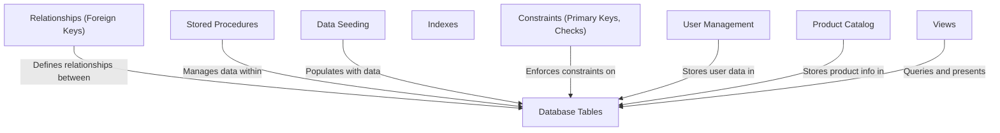

# Tutorial: 20250707_1716_code-sql-db-sample-project

The e-commerce platform centers around **Database Tables** which define the structure for products, users, and orders. **Relationships** between these tables enforce data integrity. **Stored Procedures** encapsulate business logic, like placing orders, ensuring data consistency when interacting with the tables.

**Source Directory:** `C:\_jd_programming\python\11_sourceLens_project\sourceLens\tests\sql_db_sample_project`

## Abstraction Relationships

## Chapters

1. [Constraints (Primary Keys, Checks)](01_constraints-primary-keys-checks.md)
2. [Data Seeding](02_data-seeding.md)
3. [Database Tables](03_database-tables.md)
4. [Indexes](04_indexes.md)
5. [Product Catalog](05_product-catalog.md)
6. [Relationships (Foreign Keys)](06_relationships-foreign-keys.md)
7. [Stored Procedures](07_stored-procedures.md)
8. [User Management](08_user-management.md)
9. [Views](09_views.md)
10. [Architecture Diagrams](10_diagrams.md)
11. [Code Inventory](11_code_inventory.md)
12. [Project Review](12_project_review.md)

---

*Generated by [SourceLens AI](https://github.com/openXFlow/sourceLensAI) using LLM: `gemini` (cloud) - model: `gemini-2.0-flash` | Language Profile: `Python`*