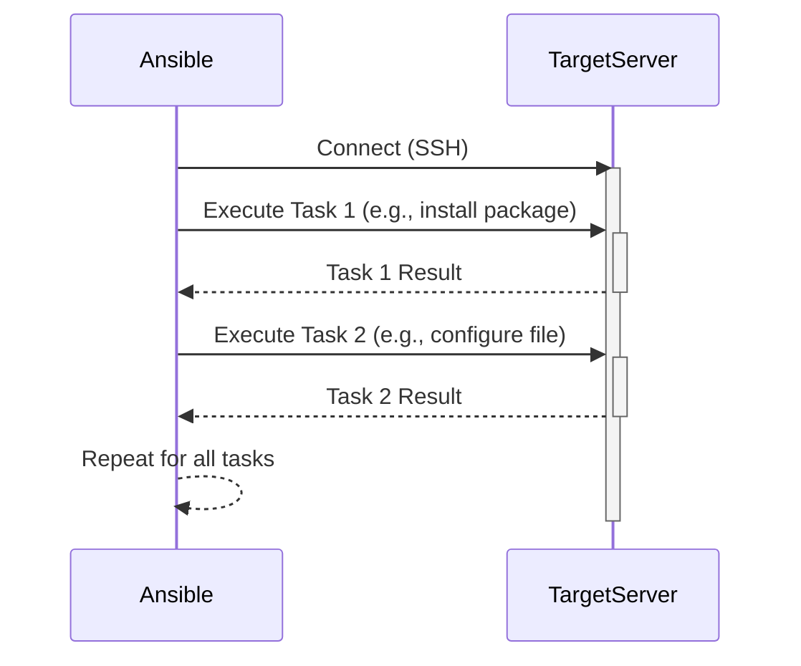

> Previously, we looked at the [Project Overview](index.md).

# Chapter 1: Ansible Playbook
Let's begin exploring this concept. This chapter will introduce you to Ansible Playbooks, a powerful tool for automating infrastructure management and application deployment within the context of our project `20250707_1734_code-devops-iac-sample-project`.
**Why Ansible Playbooks?**
Imagine you have to set up 10 identical servers, each needing the same software installed and configured. Doing this manually would be tedious and error-prone. An Ansible Playbook is like a recipe book for servers. It contains instructions that Ansible follows to automatically configure your servers exactly as you want them. Think of it as a configuration management system on steroids, allowing you to define the *desired state* of your infrastructure, and Ansible will handle the details of getting it there. This ties directly into the concept of [Configuration Management](05_configuration-management.md) discussed earlier.
**Key Concepts:**
*   **Playbook:** The main file (usually in YAML format) containing the instructions for Ansible to execute.
*   **Task:** A single action that Ansible executes, such as installing a package or creating a file.
*   **Module:** A reusable piece of code that Ansible uses to perform a task. Ansible has a vast library of modules for interacting with different operating systems, cloud providers, and applications. Examples include `apt` (for package management on Debian/Ubuntu), `yum` (for package management on RedHat/CentOS), `file` (for file manipulation), and `service` (for managing services).
*   **Role:** A collection of tasks, variables, and handlers that are organized into a reusable structure. Roles help to modularize and simplify playbooks.
*   **Inventory:** A list of the servers that Ansible will manage.
*   **Idempotency:** Ansible modules are designed to be idempotent, meaning that they will only make changes if necessary. If a task has already been completed, Ansible will skip it. This makes Ansible playbooks safe to run multiple times.
*   **Hosts:** Defines which server or group of servers in the inventory to run the tasks against.
*   **Become:** Allows tasks to run with elevated privileges (like `sudo`).
**How it Works:**
An Ansible Playbook defines a series of tasks to be executed on a set of target hosts. Ansible connects to the hosts (typically via SSH), executes the tasks, and then reports the results. The playbook is written in YAML, a human-readable data serialization format.
Here's a simplified view of the playbook execution:

The diagram illustrates how Ansible connects to a target server and executes tasks sequentially, receiving a result for each task.
**Code Example:**
Here's an excerpt from our `ansible/playbook.yml` file demonstrating a basic Ansible playbook for installing Docker:
```python
---
- name: Deploy Multi-Tier Application
  hosts: all
  become: true
  tasks:
    - name: Update apt cache
      apt:
        update_cache: yes
        cache_valid_time: 3600
    - name: Install required system packages
      apt:
        name:
          - apt-transport-https
          - ca-certificates
          - curl
          - gnupg
          - lsb-release
        state: present
    - name: Add Docker GPG key
      apt_key:
        url: https://download.docker.com/linux/ubuntu/gpg
        state: present
    - name: Add Docker repository
      apt_repository:
        repo: deb [arch=amd64] https://download.docker.com/linux/ubuntu {{ ansible_lsb.codename }} stable
        state: present
    - name: Install Docker and Docker Compose
      apt:
        name:
          - docker-ce
          - docker-ce-cli
          - containerd.io
          - docker-compose-plugin
        state: present
    - name: Include the docker_app role to deploy containers
      include_role:
        name: docker_app
```
**Explanation:**
*   `name: Deploy Multi-Tier Application`: A description of the playbook.
*   `hosts: all`: This playbook will run on all hosts defined in the inventory.
*   `become: true`: Tasks will be executed with superuser privileges (using `sudo`).
*   `tasks`: A list of tasks to be executed. Each task has a `name` (for documentation) and uses an Ansible module (in this case, the `apt` module).
*   `apt: update_cache: yes`: Updates the apt package cache.
*   `apt: name: [...] state: present`: Installs the specified packages.
* `include_role: name: docker_app`: Includes a reusable role for deploying docker containers. This links to reusable configuration elements that can be applied to multiple playbooks.
This playbook automates the process of installing Docker, a crucial step in our [Containerization (Docker)](06_containerization-docker.md) strategy, and prepares our servers for the application deployment detailed in [Application Deployment](09_application-deployment.md). This automation helps maintain consistency and reduces manual errors. The use of `apt_repository` and `apt_key` ensure that Docker is installed from the official Docker repositories, improving security and reliability. The use of a role `docker_app` enforces modularity and reusability.
**Relationships & Cross-Linking:**
Ansible playbooks are heavily integrated with the concepts we've covered previously. They depend on a properly configured [Virtual Private Cloud (VPC)](03_virtual-private-cloud-vpc.md) and the underlying [Terraform Resources](04_terraform-resources.md) that provision our infrastructure. Furthermore, they build upon the [Configuration Management](05_configuration-management.md) principles by automating the configuration of our servers. The Docker installation prepares the servers for [Containerization (Docker)](06_containerization-docker.md) and the deployment of containerized applications defined in [Docker Compose](07_docker-compose.md).
This concludes our look at this topic.

> Next, we will examine [Application Deployment](02_application-deployment.md).


---

*Generated by [SourceLens AI](https://github.com/openXFlow/sourceLensAI) using LLM: `gemini` (cloud) - model: `gemini-2.0-flash` | Language Profile: `Python`*