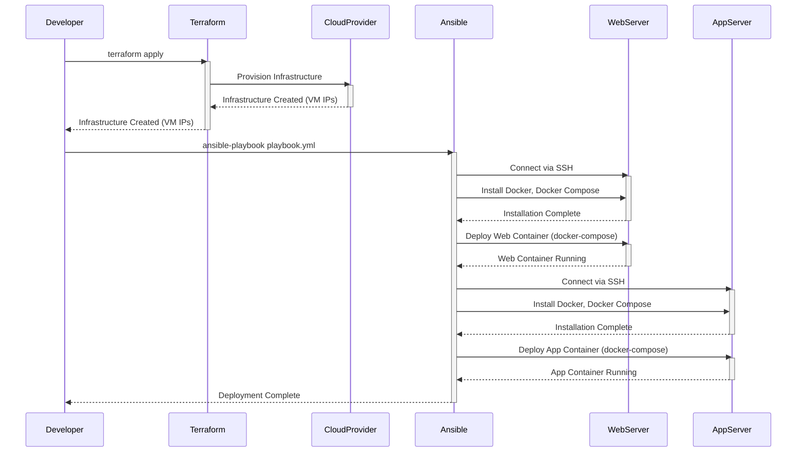

> Previously, we looked at [Ansible Playbook](01_ansible-playbook.md).

# Chapter 2: Application Deployment
Let's begin exploring this concept. This chapter will guide you through the process of deploying the multi-tier application we've been building, from packaging the code to running it on our infrastructure.
**Why Application Deployment?**
Imagine building a beautiful house (your application). You wouldn't just leave the materials scattered around! Application deployment is like carefully assembling and placing each piece of furniture (your code and dependencies) into the right room (the server) and making sure everything works together seamlessly. It's the process of taking your application code and making it available for users to access and use. Without proper deployment, your code remains just code, not a functional application.
**Key Concepts: A Three-Legged Stool**
Our application deployment process relies on three key components, much like a three-legged stool:
1.  **Containerization (Docker):** Packages the application and its dependencies into a self-contained unit. This ensures consistency across different environments. Think of it as packing all your furniture into a moving container, ready to be shipped anywhere.  We covered this in detail in [Containerization (Docker)](06_containerization-docker.md).
2.  **Infrastructure as Code (Terraform):** Provisions the necessary infrastructure (servers, networks, etc.) in a repeatable and automated way. This is like building the foundation and walls of your house.  We established the cloud infrastructure using Terraform, as outlined in [Infrastructure as Code (IaC)](01_infrastructure-as-code-iac.md) and [Terraform Resources](04_terraform-resources.md).
3.  **Configuration Management (Ansible):** Configures the servers and deploys the application containers. This is like setting up the furniture, connecting the electricity, and making sure everything is ready to live in.  We configure servers and deploy Docker containers with Ansible, which we saw in [Configuration Management](05_configuration-management.md) and [Ansible Playbook](08_ansible-playbook.md).
**The Deployment Workflow**
The deployment process follows these steps:
1.  **Terraform Infrastructure Provisioning:** Terraform creates the VPC, subnets, and virtual machines (VMs) in the cloud.
2.  **Ansible Server Configuration:** Ansible connects to the provisioned VMs and installs Docker and Docker Compose.
3.  **Application Deployment:** Ansible uses Docker Compose to deploy the web and app containers onto the respective VMs.
Here's a sequence diagram to illustrate the deployment flow:

This diagram shows how the developer triggers the deployment process by running Terraform and Ansible. Terraform creates the infrastructure, and Ansible configures the servers and deploys the application containers.
**Code Examples**
Let's look at the crucial parts of the configuration that makes deployment work:
*Dockerfile*:
```python
# Dockerfile for the Python Flask application
FROM python:3.9-slim
WORKDIR /app
COPY requirements.txt .
RUN pip install --no-cache-dir -r requirements.txt
COPY . .
CMD ["flask", "run", "--host=0.0.0.0"]
```
This Dockerfile defines how to build the Docker image for the Python Flask application. It starts from a Python base image, installs the necessary dependencies, copies the application code, and specifies the command to run the application.
*Ansible Playbook*:
```python
---
- name: Deploy Multi-Tier Application
  hosts: all
  become: true
  tasks:
    - name: Update apt cache
      apt:
        update_cache: yes
        cache_valid_time: 3600
    - name: Install required system packages
      apt:
        name:
          - apt-transport-https
          - ca-certificates
          - curl
          - gnupg
          - lsb-release
        state: present
    - name: Add Docker GPG key
      apt_key:
        url: https://download.docker.com/linux/ubuntu/gpg
        state: present
    - name: Add Docker repository
      apt_repository:
        repo: deb [arch=amd64] https://download.docker.com/linux/ubuntu {{ ansible_lsb.codename }} stable
        state: present
    - name: Install Docker and Docker Compose
      apt:
        name:
          - docker-ce
          - docker-ce-cli
          - containerd.io
          - docker-compose-plugin
        state: present
    - name: Include the docker_app role to deploy containers
      include_role:
        name: docker_app
```
This Ansible playbook automates the server configuration and application deployment. It installs Docker and Docker Compose, and then includes the `docker_app` role to deploy the containers.
*Ansible Docker App Role*:
```python
---
- name: Create directory for docker-compose file
  file:
    path: /opt/app
    state: directory
    mode: '0755'
- name: Template the docker-compose file to the server
  template:
    src: docker-compose.yml.j2
    dest: /opt/app/docker-compose.yml
- name: Run Docker Compose to start containers
  community.docker.docker_compose:
    project_src: /opt/app
    state: present
```
This Ansible role copies the `docker-compose.yml` file to the server and uses Docker Compose to start the containers. The `docker-compose.yml` file (which is templated using Jinja2 templates) defines the services, networks, and volumes for the application. See [Docker Compose](07_docker-compose.md) for more details.
**Putting It All Together**
The entire deployment process is orchestrated by the Terraform output and the Ansible inventory. Terraform outputs the IP addresses of the created servers, and Ansible uses these IPs to connect to the servers and run the playbook. The playbook installs the necessary software and deploys the application containers using Docker Compose. This automated process ensures that the application is deployed consistently and reliably across different environments.
This concludes our look at this topic.

> Next, we will examine [Cloud Provider (AWS)](03_cloud-provider-aws.md).


---

*Generated by [SourceLens AI](https://github.com/openXFlow/sourceLensAI) using LLM: `gemini` (cloud) - model: `gemini-2.0-flash` | Language Profile: `Python`*