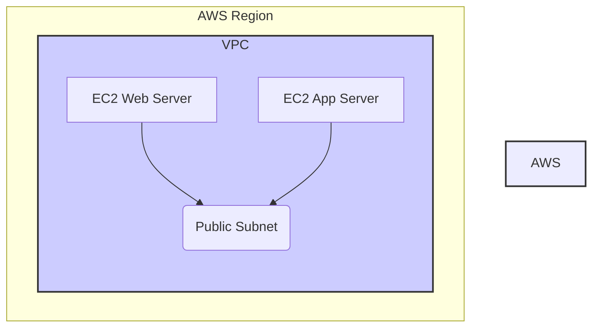

> Previously, we looked at [Application Deployment](02_application-deployment.md).

# Chapter 3: Cloud Provider (AWS)
Let's begin exploring this concept. This chapter will introduce Amazon Web Services (AWS) as the cloud provider used in this project, explaining its role and how it's utilized within the `20250707_1734_code-devops-iac-sample-project`.
**Why AWS?**
Imagine you're building a house. You could buy land, build your own power plant, and dig your own well – handling *everything* yourself. Or, you could buy a lot in a developed area where electricity, water, and other utilities are already provided.
AWS is like that developed area for computing. Instead of buying and managing physical servers, networks, and storage, you *rent* them from AWS. This allows you to focus on building your application, rather than on the underlying infrastructure. This project leverages AWS for its computing resources, network capabilities, and more.
**Key AWS Services Used in This Project**
This project primarily utilizes the following AWS services:
*   **EC2 (Elastic Compute Cloud):** EC2 provides virtual servers (instances) in the cloud. Think of them as computers that you can rent and configure to run your applications. We'll be using EC2 instances for both web servers and application servers.
*   **VPC (Virtual Private Cloud):** VPC allows you to create a private, isolated network within AWS. It's like having your own data center in the cloud. VPC enables you to define network settings, security rules, and more. We'll dive deeper into VPC in the next chapter: [Virtual Private Cloud (VPC)](03_virtual-private-cloud-vpc.md).
*   **IAM (Identity and Access Management):** IAM allows you to securely control access to AWS services and resources. It enables you to create and manage AWS users and groups, and use permissions to allow and deny their access to AWS resources.
*   **S3 (Simple Storage Service):** S3 offers object storage, which you can utilize to store and retrieve data. You can use S3 to store application assets, backups, or any kind of data.
*   **CloudWatch:** CloudWatch provides monitoring and observability services. This allows you to collect and track metrics, collect and monitor log files, and set alarms.
**How AWS is Used in This Project**
The `20250707_1734_code-devops-iac-sample-project` uses AWS as the foundation upon which our infrastructure is built. Specifically, we're provisioning EC2 instances within a VPC to host our application. The infrastructure is managed using [Infrastructure as Code (IaC)](01_infrastructure-as-code-iac.md) principles, which ensures that the AWS resources are defined and deployed in a repeatable and consistent manner.
**Code Example: Defining the AWS Provider and a VPC**
The following snippet from `terraform/main.tf` shows how the AWS provider is configured and how a VPC is defined using Terraform:
```python
--- File: terraform/main.tf ---
# main.tf - Defines the core infrastructure
provider "aws" {
  region = var.aws_region
}
resource "aws_vpc" "main" {
  cidr_block = "10.0.0.0/16"
  tags = {
    Name = "main-vpc"
  }
}
```
In this code:
*   The `provider "aws"` block configures the AWS provider, specifying the AWS region where the resources will be created. The region is defined via the `aws_region` variable, defined in `terraform/variables.tf`.
*   The `resource "aws_vpc" "main"` block defines a VPC with a specified CIDR block (the range of IP addresses for the network).
**AWS Region**
The `aws_region` variable, typically set to "us-east-1" by default in `terraform/variables.tf`, determines the geographical location where your AWS resources are deployed. Choosing the right region is important for factors like latency, data sovereignty, and pricing.
**Visualizing the AWS Infrastructure**
The diagram below shows the high-level AWS infrastructure that we'll be setting up:

This diagram illustrates a simplified view of the infrastructure. It shows two EC2 instances (web server and app server) residing within a public subnet of a VPC, all within a specific AWS region.
**Further Exploration**
We will delve into the specific AWS resources created in this project in later chapters. Specifically, [Terraform Resources](04_terraform-resources.md) provides a deeper dive into the various types of AWS resources utilized and how Terraform is used to manage them. [Virtual Private Cloud (VPC)](03_virtual-private-cloud-vpc.md) explores the network configuration in detail.
This concludes our look at this topic.

> Next, we will examine [Configuration Management](04_configuration-management.md).


---

*Generated by [SourceLens AI](https://github.com/openXFlow/sourceLensAI) using LLM: `gemini` (cloud) - model: `gemini-2.0-flash` | Language Profile: `Python`*