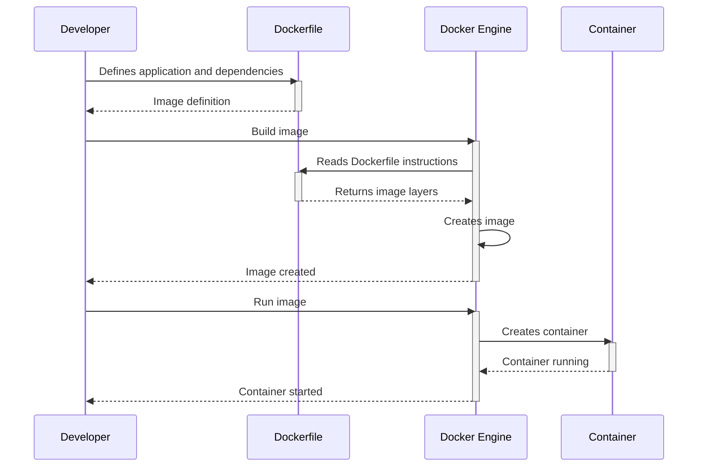

> Previously, we looked at [Configuration Management](04_configuration-management.md).

# Chapter 5: Containerization (Docker)
Let's begin exploring this concept. This chapter will introduce you to Docker and how it's used within our project to package and run applications. We'll cover why containerization is important and how Docker helps achieve it.
## Why Containerization?
Imagine you're trying to run the same application on your laptop, a colleague's computer, and a server in the cloud. Each environment has different operating systems, libraries, and dependencies. Without a consistent way to package your application and its requirements, you're likely to encounter the dreaded "it works on my machine!" problem.
Containerization, using tools like Docker, solves this problem by bundling the application and everything it needs (libraries, dependencies, system tools, runtime) into a standardized unit called a container. This container can then be run consistently on any environment that supports Docker, regardless of the underlying operating system. It's like shipping your application in a self-contained box.
## Docker: The Containerization Tool
Docker is a popular platform for building, shipping, and running applications using containers. It provides a way to:
*   **Package applications:** Docker allows you to define all the dependencies and configurations needed to run an application in a file called a `Dockerfile`.
*   **Create images:** The `Dockerfile` is then used to build a Docker image, which is a read-only template that contains everything needed to run the application.
*   **Run containers:** Docker containers are instances of Docker images. They are isolated from each other and from the host operating system, providing a consistent and reproducible environment for your applications.
## How it Works in Our Project
In our project, Docker is used for both the web and application tiers. This ensures that the applications run consistently regardless of the environment. Let's examine how it’s set up.
1.  **Dockerfile:** A `Dockerfile` defines the environment for the application. Let's look at the one for the Python Flask application in `app/Dockerfile`:
```python
# Dockerfile for the Python Flask application
FROM python:3.9-slim
WORKDIR /app
COPY requirements.txt .
RUN pip install --no-cache-dir -r requirements.txt
COPY . .
CMD ["flask", "run", "--host=0.0.0.0"]
```
This Dockerfile does the following:
*   `FROM python:3.9-slim`:  Starts with a base image containing Python 3.9. This provides a pre-configured environment with Python installed.
*   `WORKDIR /app`: Sets the working directory inside the container to `/app`.
*   `COPY requirements.txt .`: Copies the `requirements.txt` file (listing Python dependencies) into the container.
*   `RUN pip install --no-cache-dir -r requirements.txt`: Installs the Python dependencies using `pip`. The `--no-cache-dir` option prevents caching of downloaded packages, reducing the image size.
*   `COPY . .`: Copies the entire application code into the container.
*   `CMD ["flask", "run", "--host=0.0.0.0"]`: Defines the command to run when the container starts. This starts the Flask development server.
2.  **Docker Compose (Local Development):** We also use Docker Compose to define and manage multi-container applications. For local development, we use a `docker-compose.yml` file to define the application and its dependencies.
```python
# Docker Compose for local development
version: '3.8'
services:
  app:
    build: .
    ports:
      - "5000:5000"
    volumes:
      - .:/app
```
This `docker-compose.yml` file defines a single service named `app`. It specifies:
*   `build: .`:  Builds the image from the `Dockerfile` in the current directory.
*   `ports: - "5000:5000"`: Maps port 5000 on the host machine to port 5000 inside the container, allowing you to access the application from your browser.
*   `volumes: - .:/app`: Mounts the current directory (containing the application code) into the `/app` directory inside the container. This allows you to make changes to the code on your host machine and see them reflected in the running container immediately, which is very convenient for development.
## Docker and Infrastructure as Code (IaC)
Docker plays a vital role within our broader Infrastructure as Code strategy (see [Infrastructure as Code (IaC)](01_infrastructure-as-code-iac.md)). By containerizing our applications, we can create portable application units that are consistently deployed by Ansible, ensuring that our infrastructure as defined by Terraform (see [Terraform Resources](04_terraform-resources.md)) and configured by Ansible always runs the correct version of the application with all required dependencies.
## Example Workflow
Here's a simplified sequence diagram of how Docker containers get deployed:

This sequence shows the basic steps: The developer defines the application's requirements in a `Dockerfile`. The Docker Engine uses this to build an image, and then runs the image to create a container.
This concludes our look at this topic.

> Next, we will examine [Docker Compose](06_docker-compose.md).


---

*Generated by [SourceLens AI](https://github.com/openXFlow/sourceLensAI) using LLM: `gemini` (cloud) - model: `gemini-2.0-flash` | Language Profile: `Python`*