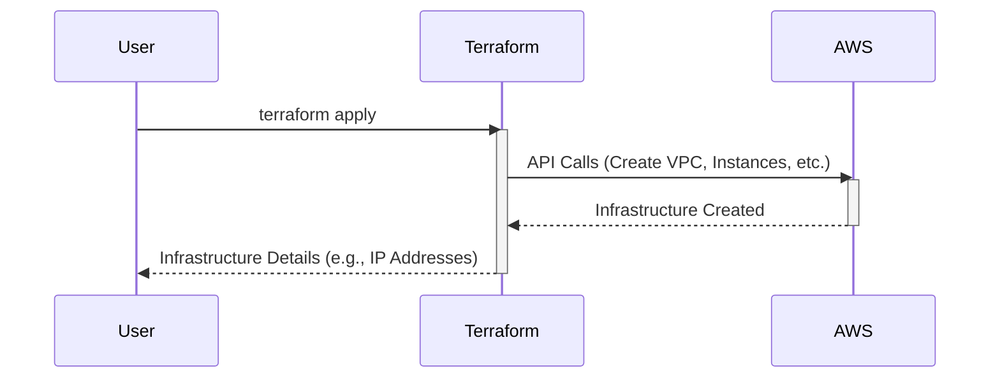

> Previously, we looked at [Docker Compose](06_docker-compose.md).

# Chapter 7: Infrastructure as Code (IaC)
Let's begin exploring this concept. In this chapter, we'll introduce Infrastructure as Code (IaC) and why it's a fundamental practice in modern software development and deployment. We'll cover its core principles, benefits, and how it's implemented in this project.
**What is Infrastructure as Code?**
Imagine building a house. You could hire a construction crew and give them instructions verbally each day, hoping everything goes according to plan. This is similar to manually configuring servers and networks. It's error-prone, difficult to reproduce, and challenging to manage as your infrastructure grows.
Infrastructure as Code (IaC) is like having a detailed blueprint for your house. Instead of manual, ad-hoc processes, you define your infrastructure – servers, networks, databases, etc. – using code. This code is then used to automatically provision and manage your infrastructure in a consistent and repeatable way.
**Why Use Infrastructure as Code?**
IaC offers several key benefits:
*   **Automation:** Automates the creation and management of infrastructure, reducing manual effort.
*   **Consistency:** Ensures that your infrastructure is deployed in a consistent state every time.
*   **Repeatability:** Allows you to easily recreate your infrastructure in different environments (e.g., development, staging, production).
*   **Version Control:** Enables you to track changes to your infrastructure configuration over time, just like you do with your application code.
*   **Cost Reduction:** Reduces errors and inefficiencies, leading to cost savings.
**Key Concepts**
At its core, IaC involves:
*   **Definition:** Describing your desired infrastructure state in code.
*   **Provisioning:** Creating the infrastructure based on the code definition.
*   **Management:** Making changes to the infrastructure by updating the code and reapplying it.
**How it Works in This Project**
This project utilizes Terraform, a popular IaC tool, to define and provision the cloud infrastructure. Terraform reads configuration files that specify the resources you want to create (e.g., virtual machines, networks, databases). It then interacts with your cloud provider (in this case, AWS, as detailed in [Cloud Provider (AWS)](02_cloud-provider-aws.md)) to create and manage those resources.
The main components related to IaC in this project are located in the `terraform/` directory. Let's look at some example code:
```python
--- File: terraform/main.tf ---
# main.tf - Defines the core infrastructure
provider "aws" {
  region = var.aws_region
}
resource "aws_vpc" "main" {
  cidr_block = "10.0.0.0/16"
  tags = {
    Name = "main-vpc"
  }
}
resource "aws_instance" "web_server" {
  ami           = "ami-0c55b159cbfafe1f0" # Example AMI
  instance_type = "t2.micro"
  subnet_id     = aws_subnet.public.id
  tags = {
    Name = "WebServer"
  }
}
```
In this code snippet, we are defining the core infrastructure components:
*   **`provider "aws"`:** Configures Terraform to use the AWS cloud provider.
*   **`resource "aws_vpc" "main"`:** Defines a Virtual Private Cloud (VPC) named "main." VPCs are isolated networks within the cloud. (More on VPCs in [Virtual Private Cloud (VPC)](03_virtual-private-cloud-vpc.md))
*   **`resource "aws_instance" "web_server"`:** Defines an AWS EC2 instance (virtual machine) named "web\_server."
Terraform also has output variables, which provide information about the created infrastructure:
```python
--- File: terraform/outputs.tf ---
output "web_server_ip" {
  description = "Public IP address of the Web Server instance."
  value       = aws_instance.web_server.public_ip
}
```
This code defines an output variable named `web_server_ip`, which will display the public IP address of the "web\_server" instance after Terraform successfully creates it. This output is then used by Ansible in subsequent steps.
Here's a simplified diagram showing how Terraform provisions the infrastructure:

This diagram illustrates the basic flow: the user triggers Terraform, which then interacts with AWS to create the defined resources. Finally, Terraform provides the user with details about the created infrastructure.
For more detail about the specific resources used in the Terraform code, refer to [Terraform Resources](04_terraform-resources.md).
This concludes our look at this topic.

> Next, we will examine [Terraform Resources](08_terraform-resources.md).


---

*Generated by [SourceLens AI](https://github.com/openXFlow/sourceLensAI) using LLM: `gemini` (cloud) - model: `gemini-2.0-flash` | Language Profile: `Python`*