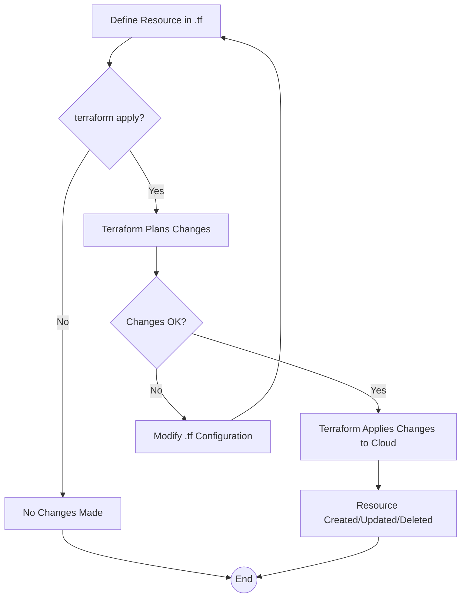

> Previously, we looked at [Infrastructure as Code (IaC)](07_infrastructure-as-code-iac.md).

# Chapter 8: Terraform Resources
Let's begin exploring this concept. In this chapter, we'll demystify Terraform Resources, which are the fundamental building blocks of your infrastructure when using Terraform. Understanding resources is crucial for effectively managing your cloud infrastructure as code.
Why do we need Terraform Resources? Imagine building a house. You wouldn't just magically wish it into existence. You'd need individual building blocks like bricks, lumber, windows, and doors. Similarly, in the cloud, you need virtual building blocks like virtual servers (EC2 instances), networks (VPCs and Subnets), databases, and load balancers. Terraform Resources are the *code representation* of these virtual building blocks.
They provide an abstraction layer, so you don't need to deal directly with the cloud provider's specific APIs every time you want to create or manage something. Terraform handles the communication with the cloud provider for you, based on the resource definitions you write.
**Key Concepts Breakdown:**
*   **Resource Declaration:** This is where you define a resource in your Terraform configuration file. You specify the resource type (e.g., `aws_vpc`, `aws_instance`), a unique name for that resource within your Terraform configuration (e.g., `main`, `web_server`), and configuration attributes that define the properties of that resource (e.g., `cidr_block`, `instance_type`).
*   **Resource Attributes:** These are the properties of the resource that you can configure. For example, for an `aws_instance` resource, you can configure the `ami` (Amazon Machine Image), `instance_type`, and `subnet_id`.
*   **Resource Dependencies:** Terraform automatically handles dependencies between resources. For example, an `aws_instance` that is deployed in an `aws_subnet` needs the subnet to be created first. Terraform analyzes your configuration and creates resources in the correct order to satisfy these dependencies. This is often achieved by referencing the attributes of other resources, such as `aws_subnet.public.id` which obtains the ID of the `public` subnet.
**Usage / How it Works:**
Terraform Resources are defined in `.tf` files. These files contain the configuration for your infrastructure. When you run `terraform apply`, Terraform reads these files, calculates the required changes to your infrastructure, and then makes the necessary calls to the cloud provider's API to create, update, or delete resources.
The general structure of a resource block is as follows:
```
resource "<resource_type>" "<resource_name>" {
  # Configuration attributes here
}
```
`<resource_type>` specifies the type of resource you want to create (e.g., `aws_vpc`, `aws_instance`). `<resource_name>` is a unique name you choose to identify this specific instance of that resource within your Terraform configuration. The curly braces `{}` enclose the configuration attributes for the resource.
Here's a simplified example of an `aws_instance` resource:
```python
resource "aws_instance" "web_server" {
  ami           = "ami-0c55b159cbfafe1f0" # Amazon Machine Image (OS template)
  instance_type = "t2.micro"              # Instance size (compute capacity)
}
```
In this example, we're defining an AWS EC2 instance named "web_server". We're specifying the AMI to use (which determines the operating system) and the instance type (which determines the size and performance of the instance). Terraform will create an instance with these specifications when you run `terraform apply`.
Below is a simple flowchart illustrating the lifecycle of a Terraform resource:

The diagram shows that the process starts by defining the resource in a `.tf` file. Then, `terraform apply` initiates the process. Terraform plans the changes, and if they are okay, Terraform applies these changes to the cloud provider, resulting in the resource being created, updated or deleted. If the changes are not ok, the configuration in `.tf` must be modified.
You can see more examples of Terraform resource definitions in the `terraform/main.tf` file that accompanies this tutorial.
This chapter builds upon the concepts introduced in [Virtual Private Cloud (VPC)](03_virtual-private-cloud-vpc.md) by showing how to define VPCs, subnets, and other resources using Terraform. These resources are the foundation for the infrastructure we will build and manage in subsequent chapters. We'll also see how these resources are tied together with [Configuration Management](05_configuration-management.md) later.
This concludes our look at this topic.

> Next, we will examine [Virtual Private Cloud (VPC)](09_virtual-private-cloud-vpc.md).


---

*Generated by [SourceLens AI](https://github.com/openXFlow/sourceLensAI) using LLM: `gemini` (cloud) - model: `gemini-2.0-flash` | Language Profile: `Python`*