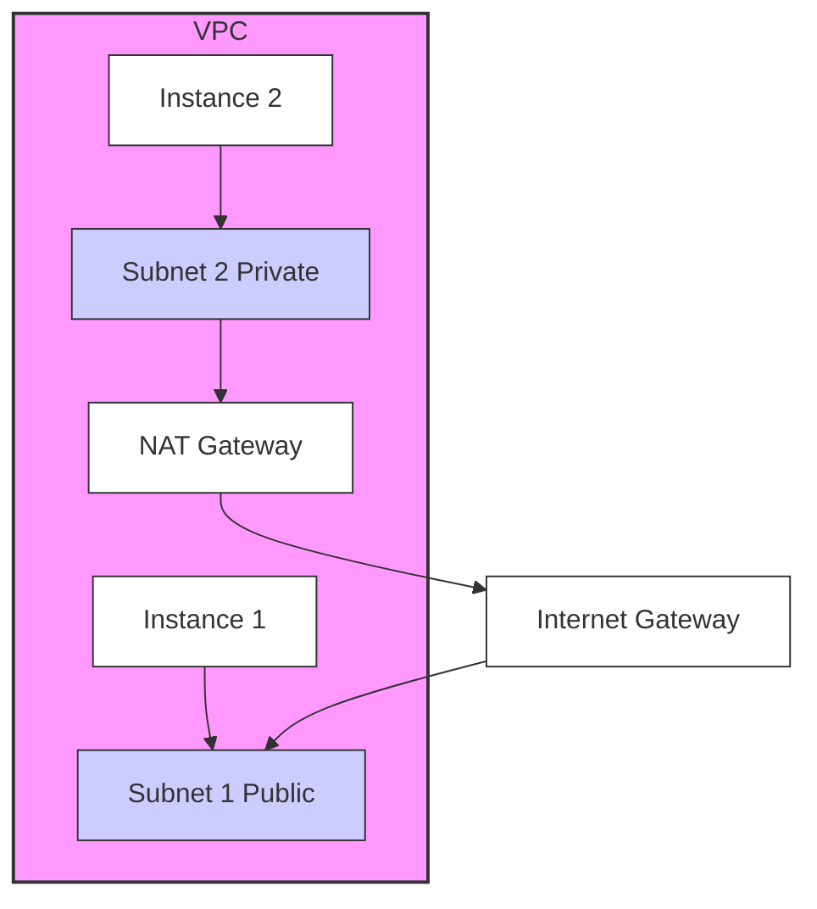

> Previously, we looked at [Terraform Resources](08_terraform-resources.md).

# Chapter 9: Virtual Private Cloud (VPC)
Let's begin exploring this concept. This chapter will explain what a Virtual Private Cloud (VPC) is, why it's important, and how it's used in the context of our project `20250707_1734_code-devops-iac-sample-project`.
**Why VPCs? The Isolated Fortress Analogy**
Imagine your applications and servers are precious jewels. You wouldn't just leave them out in the open, would you? You'd want to store them in a secure vault. A VPC is like a virtual vault within a cloud provider's infrastructure. It provides isolation and control, allowing you to define your own network space and security rules.
Without a VPC, your resources would be running in the cloud provider's default network, which is shared with other users and lacks the granular control you need for security and customization. A VPC lets you define your own IP address ranges, subnets, route tables, and network gateways, giving you complete control over your network environment.
**Key Concepts: Subnets, Route Tables, and Gateways**
A VPC isn't just one big network; it's further divided into smaller networks called *subnets*.
*   **Subnets:** Think of subnets as individual rooms within your virtual vault. Each subnet is a range of IP addresses within the VPC's overall address space. You can create public subnets (accessible from the internet) and private subnets (only accessible within the VPC).
*   **Route Tables:** Route tables dictate how network traffic is routed within the VPC and to external networks. They're like the signposts and traffic rules inside your vault, determining which direction traffic should flow.
*   **Gateways:** Gateways connect your VPC to the outside world. An *Internet Gateway* allows instances in your public subnets to connect to the internet. A *NAT Gateway* allows instances in your private subnets to connect to the internet without being directly exposed.
**How it Works: Creating an Isolated Network**
In essence, you define a VPC with a specific CIDR block (a range of IP addresses). Then, you create subnets within that CIDR block. You configure route tables to control traffic flow between subnets and the internet. Finally, you launch your resources (like EC2 instances, databases, etc.) into the subnets you've created. This entire process is often automated using Infrastructure as Code, which we touched on in [Infrastructure as Code (IaC)](01_infrastructure-as-code-iac.md) and will see in more detail in [Terraform Resources](04_terraform-resources.md).
**Code Example: Defining a Simple VPC with Terraform**
Here's a simplified excerpt from our `terraform/main.tf` file demonstrating how to define a VPC and a subnet using Terraform:
```python
--- File: terraform/main.tf ---
# main.tf - Defines the core infrastructure
resource "aws_vpc" "main" {
  cidr_block = "10.0.0.0/16"
  tags = {
    Name = "main-vpc"
  }
}
resource "aws_subnet" "public" {
  vpc_id     = aws_vpc.main.id
  cidr_block = "10.0.1.0/24"
  tags = {
    Name = "public-subnet"
  }
}
```
This code snippet defines a VPC named "main-vpc" with the CIDR block `10.0.0.0/16` and a public subnet named "public-subnet" within that VPC, using the CIDR block `10.0.1.0/24`. The `vpc_id` attribute in the `aws_subnet` resource associates the subnet with the VPC.
**Diagram: High-Level VPC Architecture**
Below is a simple diagram illustrating the relationship between a VPC, subnets, and instances.

This diagram shows a VPC containing two subnets: a public subnet (Subnet 1) and a private subnet (Subnet 2). Instance 1 is located in the public subnet and can access the internet via the Internet Gateway. Instance 2 is in the private subnet and accesses the internet via the NAT Gateway.
The AWS cloud provider, described in [Cloud Provider (AWS)](02_cloud-provider-aws.md), allows us to utilize VPCs and related components.
This concludes our look at this topic.

> Next, we will examine [Architecture Diagrams](10_diagrams.md).


---

*Generated by [SourceLens AI](https://github.com/openXFlow/sourceLensAI) using LLM: `gemini` (cloud) - model: `gemini-2.0-flash` | Language Profile: `Python`*