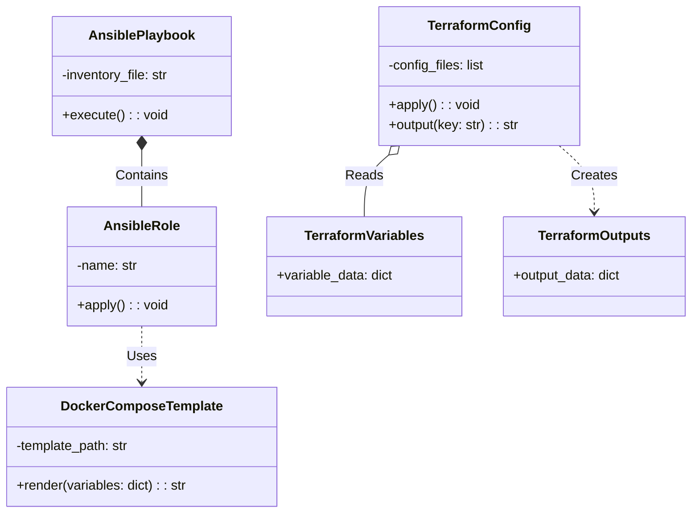
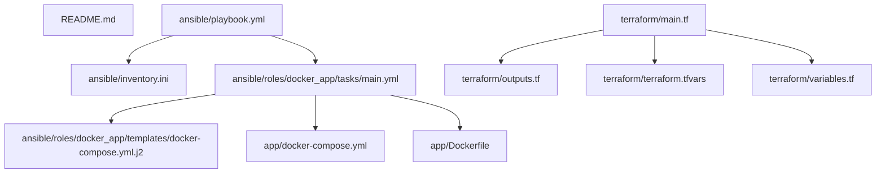
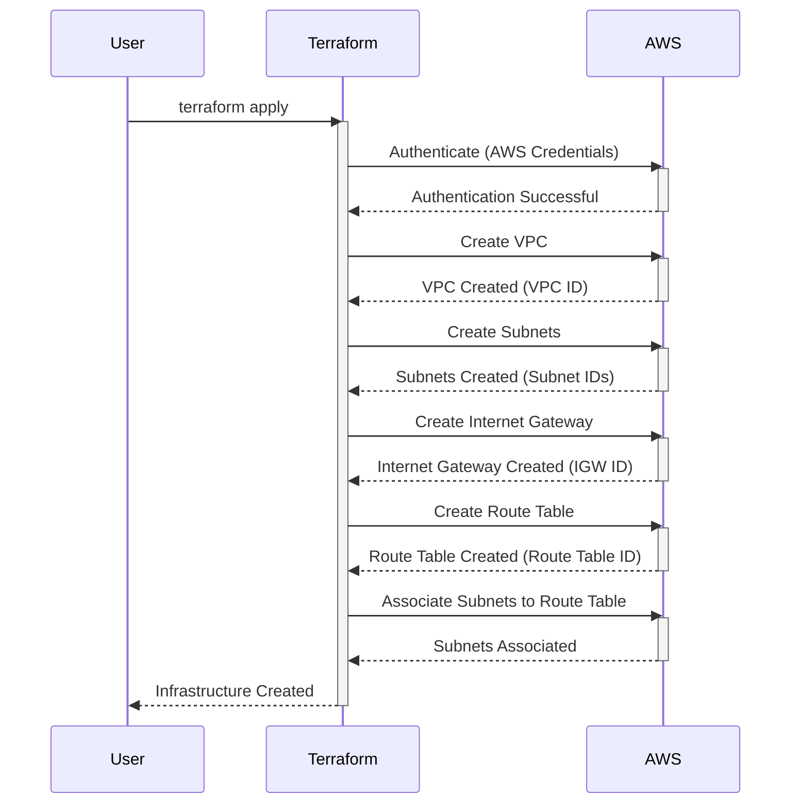
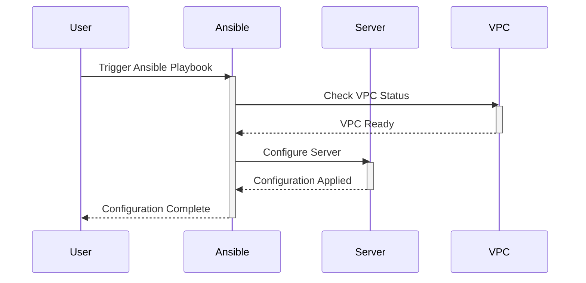
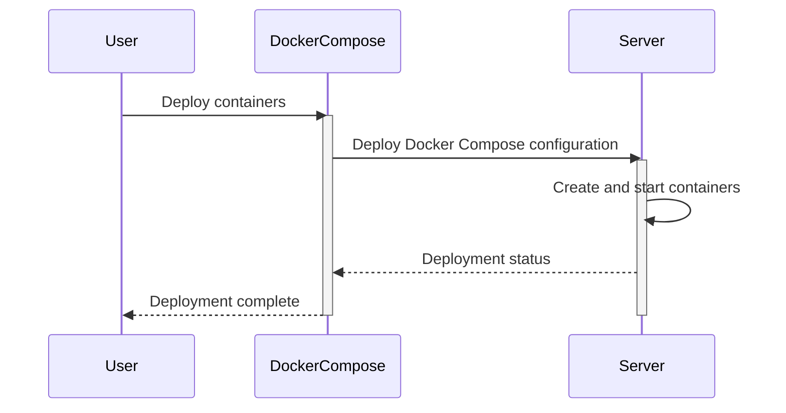
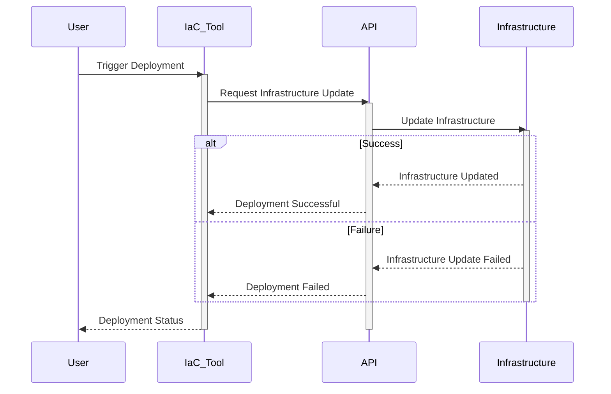
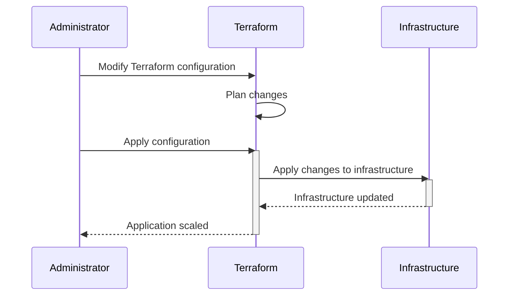

> Previously, we looked at [Virtual Private Cloud (VPC)](09_virtual-private-cloud-vpc.md).

# Chapter 10: Architecture Diagrams
## Class Diagram
Key classes and their relationships in **20250707_1734_code-devops-iac-sample-project**.

## Package Dependencies
High-level module and package structure of **20250707_1734_code-devops-iac-sample-project**.

## Sequence Diagrams
These diagrams illustrate various interaction scenarios, showcasing operations between components for specific use cases.
### A developer uses Terraform to provision a VPC in AWS.

### Ansible configures a server within the provisioned VPC.

### Docker containers are deployed to the configured server using Docker Compose.

### A user triggers an application deployment via IaC, automating infrastructure updates.

### An administrator scales the application by modifying Terraform configuration and applying the changes.

> Next, we will examine [Code Inventory](11_code_inventory.md).

---

*Generated by [SourceLens AI](https://github.com/openXFlow/sourceLensAI) using LLM: `gemini` (cloud) - model: `gemini-2.0-flash` | Language Profile: `Python`*