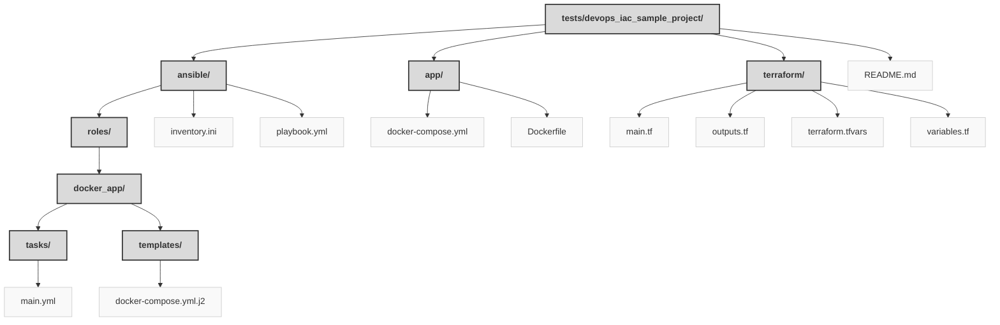

> Previously, we looked at [Architecture Diagrams](10_diagrams.md).

# Chapter 11: Code Inventory
## File Structure

## File Descriptions Summary
*   **`README.md`**: Multi-Tier Web Application Infrastructure as Code
*   **`inventory.ini`**: This inventory is typically generated dynamically from Terraform output.
*   **`playbook.yml`**: ---
*   **`main.yml`**: ---
*   **`docker-compose.yml.j2`**: Jinja2 template for Docker Compose file
*   **`docker-compose.yml`**: Docker Compose for local development
*   **`Dockerfile`**: Dockerfile for the Python Flask application
*   **`main.tf`**: main.tf - Defines the core infrastructure
*   **`outputs.tf`**: output "web_server_ip" {
*   **`terraform.tfvars`**: // Example tfvars file.
*   **`variables.tf`**: variable "aws_region" {
---
## Detailed File Content
No detailed structural information could be generated for the files based on the selected parser.

> Next, we will examine [Project Review](12_project_review.md).

---

*Generated by [SourceLens AI](https://github.com/openXFlow/sourceLensAI) using LLM: `gemini` (cloud) - model: `gemini-2.0-flash` | Language Profile: `Python`*