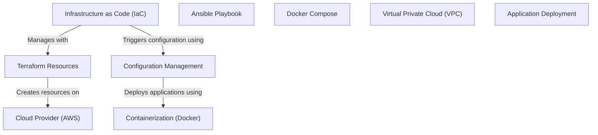

# Tutorial: 20250707_1734_code-devops-iac-sample-project

This project uses *Infrastructure as Code (IaC)* with Terraform to provision cloud resources on AWS. Configuration Management with Ansible then configures these resources by installing Docker and deploying application containers. *Containerization* ensures the application runs consistently across different environments.

**Source Directory:** `C:\_jd_programming\python\11_sourceLens_project\sourceLens\tests\devops_iac_sample_project`

## Abstraction Relationships

## Chapters

1. [Ansible Playbook](01_ansible-playbook.md)
2. [Application Deployment](02_application-deployment.md)
3. [Cloud Provider (AWS)](03_cloud-provider-aws.md)
4. [Configuration Management](04_configuration-management.md)
5. [Containerization (Docker)](05_containerization-docker.md)
6. [Docker Compose](06_docker-compose.md)
7. [Infrastructure as Code (IaC)](07_infrastructure-as-code-iac.md)
8. [Terraform Resources](08_terraform-resources.md)
9. [Virtual Private Cloud (VPC)](09_virtual-private-cloud-vpc.md)
10. [Architecture Diagrams](10_diagrams.md)
11. [Code Inventory](11_code_inventory.md)
12. [Project Review](12_project_review.md)

---

*Generated by [SourceLens AI](https://github.com/openXFlow/sourceLensAI) using LLM: `gemini` (cloud) - model: `gemini-2.0-flash` | Language Profile: `Python`*