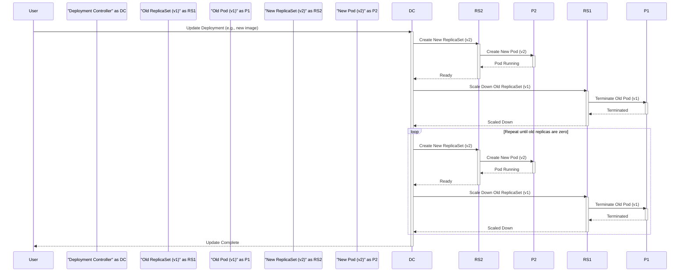

> Previously, we looked at [Container Image](01_container-image.md).

# Chapter 2: Deployment
Let's begin exploring this concept. This chapter will explain what a Deployment is in Kubernetes and how it helps manage your application's pods.
**Why Deployments? The Orchestrator's Assistant**
Imagine you're running a restaurant. You need to ensure you always have enough chefs (pods) to handle the incoming orders (traffic). You also need to be able to update the menu (application) without causing the whole restaurant to shut down. A Deployment is like a highly efficient restaurant manager who automates this process.
In Kubernetes, Deployments provide declarative updates for Pods and ReplicaSets.  Instead of manually managing individual pods, you declare the *desired state* of your application (e.g., number of replicas, container image version), and the Deployment controller works to achieve that state.  If a pod crashes, the Deployment automatically recreates it. If you want to update to a new version of your application, the Deployment can perform a rolling update, gradually replacing old pods with new ones, minimizing downtime.
**Key Concepts**
*   **Replicas:** The desired number of identical pods that should be running.
*   **Rolling Updates:** Updating pods incrementally to avoid downtime. This can be configured with strategies like "Recreate" (all old pods are killed before new ones are created) or "RollingUpdate" (old pods are gradually replaced by new pods).
*   **Rollbacks:** If an update goes wrong, you can easily revert to a previous version of the application.
*   **Declarative Updates:** Defining the desired state instead of specifying the steps to achieve it.
**How Deployments Work**
1.  **You define a Deployment:** You create a YAML file (or use Helm/Kustomize) that specifies the desired state of your application, including the number of replicas, the container image to use, and other configuration details.
2.  **Kubernetes creates a ReplicaSet:** The Deployment controller creates a ReplicaSet, which is responsible for ensuring that the specified number of pods are running. A [ReplicaSet](05_replicaset.md) ensures that the desired number of pods are running at any given time.
3.  **Pods are created:** The ReplicaSet creates and manages the pods based on the pod template defined in the Deployment. See the [Pod](03_pod.md) chapter for more details.
4.  **Updates are handled:** When you update the Deployment (e.g., change the container image), the Deployment controller creates a new ReplicaSet with the updated configuration and gradually rolls out the changes, replacing old pods with new ones. The old ReplicaSet is then scaled down to zero replicas.
**Code Examples**
Here's an example of a Deployment definition (taken from the `guestbook-chart/templates/frontend-deployment.yaml` file in our sample project):
```python
apiVersion: apps/v1
kind: Deployment
metadata:
  name: {{ .Release.Name }}-frontend
  labels:
    {{- include "guestbook.labels" . | nindent 8 }}
    app.kubernetes.io/component: frontend
spec:
  replicas: {{ .Values.frontend.replicaCount }}
  selector:
    matchLabels:
      app.kubernetes.io/component: frontend
  template:
    metadata:
      labels:
        {{- include "guestbook.labels" . | nindent 12 }}
        app.kubernetes.io/component: frontend
    spec:
      containers:
      - name: php-redis
        image: {{ .Values.frontend.image }}
        ports:
        - containerPort: {{ .Values.frontend.port }}
```
This Deployment ensures that a specified number of `frontend` pods (defined by `replicas`) are running, using the container image defined in `.Values.frontend.image`. The `selector` field tells the Deployment which pods it should manage, based on the labels. The `template` section defines the pod's configuration.  The `{{ .Release.Name }}` and `{{ .Values.* }}` syntax are Helm templating features, further explained in the [Values (Helm)](07_values-helm.md) and [Helm Chart](08_helm-chart.md) chapters.
**Rolling Update Example with Diagram**
Here's a simplified sequence diagram illustrating a rolling update:

This diagram shows how the Deployment Controller gradually replaces pods from the old ReplicaSet (RS1) with pods from the new ReplicaSet (RS2). This process minimizes downtime during updates.
**Relationship to Other Resources**
As you can see in the diagrams, Deployments manage [ReplicaSet](05_replicaset.md) objects, which in turn manage the [Pods](03_pod.md). The [Container Image](02_container-image.md) is referenced within the pod definition.
This concludes our look at this topic.

> Next, we will examine [Helm Chart](03_helm-chart.md).


---

*Generated by [SourceLens AI](https://github.com/openXFlow/sourceLensAI) using LLM: `gemini` (cloud) - model: `gemini-2.0-flash` | Language Profile: `Python`*