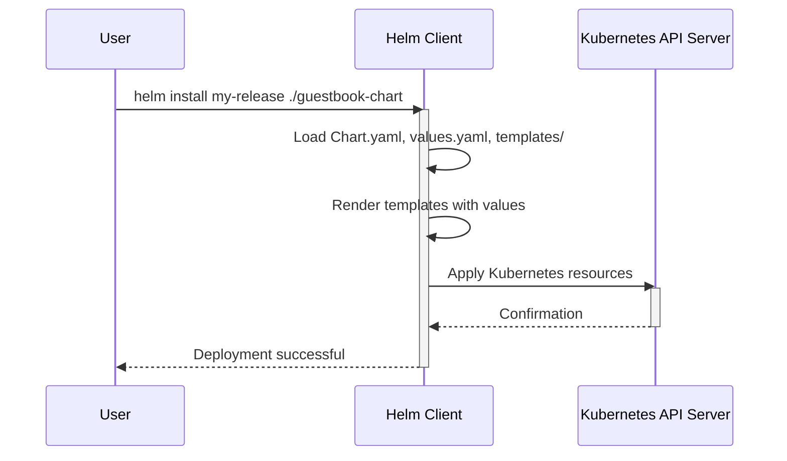

> Previously, we looked at [Deployment](02_deployment.md).

# Chapter 3: Helm Chart
Let's begin exploring this concept. This chapter explains what a Helm Chart is, why it's used, and how it simplifies Kubernetes deployments.
**Motivation/Purpose:**
Imagine deploying an application to Kubernetes. You need to create multiple YAML files: Deployments, Services, ConfigMaps, and more. Managing these individually can become complex, especially when you have multiple environments (development, staging, production) with slightly different configurations.
A Helm Chart is like a package manager for Kubernetes. It bundles all your application's Kubernetes resource definitions into a single, manageable unit. Think of it like a `.zip` file containing all the necessary instructions and configurations for your application, but specifically designed for Kubernetes. This packaging greatly simplifies deployment, versioning, and sharing of applications.
**Key Concepts Breakdown:**
A Helm Chart consists of several key components:
*   **`Chart.yaml`:** This file contains metadata about the chart, such as its name, version, and description.
*   **`values.yaml`:** This file defines the default values for the chart's configurable parameters. These parameters can be overridden during deployment. This file is examined in detail in the previous chapter: [Values (Helm)](07_values-helm.md)
*   **`templates/` directory:** This directory contains template files that define the Kubernetes resources. These templates use the Go template language, allowing you to dynamically generate resource definitions based on the values provided in `values.yaml`.
*   **Other files:** Charts can also contain other files, such as documentation, dependencies, and helper templates.
**Usage / How it Works:**
Helm uses the information in the `Chart.yaml`, `values.yaml`, and `templates/` directory to generate Kubernetes resource definitions. It then applies these definitions to your Kubernetes cluster, deploying your application.
Here's a simplified workflow:
1.  You create or download a Helm Chart.
2.  You customize the `values.yaml` file to match your desired configuration.
3.  You use the `helm install` command to deploy the chart to your Kubernetes cluster.
4.  Helm processes the chart and applies the generated Kubernetes resources to your cluster.
**Code Examples (Short & Essential):**
Let's look at some key files from the example `guestbook-chart`:
```python
--- File: guestbook-chart/Chart.yaml ---
apiVersion: v2
name: guestbook
description: A Helm chart for a multi-tier guestbook application on Kubernetes
type: application
version: 0.1.0
appVersion: "1.0.0"
```
This `Chart.yaml` file defines basic metadata about the `guestbook` chart. The `apiVersion` specifies the Helm Chart API version, `name` is the name of our chart, `description` describes what the chart deploys, `type` specifies chart type and `version` and `appVersion` manage chart versioning.
```python
--- File: guestbook-chart/values.yaml ---
# Default values for guestbook chart.
frontend:
  replicaCount: 1
  image: "gcr.io/google-samples/gb-frontend:v4"
  port: 80
redis:
  leader:
    replicaCount: 1
    image: "redis:6.0.5"
    port: 6379
  follower:
    replicaCount: 2
    image: "redis:6.0.5"
    port: 6379
```
This `values.yaml` file defines the default values for the `frontend` and `redis` components of the guestbook application. For instance, it sets the default number of frontend replicas to 1 and specifies the image to use. These values can be overridden when you install the chart.
```python
--- File: guestbook-chart/templates/frontend-deployment.yaml ---
apiVersion: apps/v1
kind: Deployment
metadata:
  name: {{ .Release.Name }}-frontend
  labels:
    {{- include "guestbook.labels" . | nindent 8 }}
    app.kubernetes.io/component: frontend
spec:
  replicas: {{ .Values.frontend.replicaCount }}
  selector:
    matchLabels:
      app.kubernetes.io/component: frontend
  template:
    metadata:
      labels:
        {{- include "guestbook.labels" . | nindent 12 }}
        app.kubernetes.io/component: frontend
    spec:
      containers:
      - name: php-redis
        image: {{ .Values.frontend.image }}
        ports:
        - containerPort: {{ .Values.frontend.port }}
```
This `frontend-deployment.yaml` file is a template that defines a Kubernetes Deployment for the frontend component. Notice the use of Go template syntax (e.g., `{{ .Release.Name }}` and `{{ .Values.frontend.replicaCount }}`). These placeholders are replaced with actual values when the chart is deployed. `.Release.Name` accesses the release name assigned to the Helm deployment. `.Values.frontend.replicaCount` accesses the `replicaCount` defined under the `frontend` section in `values.yaml`.
**Inline Diagrams (Optional):**
Here's a simplified sequence diagram illustrating the Helm deployment process:

This diagram shows how a user initiates a Helm deployment, the Helm client renders the templates using the values, and then applies the generated Kubernetes resources to the Kubernetes API server. The API server confirms the deployment, and the Helm client informs the user.
**Relationships & Cross-Linking:**
Helm Charts rely on several Kubernetes concepts covered in previous chapters, such as [Deployment](04_deployment.md), [Service](06_service.md), and are configured by the [Values (Helm)](07_values-helm.md) file. They provide a higher level of abstraction for managing these resources. Other methods of configuring kubernetes deployments exist, and we will look at them in [Kustomize](09_kustomize.md).
**Conclusion:**
Helm Charts offer a powerful way to package, version, and deploy Kubernetes applications. They simplify the deployment process and promote consistency across different environments. By using Helm, you can manage your Kubernetes resources more efficiently and effectively.
This concludes our look at this topic.

> Next, we will examine [Kustomize](04_kustomize.md).


---

*Generated by [SourceLens AI](https://github.com/openXFlow/sourceLensAI) using LLM: `gemini` (cloud) - model: `gemini-2.0-flash` | Language Profile: `Python`*