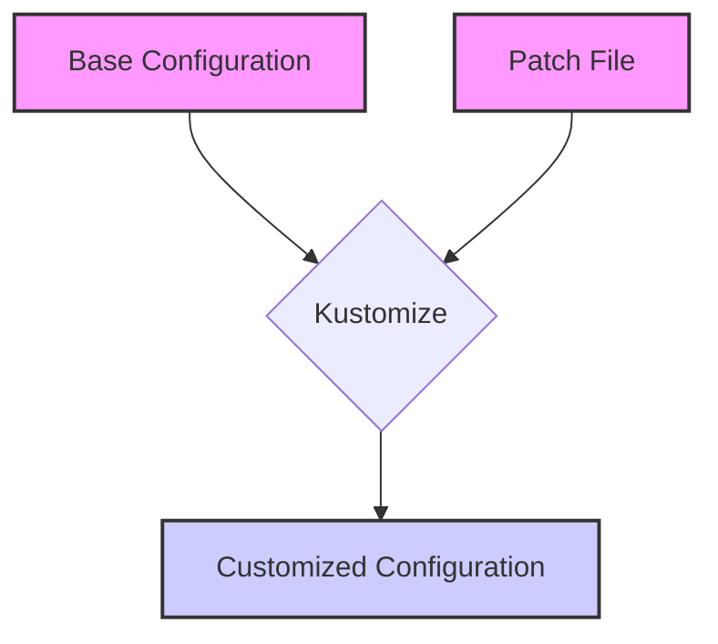

> Previously, we looked at [Helm Chart](03_helm-chart.md).

# Chapter 4: Kustomize
Let's begin exploring this concept. This chapter will introduce you to Kustomize, a powerful tool for managing and customizing your Kubernetes configurations.
**Why Kustomize?**
Imagine you have a beautifully crafted Kubernetes configuration that works perfectly in your development environment. Now, you need to deploy the same application to production. However, production requires slightly different settings – more replicas, different resource limits, and perhaps a different image tag.
You *could* manually edit your existing configuration files, but that's error-prone and difficult to maintain. What if you need to make the same changes across multiple environments? Copying and pasting the same changes is even worse!
Kustomize solves this problem by allowing you to create *variations* of your base configurations without directly modifying the original files. It's like creating a set of "patches" that are applied on top of your base configuration, tailoring it to specific environments or use cases.
**Key Concepts:**
*   **Base:** The original, template-free YAML files that define your Kubernetes resources. Think of this as the foundation upon which your customizations are built.  Our example uses a [Helm Chart](08_helm-chart.md) as the base.
*   **Overlay:** A directory containing a `kustomization.yaml` file and any patches or other configuration files that define the customizations for a specific environment (e.g., production, staging, development).
*   **Kustomization:** A file named `kustomization.yaml` (or `kustomization.yml`) that declares the base, any resources to be added or modified, and any patches to be applied. It acts as a recipe for building a customized configuration.
*   **Patches:** YAML files that define the changes to be applied to the base configuration. These can be used to modify existing resources or add new ones.
**How Kustomize Works:**
Kustomize works by reading your base configuration and then applying the modifications defined in your overlays. It then generates a final, customized YAML file that you can deploy to your Kubernetes cluster.  The source YAML remain untouched.
Here's a high-level overview of the Kustomize workflow:
1.  **Define a Base:** Start with your base Kubernetes configuration files (e.g., Deployments, Services, etc.).
2.  **Create Overlays:** Create separate directories for each environment (e.g., `overlays/production`, `overlays/staging`).
3.  **Define Kustomizations:** In each overlay directory, create a `kustomization.yaml` file that specifies the base and any patches or other resources.
4.  **Build the Configuration:** Use the `kustomize build` command to generate the final, customized YAML file.
5.  **Apply the Configuration:** Deploy the generated YAML file to your Kubernetes cluster using `kubectl apply -f <generated_file.yaml>`.
**Code Examples:**
Let's look at a simplified example of how Kustomize can be used to customize a Deployment:
```python
--- File: kustomize/base/kustomization.yaml ---
apiVersion: kustomize.config.k8s.io/v1beta1
kind: Kustomization
# Use the Helm chart as a base for Kustomize
helmCharts:
  - name: guestbook
    releaseName: guestbook-kustomized
    repo: file://../../guestbook-chart
    version: 0.1.0
    valuesInline:
      frontend:
        replicaCount: 2 # Base replica count for Kustomize
```
This `kustomization.yaml` file in the `base` directory defines a base configuration using a [Helm Chart](08_helm-chart.md). Specifically it sets the `replicaCount` to 2.
Now, let's create an overlay for the production environment:
```python
--- File: kustomize/overlays/production/ kustomization.yaml ---
apiVersion: kustomize.config.k8s.io/v1beta1
kind: Kustomization
# Inherit from the base
bases:
  - ../../base
# Apply patches for the production environment
patches:
  - path: frontend-patch.yaml
    target:
      kind: Deployment
      name: guestbook-kustomized-frontend
```
This `kustomization.yaml` file inherits the base configuration from the `base` directory. It also defines a patch that will be applied to the Deployment named `guestbook-kustomized-frontend`.
Here's the patch file:
```python
--- File: kustomize/overlays/production/frontend-patch.yaml ---
# This patch increases the number of frontend replicas for production.
apiVersion: apps/v1
kind: Deployment
metadata:
  name: guestbook-kustomized-frontend
spec:
  replicas: 5 # Scale up for production traffic
```
This patch file increases the number of replicas for the `guestbook-kustomized-frontend` Deployment to 5.
To build the configuration for the production environment, you would run the following command:
```bash
kustomize build kustomize/overlays/production/
```
This command will generate a single YAML file containing the customized configuration for the production environment. The base `replicaCount` (defined in base `kustomization.yaml`) is overwritten by the `frontend-patch.yaml` value.
**Visualizing Kustomize:**
Here's a diagram showing how Kustomize applies patches to a base configuration:

This diagram illustrates how Kustomize takes a base configuration and a patch file as input and generates a customized configuration as output. The "Base Configuration" and "Patch File" are combined by Kustomize to produce the "Customized Configuration".
**Benefits of Using Kustomize:**
*   **Declarative Configuration:** Kustomize allows you to define your configurations in a declarative way, making it easier to manage and maintain.
*   **Template-Free:** Kustomize doesn't require you to use templates, which can be complex and difficult to debug.
*   **Version Control Friendly:** Because Kustomize doesn't modify your base configuration files, it's easy to track changes and collaborate with others using version control systems like Git.
*   **Environment-Specific Customization:** Kustomize makes it easy to customize your configurations for different environments without duplicating code.
**Relationship to Other Chapters:**
*   This chapter builds upon the concepts introduced in the [Deployment](04_deployment.md) chapter, as Kustomize is often used to customize Deployments.
*   Understanding [Helm Charts](08_helm-chart.md) will aid in understanding the base structure.
This concludes our look at this topic.

> Next, we will examine [Namespace](05_namespace.md).


---

*Generated by [SourceLens AI](https://github.com/openXFlow/sourceLensAI) using LLM: `gemini` (cloud) - model: `gemini-2.0-flash` | Language Profile: `Python`*