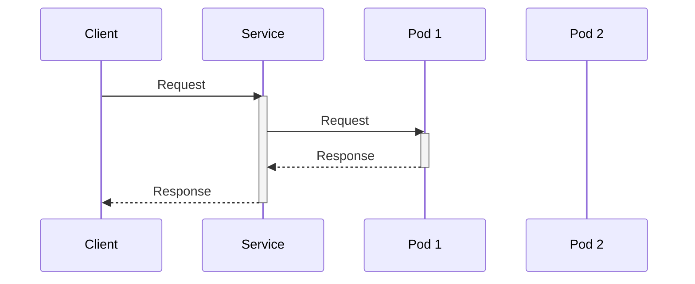

> Previously, we looked at [ReplicaSet](07_replicaset.md).

# Chapter 8: Service
Let's begin exploring this concept. This chapter will explain what a Kubernetes Service is, why we need it, and how it works within the context of our example project, `20250707_1820_code-kubernetes-cfg-sample-project`.
**Why Services?**
Imagine you have a restaurant. Customers don't care which specific chef is cooking their food; they just want food from the restaurant. A Service in Kubernetes is similar to the restaurant itself. It provides a single point of access to a group of Pods (our chefs), abstracting away the complexity of individual Pod IP addresses and their potential changes due to scaling or failures.
Without Services, applications would need to track the individual IP addresses of Pods, which are dynamic and can change frequently. This would make inter-pod communication very complex and fragile. Services solve this problem by providing a stable, consistent endpoint for accessing Pods.
**Key Concepts**
*   **Selectors:** Services use selectors to determine which Pods they should route traffic to. A selector is essentially a label query. Only Pods that match the selector are considered part of the service. In our example, see the `selector` fields in `frontend-service.yaml` and `redis-leader-service.yaml`.
*   **Endpoint:** The service exposes a single IP address and port.
*   **Types:** Kubernetes supports different service types, such as `ClusterIP`, `NodePort`, and `LoadBalancer`.
    *   `ClusterIP`: Exposes the Service on a cluster-internal IP. This is the default type.
    *   `NodePort`: Exposes the Service on each Node's IP at a static port.
    *   `LoadBalancer`: Exposes the Service externally using a cloud provider's load balancer.
**How Services Work**
1.  A Service is defined with a name, a selector, and a port mapping.
2.  The selector matches Pods based on labels.
3.  The Service assigns a stable IP address and port to the selected Pods.
4.  Traffic sent to the Service's IP address and port is routed to one of the matching Pods.
Here's a simple sequence diagram illustrating how a Service works:

This diagram shows that a client sends a request to the Service. The Service, in turn, forwards the request to one of the available Pods (in this case, Pod 1). The Pod processes the request and sends the response back to the Service, which then relays it back to the client. The client only interacts with the Service, never directly with the Pod.
**Code Examples**
Let's examine some relevant code snippets from the `guestbook-chart/templates` directory:
```python
--- File: guestbook-chart/templates/frontend-service.yaml ---
apiVersion: v1
kind: Service
metadata:
  name: {{ .Release.Name }}-frontend
spec:
  type: LoadBalancer
  ports:
  - port: 80
    targetPort: {{ .Values.frontend.port }}
  selector:
    app.kubernetes.io/component: frontend
```
This YAML defines a Service named `{{ .Release.Name }}-frontend` of type `LoadBalancer`. It exposes port 80 and routes traffic to Pods with the label `app.kubernetes.io/component: frontend` on the port defined by the Helm value `frontend.port`. The `LoadBalancer` type means this service will be exposed externally through a cloud provider's load balancer.
```python
--- File: guestbook-chart/templates/redis-leader-service.yaml ---
apiVersion: v1
kind: Service
metadata:
  name: redis-leader
spec:
  ports:
  - port: {{ .Values.redis.leader.port }}
  selector:
    app.kubernetes.io/component: redis-leader
```
This YAML defines a Service named `redis-leader`. It exposes the port defined by the Helm value `redis.leader.port` and routes traffic to Pods with the label `app.kubernetes.io/component: redis-leader`. The default type of a Service is ClusterIP, so this Service will only be accessible within the Kubernetes cluster.
**Relationships and Cross-Linking**
Services are crucial for enabling communication between different parts of your application. They work in conjunction with [Pods](03_pod.md), [Deployments](04_deployment.md), and [ReplicaSets](05_replicaset.md) to provide a resilient and scalable architecture. You can also configure service properties using [Values (Helm)](07_values-helm.md) and manage them through [Helm Chart](08_helm-chart.md) or [Kustomize](09_kustomize.md).
**In Summary**
Services are a fundamental abstraction in Kubernetes that provide a stable and consistent way to access Pods. They enable loose coupling between components, making your applications more resilient and scalable.
This concludes our look at this topic.

> Next, we will examine [Values (Helm)](09_values-helm.md).


---

*Generated by [SourceLens AI](https://github.com/openXFlow/sourceLensAI) using LLM: `gemini` (cloud) - model: `gemini-2.0-flash` | Language Profile: `Python`*