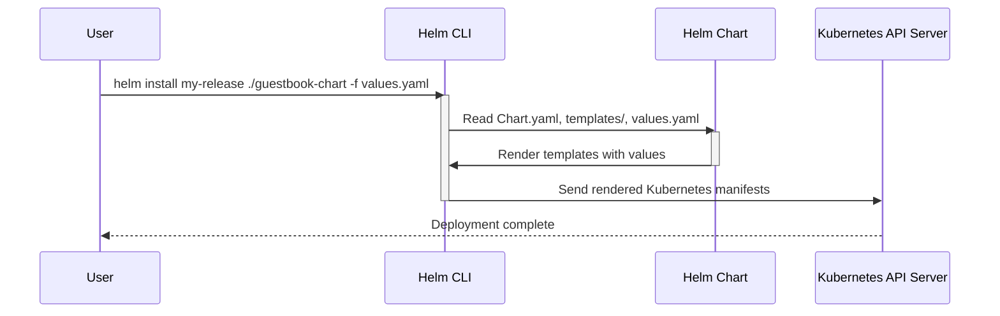

> Previously, we looked at [Service](08_service.md).

# Chapter 9: Values (Helm)
Let's begin exploring this concept. This chapter explains what Helm "Values" are and how they're used to customize your deployments. Think of them as configuration settings that make your applications adaptable to different environments.
**Why Values? The Analogy of a Recipe**
Imagine you have a recipe for a cake. The recipe lists ingredients and instructions. Now, imagine you want to make a slightly different cake – maybe a chocolate version instead of vanilla. Instead of creating a whole new recipe, you can simply adjust a few "values" like the flavor extract.
Helm Values are like that "flavor extract" – they let you customize your Kubernetes deployments without completely rewriting your configuration. They provide a way to parameterize your Helm charts, making them reusable and adaptable to different environments (development, staging, production, etc.).
**Key Concepts**
*   **Key-Value Pairs:** Values are stored as key-value pairs. The key is a variable name, and the value is the setting you want to use for that variable.
*   **`values.yaml`:** The main `values.yaml` file in your Helm chart defines the *default* values for your configuration.
*   **Overriding Values:** You can override these default values using separate files (e.g., `values.staging.yaml`, `values.production.yaml`) or by passing values directly through the command line when installing or upgrading your Helm chart.
**How it Works**
Helm uses the values you provide to render the Kubernetes manifests (YAML files) that define your application. Inside your chart's templates (the `.yaml` files in the `templates/` directory), you can use template directives to access these values.  This substitution allows you to dynamically generate configuration based on the environment.
For example, consider a scenario where you want to deploy a different number of replicas in staging versus production. You can define a `replicaCount` value and use it in your Deployment template.
**Code Examples**
Here's an example `values.yaml` file:
```python
---
# Default values for guestbook chart.
frontend:
  replicaCount: 1
  image: "gcr.io/google-samples/gb-frontend:v4"
  port: 80
redis:
  leader:
    replicaCount: 1
    image: "redis:6.0.5"
    port: 6379
  follower:
    replicaCount: 2
    image: "redis:6.0.5"
    port: 6379
```
And here's a `values.staging.yaml` file:
```python
---
# Staging specific values
frontend:
  replicaCount: 1 # Keep it low for staging
redis:
  follower:
    replicaCount: 1
```
In the staging environment, we override the default `frontend.replicaCount` and `redis.follower.replicaCount` to reduce resource consumption.
**Example Mermaid Diagram**
This diagram illustrates how values are injected into the template rendering process.

This `sequenceDiagram` shows the flow: The user tells `Helm CLI` to install the chart with a values file. The chart data and values are used to render the templates. Finally, the resulting Kubernetes manifests are sent to the `Kubernetes API Server`.
**Relationships & Cross-Linking**
Understanding Helm Values is crucial before moving on to creating a full [Helm Chart](08_helm-chart.md). Values allow you to make use of concepts discussed previously, such as choosing different [Container Images](02_container-image.md) or controlling the number of [ReplicaSet](05_replicaset.md) instances.
This concludes our look at this topic.

> Next, we will examine [Architecture Diagrams](10_diagrams.md).


---

*Generated by [SourceLens AI](https://github.com/openXFlow/sourceLensAI) using LLM: `gemini` (cloud) - model: `gemini-2.0-flash` | Language Profile: `Python`*