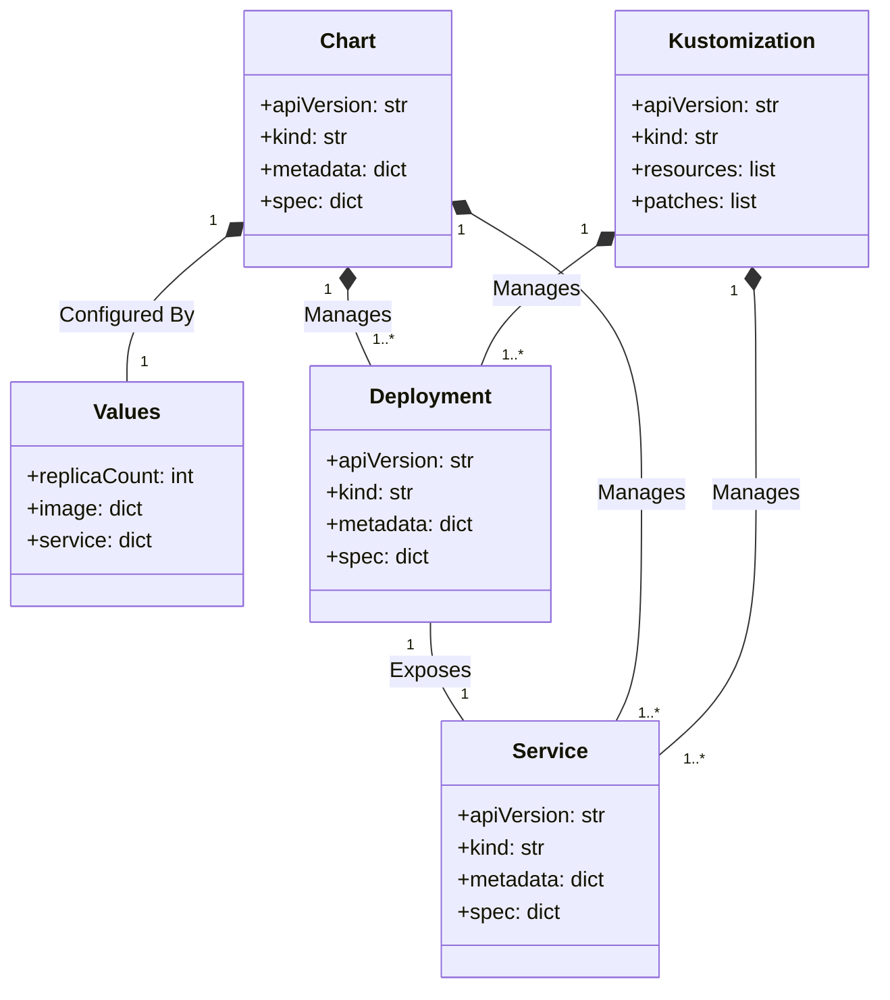
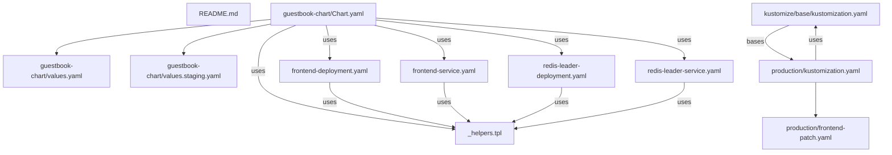
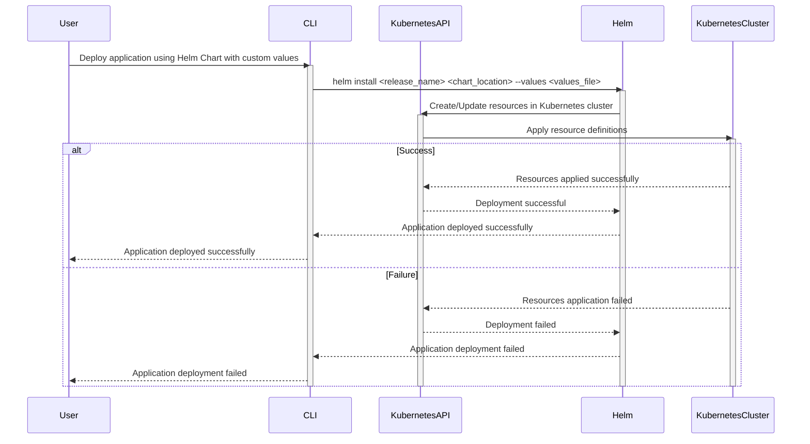
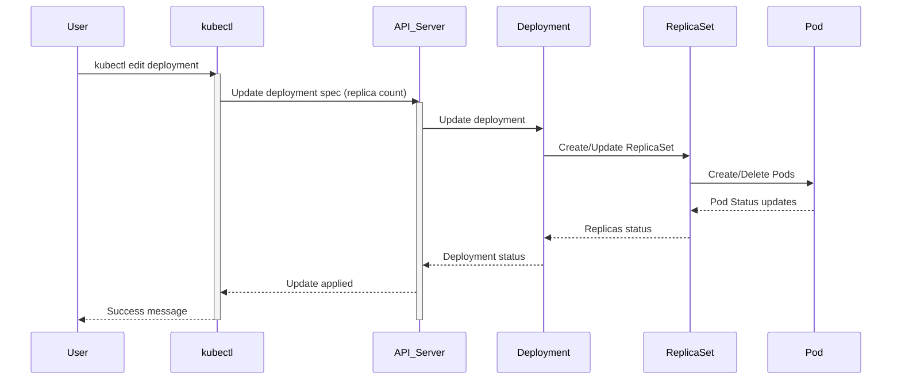
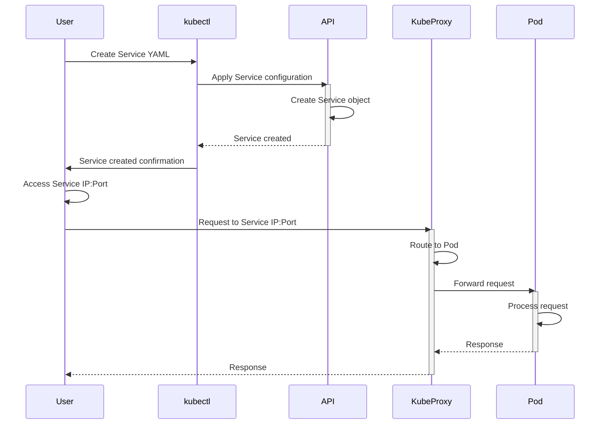
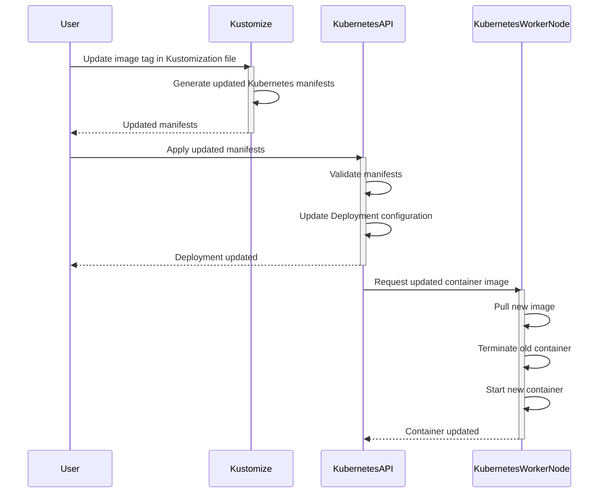
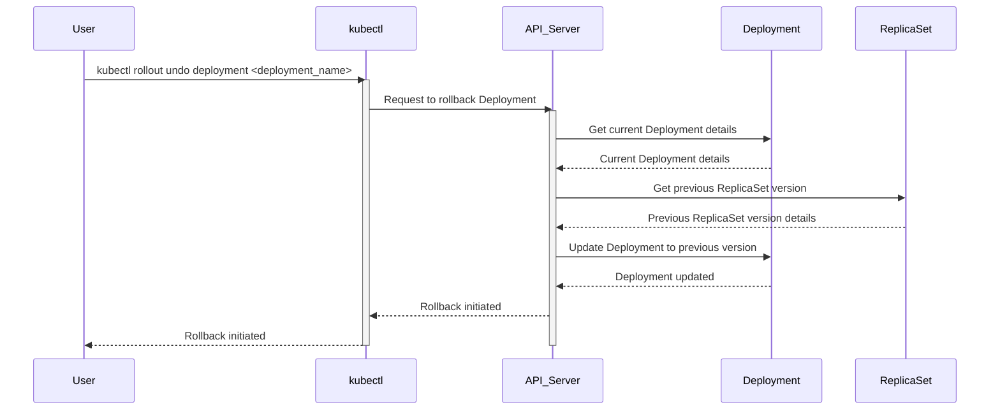

> Previously, we looked at [Values (Helm)](09_values-helm.md).

# Chapter 10: Architecture Diagrams
## Class Diagram
Key classes and their relationships in **20250707_1820_code-kubernetes-cfg-sample-project**.

## Package Dependencies
High-level module and package structure of **20250707_1820_code-kubernetes-cfg-sample-project**.

## Sequence Diagrams
These diagrams illustrate various interaction scenarios, showcasing operations between components for specific use cases.
### Deploying a new application using a Helm Chart with customized Values.

### Scaling a Deployment by updating the replica count.

### Exposing an application running in a Pod through a Service.

### Updating a Container Image in a Deployment via Kustomize.

### Rolling back a Deployment to a previous version after a failed update.

> Next, we will examine [Code Inventory](11_code_inventory.md).

---

*Generated by [SourceLens AI](https://github.com/openXFlow/sourceLensAI) using LLM: `gemini` (cloud) - model: `gemini-2.0-flash` | Language Profile: `Python`*