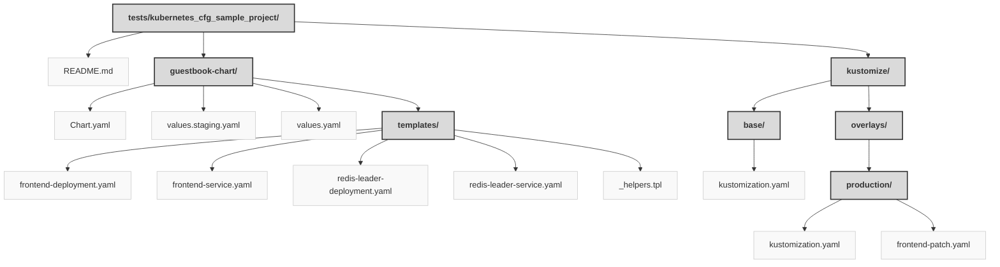

> Previously, we looked at [Architecture Diagrams](10_diagrams.md).

# Chapter 11: Code Inventory
## File Structure

## File Descriptions Summary
*   **`README.md`**: Kubernetes Guestbook Application Deployment
*   **`Chart.yaml`**: apiVersion: v2
*   **`values.staging.yaml`**: Staging specific values
*   **`values.yaml`**: Default values for guestbook chart.
*   **`frontend-deployment.yaml`**: apiVersion: apps/v1
*   **`frontend-service.yaml`**: apiVersion: v1
*   **`redis-leader-deployment.yaml`**: apiVersion: apps/v1
*   **`redis-leader-service.yaml`**: apiVersion: v1
*   **`_helpers.tpl`**: {{/*
*   **`kustomization.yaml`**: apiVersion: kustomize.config.k8s.io/v1beta1
*   **` kustomization.yaml`**: apiVersion: kustomize.config.k8s.io/v1beta1
*   **`frontend-patch.yaml`**: This patch increases the number of frontend replicas for production.
---
## Detailed File Content
No detailed structural information could be generated for the files based on the selected parser.

> Next, we will examine [Project Review](12_project_review.md).

---

*Generated by [SourceLens AI](https://github.com/openXFlow/sourceLensAI) using LLM: `gemini` (cloud) - model: `gemini-2.0-flash` | Language Profile: `Python`*