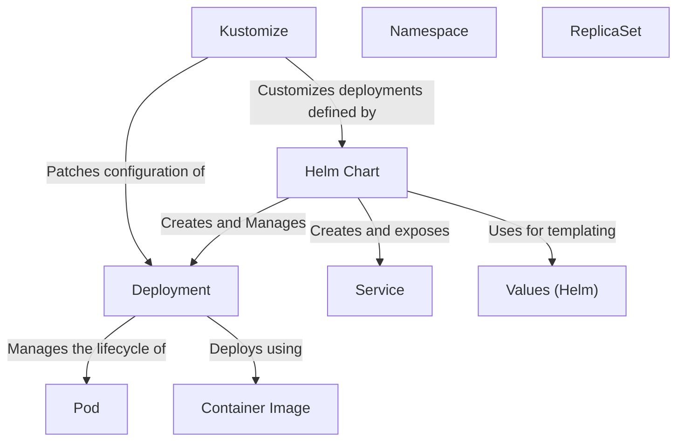

# Tutorial: 20250707_1820_code-kubernetes-cfg-sample-project

This project uses a *Helm Chart* to define and deploy a multi-tier guestbook application on Kubernetes. The Helm chart templates create Kubernetes resources like *Deployments* and *Services* for the frontend and Redis components.  *Kustomize* is then used to customize and manage these deployed resources, overriding configurations defined in the Helm chart's *Values*.

**Source Directory:** `C:\_jd_programming\python\11_sourceLens_project\sourceLens\tests\kubernetes_cfg_sample_project`

## Abstraction Relationships

## Chapters

1. [Container Image](01_container-image.md)
2. [Deployment](02_deployment.md)
3. [Helm Chart](03_helm-chart.md)
4. [Kustomize](04_kustomize.md)
5. [Namespace](05_namespace.md)
6. [Pod](06_pod.md)
7. [ReplicaSet](07_replicaset.md)
8. [Service](08_service.md)
9. [Values (Helm)](09_values-helm.md)
10. [Architecture Diagrams](10_diagrams.md)
11. [Code Inventory](11_code_inventory.md)
12. [Project Review](12_project_review.md)

---

*Generated by [SourceLens AI](https://github.com/openXFlow/sourceLensAI) using LLM: `gemini` (cloud) - model: `gemini-2.0-flash` | Language Profile: `Python`*