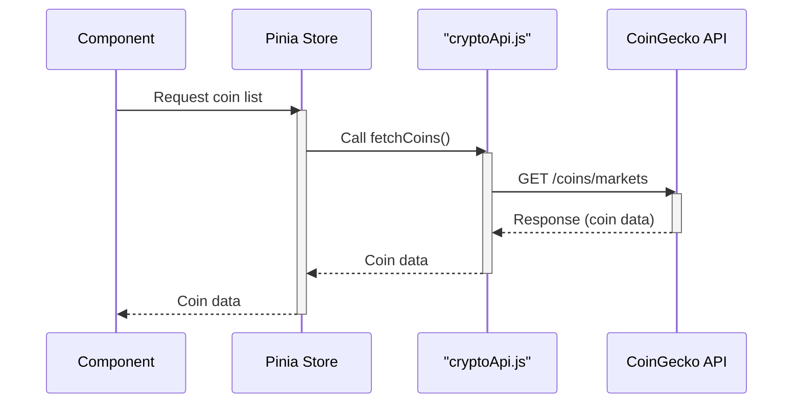

> Previously, we looked at the [Project Overview](index.md).

# Chapter 1: API Service Abstraction
Let's begin exploring this concept. In this chapter, we'll delve into the API Service Abstraction layer within our Vue.js project. This layer focuses on isolating and managing the communication with the external cryptocurrency API.
**Why This Abstraction?**
Imagine you're ordering food at a restaurant. You don't go to the kitchen yourself, prepare the ingredients, and cook the meal. Instead, you interact with a waiter/waitress (an abstraction layer) who takes your order and brings you the food. This abstraction simplifies the process for you, the customer.
Similarly, our application needs data from a cryptocurrency API. Instead of directly making API calls throughout our components, we use an API service abstraction. This abstraction offers several advantages:
*   **Code Reusability:** We can reuse the API interaction logic across multiple components.
*   **Separation of Concerns:** Components don't need to know the specifics of API endpoints or data formats. They simply request data from the service.
*   **Maintainability:** If the API changes (e.g., endpoint URL changes), we only need to update the service layer, not every component that uses the API.
*   **Testability:** We can easily mock the API service for testing purposes.
**Key Concepts**
The core component of our API Service Abstraction is the `cryptoApi.js` file located in the `src/services/` directory. It exports functions responsible for interacting with the CoinGecko API.
**Usage / How it Works**
The `cryptoApi.js` module provides functions like `fetchCoins` and `fetchCoinData`. These functions handle the following:
1.  **Constructing API Requests:** Building the correct URL and setting necessary parameters.
2.  **Sending HTTP Requests:** Using `axios` to make GET requests to the CoinGecko API.
3.  **Handling Responses:** Processing the API's response, including potential error handling (although error handling is primarily done in the Pinia store in this example).
4.  **Data Transformation (Optional):** Transforming the API's data into a format suitable for our application (in this case, the transformation is minimal).
The [Pinia Store](05_pinia-store.md) then imports and uses these functions to retrieve and manage cryptocurrency data.
**Code Examples**
Here's a snippet of the `cryptoApi.js` file:
```python
--- File: src/services/cryptoApi.js ---
import axios from 'axios';
const API_BASE_URL = 'https://api.coingecko.com/api/v3';
export async function fetchCoins() {
    const response = await axios.get(`${API_BASE_URL}/coins/markets`, {
        params: {
            vs_currency: 'usd',
            order: 'market_cap_desc',
            per_page: 50,
            page: 1,
        },
    });
    return response.data;
}
```
This `fetchCoins` function fetches a list of cryptocurrency coins from the CoinGecko API. It uses `axios` to make a GET request to the `/coins/markets` endpoint with specific query parameters to control the currency, ordering, and pagination. The function then returns the `response.data`, which is an array of coin objects.
Let's also look at the `fetchCoinData` function:
```python
--- File: src/services/cryptoApi.js ---
import axios from 'axios';
const API_BASE_URL = 'https://api.coingecko.com/api/v3';
export async function fetchCoinData(coinId) {
    const response = await axios.get(`${API_BASE_URL}/coins/${coinId}/market_chart`, {
        params: {
            vs_currency: 'usd',
            days: '30',
        },
    });
    return response.data;
}
```
This function fetches historical market data for a specific coin, identified by its `coinId`.  It makes a GET request to the `/coins/{coinId}/market_chart` endpoint, specifying the currency and the number of days of historical data to retrieve.
Here's an example of how the [Pinia Store](05_pinia-store.md) utilizes the abstraction:
```python
--- File: src/store.js ---
import { defineStore } from 'pinia';
import { fetchCoins } from './services/cryptoApi';
export const useCryptoStore = defineStore('crypto', {
  state: () => ({
    coins: [],
    loading: false,
    error: null,
  }),
  actions: {
    async getCoinList() {
      this.loading = true;
      this.error = null;
      try {
        this.coins = await fetchCoins();
      } catch (error) {
        this.error = 'Failed to fetch coin list.';
      } finally {
        this.loading = false;
      }
    },
  },
});
```
As you can see, the `getCoinList` action within the Pinia store simply calls `fetchCoins` from the `cryptoApi.js` module. The store handles the loading state and error handling, while the API service focuses solely on fetching the data.
**Communication Flow**

This sequence diagram illustrates how the component requests data, which is then handled by the Pinia store by using the `cryptoApi.js` module to make requests to the CoinGecko API.
This concludes our look at this topic.

> Next, we will examine [Pinia Store](02_pinia-store.md).


---

*Generated by [SourceLens AI](https://github.com/openXFlow/sourceLensAI) using LLM: `gemini` (cloud) - model: `gemini-2.0-flash` | Language Profile: `Python`*