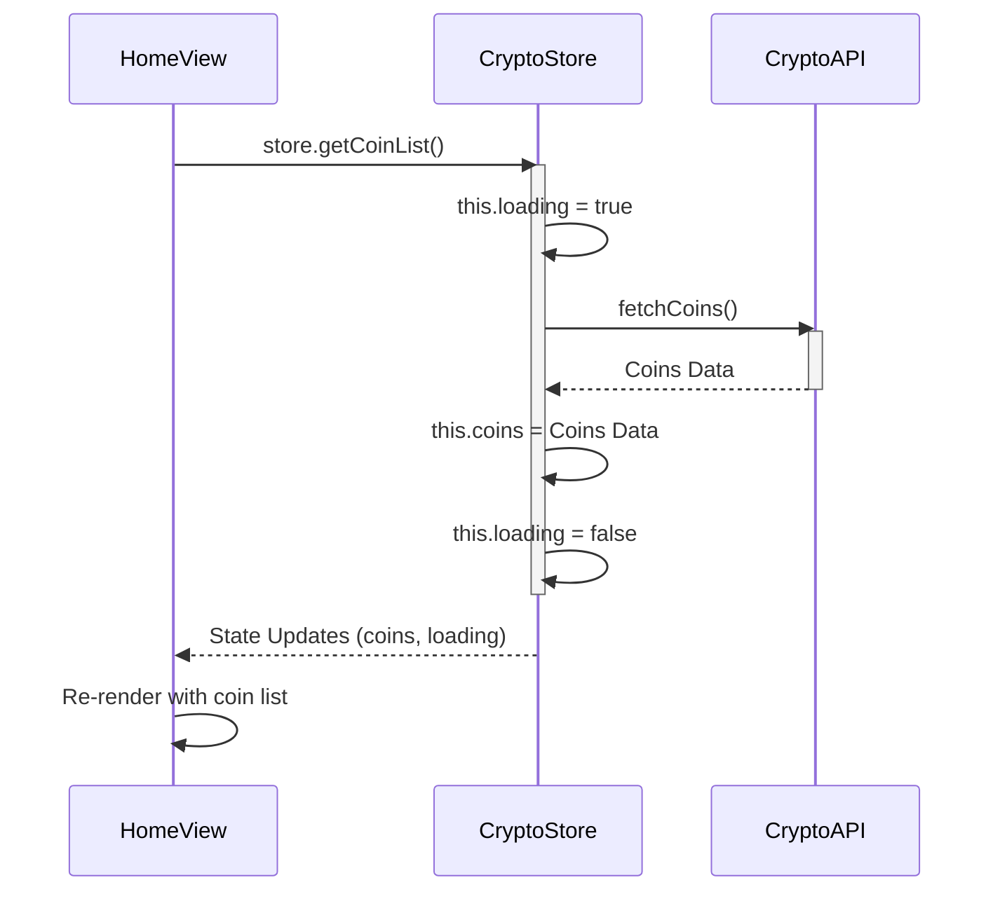

> Previously, we looked at [API Service Abstraction](01_api-service-abstraction.md).

# Chapter 2: Pinia Store
Let's begin exploring this concept. In this chapter, we will delve into the Pinia store, which serves as the centralized state management system for our Vue.js application. We'll cover its purpose, structure, and how it's used to manage application data like the cryptocurrency list.
**Why Pinia? The Central Data Hub**
Imagine your application as a city. Individual components are like buildings, each needing access to various resources like water, electricity, and information. Without a central hub, each building would have to independently manage its resources, leading to inefficiency and potential inconsistencies.
Pinia acts as that central hub, providing a single source of truth for your application's data. It simplifies state management, making it easier to share and update data across different components. Think of it like a well-organized database for your frontend application. It helps to avoid "prop drilling" (passing props down through multiple layers of components) and makes your code more maintainable.
**Key Concepts: State, Actions, and Getters (Implicit)**
A Pinia store consists primarily of two key parts:
*   **State:** This represents the data that your application needs to store and manage. In our case, it includes the list of cryptocurrencies (`coins`), a loading flag (`loading`), an error message (`error`), and the details of a selected coin (`selectedCoin`).
*   **Actions:** These are methods that you use to modify the state. They can be synchronous or asynchronous, allowing you to perform API calls, process data, and update the store's state accordingly. In our example, `getCoinList` fetches the list of coins from the API, and `getCoinDetails` fetches the details of a specific coin.
While not explicitly defined as "getters" in this simple example, Pinia also supports getters, which are computed properties for the store. They allow you to derive values from the state in a reactive and efficient manner. We aren't using getters directly in the provided code, but they are a crucial part of Pinia's capabilities for more complex data transformations.
**How it Works: Centralized Data Management**
The Pinia store works by providing a reactive data container that components can access and modify through defined actions.
Here's a breakdown of the general workflow:
1.  **Define the Store:** You create a Pinia store using `defineStore`, specifying a unique ID (e.g., `'crypto'`) and defining the `state` and `actions`.
2.  **Access the Store in Components:** Within a component, you import the store using `useCryptoStore()`. This provides access to the store's `state` and `actions`.
3.  **Read State:** Components can directly access the store's `state` properties to display data. Vue's reactivity system ensures that the component automatically re-renders whenever the state changes.
4.  **Dispatch Actions:** Components can call the store's `actions` to modify the state. These actions often involve fetching data from an API and updating the state accordingly.
Let's see the process with the `HomeView` and the store, with a `sequenceDiagram`

The diagram shows how the `HomeView` component interacts with the `CryptoStore` to fetch and display the list of coins. It visualizes the flow of data and the state updates.
**Code Examples: Defining and Using the Store**
First, let's look at how we define the Pinia store in `src/store.js`:
```python
--- File: src/store.js ---
import { defineStore } from 'pinia';
import { fetchCoins, fetchCoinData } from './services/cryptoApi';
export const useCryptoStore = defineStore('crypto', {
  state: () => ({
    coins: [],
    loading: false,
    error: null,
    selectedCoin: null,
  }),
  actions: {
    async getCoinList() {
      this.loading = true;
      this.error = null;
      try {
        this.coins = await fetchCoins();
      } catch (error) {
        this.error = 'Failed to fetch coin list.';
      } finally {
        this.loading = false;
      }
    },
    async getCoinDetails(id) {
        this.loading = true;
        this.error = null;
        try {
          this.selectedCoin = await fetchCoinData(id);
        } catch (error) {
          this.error = `Failed to fetch details for ${id}.`;
        } finally {
          this.loading = false;
        }
    },
  },
});
```
*   `defineStore('crypto', ...)`: Defines a store with the ID 'crypto'. This ID is used to connect the store across the application.
*   `state: () => ({ ... })`: Defines the store's state as a function that returns an object. This ensures that each component using the store gets its own isolated copy of the state, preventing unintended side effects.
*   `actions: { ... }`: Defines the actions that can be used to modify the state. `getCoinList` and `getCoinDetails` are asynchronous actions that fetch data from the API and update the state based on the response. They also handle loading states and errors.
Now, let's see how we use the store in `src/views/HomeView.vue`:
```python
--- File: src/views/HomeView.vue ---
<template>
  <div class="home">
    <h1>Crypto Dashboard</h1>
    <LoadingSpinner v-if="store.loading" />
    <div v-if="store.error">{{ store.error }}</div>
    <CryptoTable v-if="!store.loading && store.coins.length" :coins="store.coins" />
  </div>
</template>
<script>
import { useCryptoStore } from '../store';
import CryptoTable from '../components/CryptoTable.vue';
import LoadingSpinner from '../components/LoadingSpinner.vue';
export default {
  components: { CryptoTable, LoadingSpinner },
  setup() {
    const store = useCryptoStore();
    store.getCoinList();
    return { store };
  },
};
</script>
```
*   `import { useCryptoStore } from '../store';`: Imports the `useCryptoStore` function, which allows us to access the store.
*   `const store = useCryptoStore();`: Calls `useCryptoStore()` to get an instance of the store.
*   `store.getCoinList();`: Calls the `getCoinList` action to fetch the list of coins when the component is mounted.
*   The template uses `store.loading`, `store.error`, and `store.coins` to display the data and handle loading and error states.
The same pattern is used in `CoinDetailView.vue` to display details about a selected cryptocurrency.
**Relationships & Cross-Linking**
The Pinia store is closely related to the [API Service Abstraction](04_api-service-abstraction.md) chapter, as it relies on the API service to fetch data. The store then manages this data and makes it available to the [Vue Components](02_vue-components.md) used in the [Views](06_views.md). The [Vue Instance](01_vue-instance.md) initializes Pinia, and the [Vue Router](03_vue-router.md) often triggers store actions based on navigation.
**Conclusion**
The Pinia store provides a centralized and reactive way to manage your application's state, making it easier to share and update data across components. By understanding the concepts of state, actions, and getters, you can effectively use Pinia to build more maintainable and scalable Vue.js applications.
This concludes our look at this topic.

> Next, we will examine [Views](03_views.md).


---

*Generated by [SourceLens AI](https://github.com/openXFlow/sourceLensAI) using LLM: `gemini` (cloud) - model: `gemini-2.0-flash` | Language Profile: `Python`*