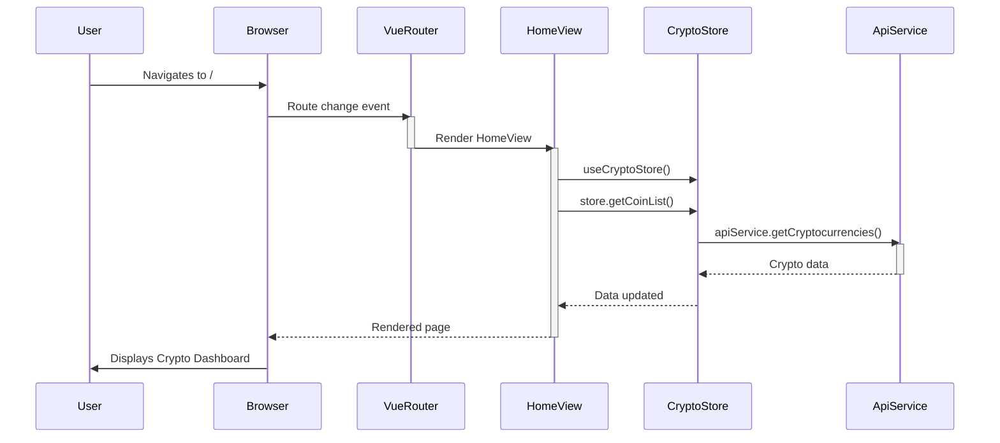

> Previously, we looked at [Pinia Store](02_pinia-store.md).

# Chapter 3: Views
Let's begin exploring this concept. In this chapter, we'll delve into the "Views" of our Vue.js application, focusing on their role in structuring the user interface and how they orchestrate components to create complete pages.
**Why Views? The Stage for Our Components**
Think of a theater production. Components are like the actors, each with their specific role and lines. The "Views" are the stages where these actors perform. Each stage (or view) represents a different scene or section of the play (the application), bringing together the necessary actors (components) to deliver that scene.
In our application, views provide a high-level structure for different sections of the app, such as the homepage or the cryptocurrency details page. They handle the overall layout and data flow specific to that page, ensuring a coherent user experience. Without views, our components would be floating in isolation, lacking a clear purpose and organization within the application.
**Key Concepts: Views as Orchestrators**
Views are essentially Vue components, but they serve a specific purpose:
1.  **Route Association:** Views are directly linked to routes defined in our [Vue Router](03_vue-router.md) configuration. When a user navigates to a specific route, the corresponding view is rendered. This is what allows the SPA to switch between logical 'pages'.
2.  **Component Composition:** Views act as containers, bringing together multiple reusable [Vue Components](02_vue-components.md) to create a complete page. They dictate how these components are arranged and interact with each other.
3.  **Data Fetching (Often Delegated):** Views are responsible for initiating the data fetching process. While the actual data retrieval is often handled by our [API Service Abstraction](04_api-service-abstraction.md) and managed by the [Pinia Store](05_pinia-store.md), the view triggers this process when the page loads.
4. **Presentation Logic:** Views mainly concentrate on controlling layout, composition of components, and initiating data retrieval. They aim to remain relatively "thin" regarding business logic, delegating such logic to components, services, or the store.
**How Views Work: A Page's Blueprint**
When a user visits a specific route (e.g., `/`), the Vue Router renders the associated view. The view then mounts its child components and initiates data fetching, often using the Pinia store. The fetched data is then passed down to the components as props, enabling them to render the dynamic content. Let's consider the `HomeView` as an example.
```python
--- File: src/views/HomeView.vue ---
<template>
  <div class="home">
    <h1>Crypto Dashboard</h1>
    <LoadingSpinner v-if="store.loading" />
    <div v-if="store.error">{{ store.error }}</div>
    <CryptoTable v-if="!store.loading && store.coins.length" :coins="store.coins" />
  </div>
</template>
<script>
import { useCryptoStore } from '../store';
import CryptoTable from '../components/CryptoTable.vue';
import LoadingSpinner from '../components/LoadingSpinner.vue';
export default {
  components: { CryptoTable, LoadingSpinner },
  setup() {
    const store = useCryptoStore();
    store.getCoinList();
    return { store };
  },
};
</script>
```
In this code:
1.  The `HomeView` imports the `CryptoTable` and `LoadingSpinner` components.
2.  Inside the `setup` function, it retrieves the `useCryptoStore` and calls `store.getCoinList()` to initiate fetching the cryptocurrency list when the view is mounted.
3.  The template displays a loading spinner or an error message based on the store's state. If the data is loaded successfully, it renders the `CryptoTable` component, passing the list of coins as a prop.
Here's how it roughly works in a sequence diagram.

The user navigates, the Vue Router tells the HomeView to render, the HomeView gets data from the CryptoStore (which uses the ApiService), and the HomeView renders the page.
**Coin Detail View**
The `CoinDetailView` works similarly, fetching details for a specific cryptocurrency based on the `id` passed as a prop from the route.
```python
--- File: src/views/CoinDetailView.vue ---
<template>
  <div class="coin-detail">
    <button @click="$router.back()">Back</button>
    <h2>Details for {{ id }}</h2>
    <LoadingSpinner v-if="store.loading" />
    <div v-if="store.error">{{ store.error }}</div>
    <CryptoChart v-if="store.selectedCoin" :chart-data="store.selectedCoin.prices" />
  </div>
</template>
<script>
import { useCryptoStore } from '../store';
import CryptoChart from '../components/CryptoChart.vue';
import LoadingSpinner from '../components/LoadingSpinner.vue';
export default {
  props: ['id'],
  components: { CryptoChart, LoadingSpinner },
  setup(props) {
    const store = useCryptoStore();
    store.getCoinDetails(props.id);
    return { store };
  },
};
</script>
```
**Key Takeaways**
Views provide a structural foundation for our application, acting as containers for components and facilitating data flow. They are the bridge between routes and the user interface, ensuring that the right content is displayed at the right time. They initiate data fetching and manage the overall layout of each page.
This concludes our look at this topic.

> Next, we will examine [Vue Components](04_vue-components.md).


---

*Generated by [SourceLens AI](https://github.com/openXFlow/sourceLensAI) using LLM: `gemini` (cloud) - model: `gemini-2.0-flash` | Language Profile: `Python`*