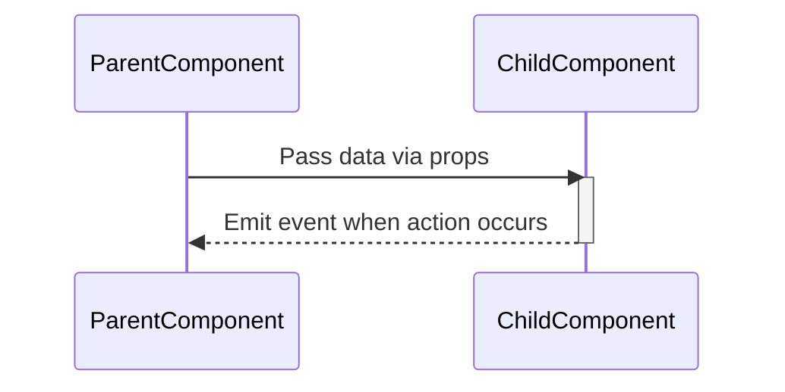

> Previously, we looked at [Views](03_views.md).

# Chapter 4: Vue Components
Let's begin exploring this concept. This chapter will introduce you to Vue Components, the reusable building blocks of our application's user interface in the `20250707_1829_code-vue-js-frontend-sample-project`. We'll cover what they are, why they're important, and how they work within the context of this project.
**Why Vue Components?**
Think of Vue components as LEGO bricks. Each brick represents a specific UI element (like a button, a table, or a chart), and you can combine these bricks to build complex interfaces. Instead of writing the same HTML, CSS, and JavaScript code repeatedly for each similar element, you can create a component once and reuse it throughout your application.
This promotes code reusability, maintainability, and a more organized project structure. It also allows for easier testing and debugging, as you can isolate and test each component individually.
**Key Concepts**
*   **Reusability:** Components can be used multiple times in different parts of your application.
*   **Encapsulation:** Components encapsulate their own HTML structure, CSS styling, and JavaScript logic, preventing conflicts and making them self-contained.
*   **Props:** Components receive data from their parent components through *props*. Props are like arguments passed to a function.
*   **Events:** Components can emit events to communicate with their parent components. Events are like signals that indicate a specific action or state change.
**How Vue Components Work**
A Vue component is essentially a JavaScript object that defines the structure, behavior, and appearance of a UI element. It typically includes:
*   **Template:** The HTML markup that defines the component's structure.
*   **Script:** The JavaScript code that handles the component's logic, data, and methods.
*   **Style:** The CSS styles that define the component's appearance.
Components are defined in `.vue` files, which use a special syntax to combine HTML, JavaScript, and CSS within a single file.
**Code Examples**
Let's look at some examples from our project:
*   `CryptoTable.vue`: This component displays a table of cryptocurrency data.
*   `CryptoChart.vue`: This component renders a chart showing cryptocurrency price history.
*   `LoadingSpinner.vue`: This component displays a loading spinner while data is being fetched.
Here's a simplified example of `CryptoTable.vue`:
```python
--- File: src/components/CryptoTable.vue ---
<template>
  <table>
    <thead>
      <tr>
        <th>Name</th>
        <th>Price (USD)</th>
      </tr>
    </thead>
    <tbody>
      <tr v-for="coin in coins" :key="coin.id">
        <td>{{ coin.name }}</td>
        <td>{{ coin.current_price }}</td>
      </tr>
    </tbody>
  </table>
</template>
<script>
export default {
  props: ['coins'] // 'coins' is a prop
};
</script>
```
In this example:
*   `<template>`: Defines the HTML structure of the table.
*   `v-for`:  A Vue directive that iterates over the `coins` array.
*   `props: ['coins']`: Declares that the component receives a prop named `coins`, which is an array of cryptocurrency objects. The parent component passes the `coins` data *into* the CryptoTable component via this prop.
Here's `CryptoChart.vue`:
```python
--- File: src/components/CryptoChart.vue ---
<template>
  <div class="chart-container">
    <Line :data="chartDataFormatted" :options="chartOptions" />
  </div>
</template>
<script>
import { Line } from 'vue-chartjs';
// ... other imports ...
export default {
  name: 'CryptoChart',
  components: { Line },
  props: {
    chartData: {
      type: Array,
      required: true,
    },
    coinId: {
      type: String,
      required: true,
    }
  },
  computed: {
    chartDataFormatted() {
      // ... format chart data ...
    },
    chartOptions() {
      // ... define chart options ...
    },
  },
};
</script>
<style scoped>
.chart-container {
  position: relative;
  height: 400px;
  width: 100%;
}
</style>
```
Key aspects of `CryptoChart.vue`:
*   It uses the `vue-chartjs` library to render a line chart.
*   It takes two props: `chartData` (the historical price data) and `coinId` (the ID of the cryptocurrency). These are configured to be `required`.
*   It uses computed properties (`chartDataFormatted`, `chartOptions`) to format the data and configure the chart.
And the simple `LoadingSpinner.vue`:
```python
--- File: src/components/LoadingSpinner.vue ---
<template>
  <div class="spinner-overlay">
    <div class="spinner"></div>
    <p>Loading data...</p>
  </div>
</template>
<script>
export default {
  name: 'LoadingSpinner',
};
</script>
<style scoped>
/* Styles for the spinner */
</style>
```
This component is purely presentational, meaning it doesn't receive any props or emit any events. It simply displays a loading spinner using HTML and CSS.
**Component Communication - Illustration via Mermaid Diagram**
Consider how components interact. The diagram below illustrates parent-child communication via props (data flow) and events.

This simple diagram shows:
1.  The ParentComponent passes data to the ChildComponent via props.
2.  The ChildComponent emits an event back to the ParentComponent when a specific action takes place.
**Relationships to Other Concepts**
Vue Components are crucial for constructing `Views` (covered in [Views](06_views.md)), which represent different pages or sections of the application. Components also utilize the data fetched by the `API Service Abstraction` (covered in [API Service Abstraction](04_api-service-abstraction.md)) and managed by the `Pinia Store` (covered in [Pinia Store](05_pinia-store.md)). Finally, the `Vue Router` (covered in [Vue Router](03_vue-router.md)) helps manage which `Views` (which use Components) are displayed. The `Vue Instance` (covered in [Vue Instance](01_vue-instance.md)) is the root of the application, which mounts all components and handles the overall structure.
This concludes our look at this topic.

> Next, we will examine [Vue Instance](05_vue-instance.md).


---

*Generated by [SourceLens AI](https://github.com/openXFlow/sourceLensAI) using LLM: `gemini` (cloud) - model: `gemini-2.0-flash` | Language Profile: `Python`*