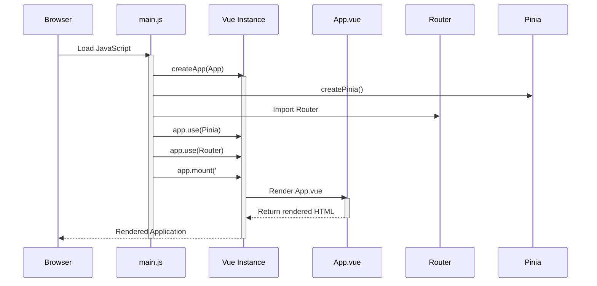

> Previously, we looked at [Vue Components](04_vue-components.md).

# Chapter 5: Vue Instance
Let's begin exploring this concept. This chapter will explain the Vue Instance, which is the foundation of our application.
**Motivation/Purpose:**
Think of the Vue Instance as the "brain" of our application. It's the central point that manages and orchestrates all the other parts – components, routing, data storage, and the user interface. Without it, we'd just have a collection of disconnected pieces. It's analogous to a conductor in an orchestra; the conductor brings together individual musicians (components) to create a harmonious performance (application). It initializes the application and connects all plugins.
**Key Concepts Breakdown:**
The Vue Instance primarily involves these key elements:
*   **`createApp(App)`:** This function, imported from `vue`, creates the root Vue application instance. It takes a root component (`App` in our case) as its argument.
*   **Root Component (`App.vue`):** This is the top-level component that contains all other components in our application. It acts as the container for the application's structure and user interface. We will dive deeper into [Vue Components](02_vue-components.md) in the next chapter.
*   **Plugins (Pinia & Router):** These are extensions that add functionality to our application. In this project, we use Pinia for state management and Vue Router for navigation. We will look at the [Pinia Store](05_pinia-store.md) and [Vue Router](03_vue-router.md) later on.
*   **`app.use()`:** This method is used to install plugins into the Vue application instance.
*   **`app.mount('#app')`:** This method mounts the Vue application instance to a specific DOM element in our HTML. In our case, it's the element with the ID `app`.
**Usage / How it Works:**
The Vue Instance is created and initialized in `src/main.js`. This file is the entry point for our application. It's responsible for creating the Vue Instance, registering plugins, and mounting the application to the DOM.
The process is as follows:
1.  We import the necessary modules: `createApp` from `vue`, `createPinia` from `pinia`, our root component `App.vue`, and the router instance.
2.  We create a new Vue application instance using `createApp(App)`.
3.  We create a Pinia store using `createPinia()`.
4.  We register the Pinia and Router plugins using `app.use(pinia)` and `app.use(router)`.
5.  Finally, we mount the application to the DOM element with the ID `app` using `app.mount('#app')`. This tells Vue to take control of that element and render the application within it.
**Code Examples (Short & Essential):**
Here's the relevant code from `src/main.js`:
```python
--- File: src/main.js ---
import { createApp } from 'vue';
import { createPinia } from 'pinia';
import App from './App.vue';
import router from './router';
const app = createApp(App);
const pinia = createPinia();
app.use(pinia);
app.use(router);
app.mount('#app');
```
And here is the relevant part from `public/index.html`:
```python
--- File: public/index.html ---
    <div id="app"></div>
```
The code above shows that the `app` Vue Instance is mounted onto the div element with the id of "app".
**Inline Diagrams (Optional):**
Below is a simple sequence diagram illustrating the initialization process.

This diagram illustrates how `main.js` orchestrates the creation of the Vue Instance, the initialization of Pinia and the Router, and the mounting of the application onto the DOM.
**Relationships & Cross-Linking:**
As mentioned earlier, the Vue Instance works closely with [Vue Components](02_vue-components.md), the [Vue Router](03_vue-router.md), and the [Pinia Store](05_pinia-store.md). It uses components to build the user interface, the router to handle navigation, and Pinia to manage application state.
**Conclusion:**
The Vue Instance is the core of our application. It ties together all the different parts and makes our application functional. It handles the creation and mounting of the app, and integrates the plugins. Understanding the Vue Instance is fundamental to understanding the overall structure of the `20250707_1829_code-vue-js-frontend-sample-project`. This concludes our look at this topic.

> Next, we will examine [Vue Router](06_vue-router.md).


---

*Generated by [SourceLens AI](https://github.com/openXFlow/sourceLensAI) using LLM: `gemini` (cloud) - model: `gemini-2.0-flash` | Language Profile: `Python`*