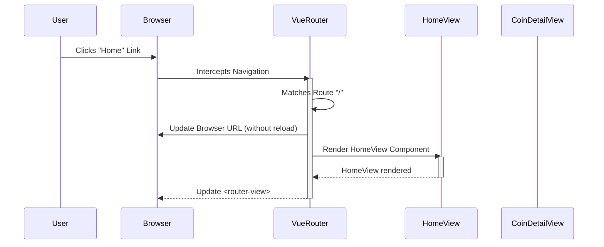

> Previously, we looked at [Vue Instance](05_vue-instance.md).

# Chapter 6: Vue Router
Let's begin exploring this concept. This chapter will explain the Vue Router, a critical component for building Single Page Applications (SPAs) with Vue.js. We'll cover its purpose, how it works, and see it in action within our sample project.
**Why Vue Router?**
Imagine browsing a traditional website. Each time you click a link, the browser requests a new page from the server. This results in a full page reload, which can be slow and disruptive.
Now, think of a desktop application. Navigation is typically instantaneous because the application loads all its essential parts at startup. An SPA aims for a similar experience in the browser.
Vue Router makes this possible by allowing us to change what the user sees without reloading the entire page. It acts as a traffic controller, mapping URLs to specific components, which are then displayed in a designated area of the page. It provides the illusion of navigating between separate pages while actually dynamically updating the content within a single web page. This significantly improves the user experience.
**Key Concepts**
At its core, Vue Router manages a mapping between URLs (routes) and Vue components. This mapping is defined in `src/router.js`.
*   **Routes:** Each route is an object that defines a `path` (the URL) and a `component` (the Vue component to display when that URL is visited).
*   **Router Instance:** The `createRouter` function creates a router instance that manages the routes and navigation.
*   **`router-link`:** This is a Vue component used in templates to create links that trigger navigation within the application. Instead of standard HTML `<a href="...">` tags, use `<router-link to="...">`.
*   **`router-view`:** This is a Vue component that acts as a placeholder where the matched component for the current route is rendered.
**How it Works**
1.  The user clicks a `<router-link>`.
2.  Vue Router intercepts the click and updates the URL in the browser's address bar *without* triggering a full page reload.
3.  Based on the new URL, Vue Router finds the matching route in its configuration.
4.  The corresponding component for that route is rendered within the `<router-view>`.
**Code Examples**
Here's the essential part of `src/router.js`:
```python
--- File: src/router.js ---
import { createRouter, createWebHistory } from 'vue-router';
import HomeView from './views/HomeView.vue';
import CoinDetailView from './views/CoinDetailView.vue';
const routes = [
  {
    path: '/',
    name: 'home',
    component: HomeView,
  },
  {
    path: '/coin/:id',
    name: 'coin-detail',
    component: CoinDetailView,
    props: true,
  },
];
const router = createRouter({
  history: createWebHistory(),
  routes,
});
export default router;
```
*Explanation:*
*   `routes`: An array of route objects.
*   `path: '/'`: Matches the root URL (e.g., `http://localhost:8080/`).
*   `component: HomeView`: Specifies that the `HomeView` component should be rendered when the root URL is visited.
*   `path: '/coin/:id'`: Matches URLs like `/coin/123` where `123` is a dynamic parameter representing the coin ID.
*   `props: true`: Passes the `:id` parameter as a prop to the `CoinDetailView` component. This makes it easily accessible inside the component.
And here's a snippet of `src/App.vue` where the router is used:
```python
--- File: src/App.vue ---
<template>
  <div id="app">
    <nav>
      <router-link to="/">Home</router-link>
    </nav>
    <router-view/>
  </div>
</template>
```
*Explanation:*
*   `<router-link to="/">`: Creates a link that navigates to the root path.
*   `<router-view/>`:  A placeholder where the component associated with the current route will be rendered.
We can visualize the interaction with a sequence diagram:

This diagram shows how Vue Router intercepts navigation events, matches routes, and renders the corresponding components.
**Relationships & Cross-Linking**
The Vue Router relies on the [Vue Components](02_vue-components.md) that it renders. It is initialized and used within the [Vue Instance](01_vue-instance.md) in `main.js`. The `CoinDetailView` uses data that could be provided by the [API Service Abstraction](04_api-service-abstraction.md) (though not shown in this simplified example) and/or managed in a [Pinia Store](05_pinia-store.md). The actual components that are rendered by the router live under [Views](06_views.md).
**Conclusion**
Vue Router is essential for building SPAs with Vue.js. It provides client-side navigation without full page reloads, resulting in a smoother and faster user experience. By understanding its key concepts – routes, the router instance, `router-link`, and `router-view` – you can effectively manage navigation within your Vue applications.
This concludes our look at this topic.

> Next, we will examine [Architecture Diagrams](07_diagrams.md).


---

*Generated by [SourceLens AI](https://github.com/openXFlow/sourceLensAI) using LLM: `gemini` (cloud) - model: `gemini-2.0-flash` | Language Profile: `Python`*