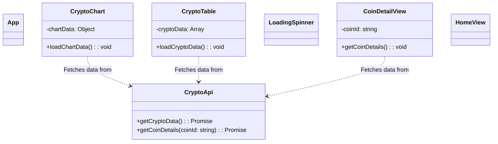
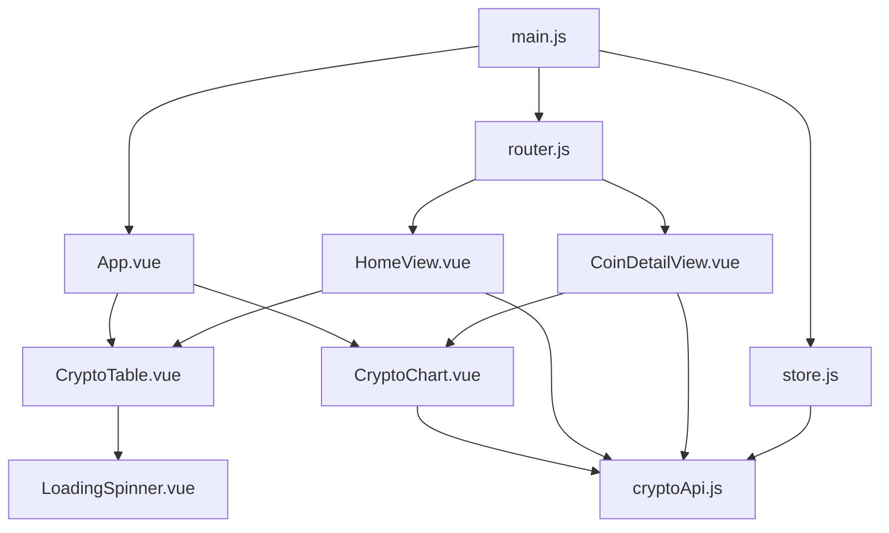
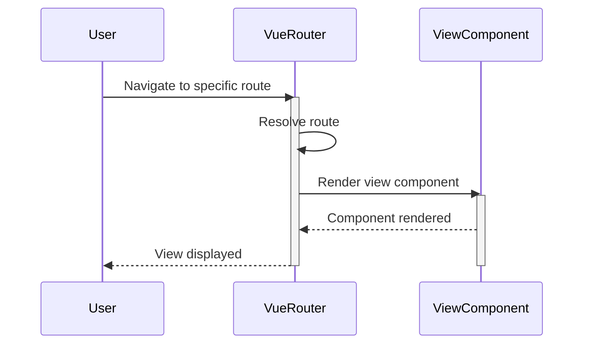
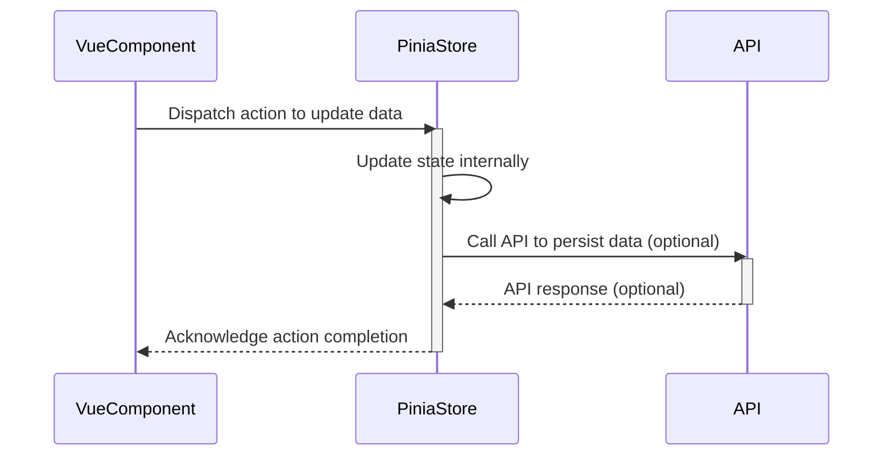
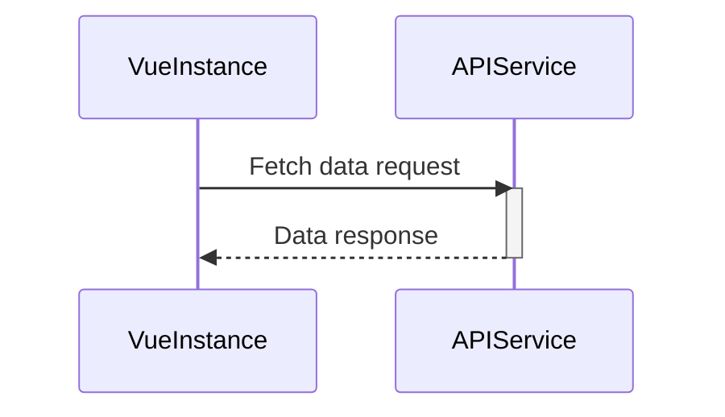
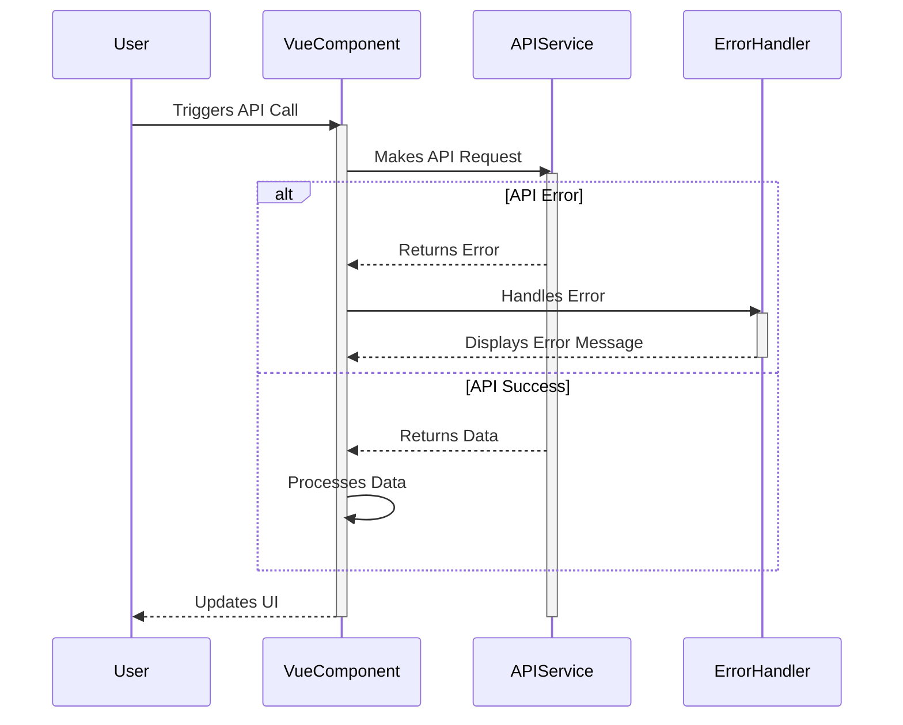
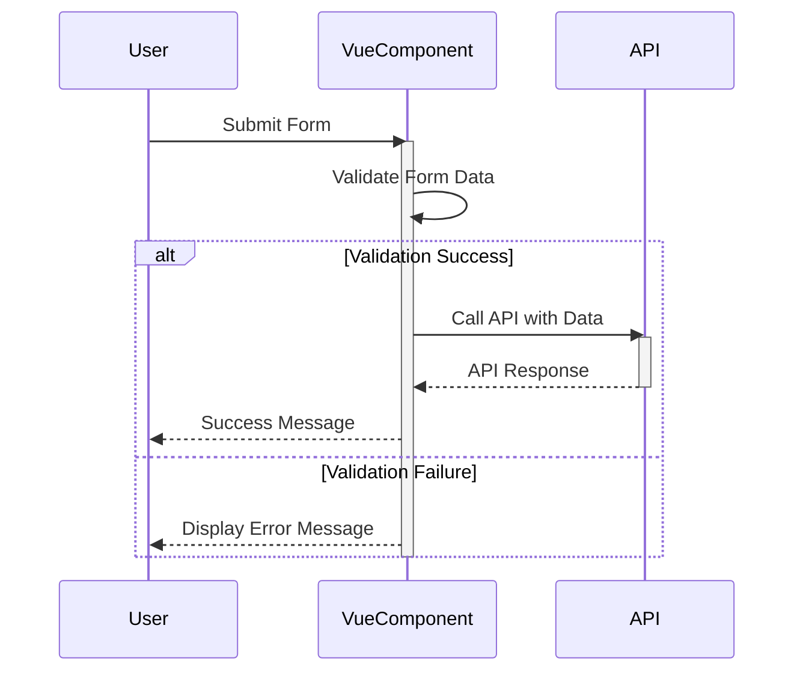

> Previously, we looked at [Vue Router](06_vue-router.md).

# Chapter 7: Architecture Diagrams
## Class Diagram
Key classes and their relationships in **20250707_1829_code-vue-js-frontend-sample-project**.

## Package Dependencies
High-level module and package structure of **20250707_1829_code-vue-js-frontend-sample-project**.

## Sequence Diagrams
These diagrams illustrate various interaction scenarios, showcasing operations between components for specific use cases.
### User navigates to a specific view using the Vue Router.

### A Vue Component dispatches an action to update data in the Pinia Store.

### The Vue Instance makes a request to the API Service to fetch data.

### API Service returns an error, triggering an error handling flow in the Vue Component.

### User submits a form which triggers validation by a Vue Component and subsequent API call.

> Next, we will examine [Code Inventory](08_code_inventory.md).

---

*Generated by [SourceLens AI](https://github.com/openXFlow/sourceLensAI) using LLM: `gemini` (cloud) - model: `gemini-2.0-flash` | Language Profile: `Python`*