> Previously, we looked at [Architecture Diagrams](07_diagrams.md).

# Chapter 8: Code Inventory
## File Structure

```mermaid
graph TD
    ROOT_DIR_MERMAID_0[tests/vue_js_frontend_sample_project/]
    FILE_0[package.json]
    FILE_1[README.md]
    FILE_2[index.html]
    FILE_3[App.vue]
    FILE_4[main.js]
    FILE_5[router.js]
    FILE_6[store.js]
    FILE_7[CryptoChart.vue]
    FILE_8[CryptoTable.vue]
    FILE_9[LoadingSpinner.vue]
    FILE_10[cryptoApi.js]
    FILE_11[CoinDetailView.vue]
    FILE_12[HomeView.vue]
    DIR_public_1[public/]
    DIR_src_2[src/]
    DIR_src_components_3[components/]
    DIR_src_services_4[services/]
    DIR_src_views_5[views/]
    ROOT_DIR_MERMAID_0 --> DIR_public_1
    DIR_public_1 --> FILE_2
    ROOT_DIR_MERMAID_0 --> DIR_src_2
    DIR_src_2 --> DIR_src_components_3
    DIR_src_components_3 --> FILE_7
    DIR_src_components_3 --> FILE_8
    DIR_src_components_3 --> FILE_9
    DIR_src_2 --> DIR_src_services_4
    DIR_src_services_4 --> FILE_10
    DIR_src_2 --> DIR_src_views_5
    DIR_src_views_5 --> FILE_11
    DIR_src_views_5 --> FILE_12
    DIR_src_2 --> FILE_3
    DIR_src_2 --> FILE_4
    DIR_src_2 --> FILE_5
    DIR_src_2 --> FILE_6
    ROOT_DIR_MERMAID_0 --> FILE_0
    ROOT_DIR_MERMAID_0 --> FILE_1
    %% Styling for better readability
    classDef dir fill:#dadada,stroke:#333,stroke-width:2px,color:#333,font-weight:bold;
    classDef file fill:#f9f9f9,stroke:#ccc,stroke-width:1px,color:#333;
    class ROOT_DIR_MERMAID_0 dir;
    class FILE_0 file;
    class FILE_1 file;
    class FILE_2 file;
    class FILE_3 file;
    class FILE_4 file;
    class FILE_5 file;
    class FILE_6 file;
    class FILE_7 file;
    class FILE_8 file;
    class FILE_9 file;
    class FILE_10 file;
    class FILE_11 file;
    class FILE_12 file;
    class DIR_public_1 dir;
    class DIR_src_2 dir;
    class DIR_src_components_3 dir;
    class DIR_src_services_4 dir;
    class DIR_src_views_5 dir;
```

## File Descriptions Summary
*   **`package.json`**: {
*   **`README.md`**: Vue.js Crypto Dashboard
*   **`index.html`**: <!DOCTYPE html>
*   **`App.vue`**: <template>
*   **`main.js`**: import { createApp } from 'vue';
*   **`router.js`**: import { createRouter, createWebHistory } from 'vue-router';
*   **`store.js`**: import { defineStore } from 'pinia';
*   **`CryptoChart.vue`**: <template>
*   **`CryptoTable.vue`**: <template>
*   **`LoadingSpinner.vue`**: <template>
*   **`cryptoApi.js`**: import axios from 'axios';
*   **`CoinDetailView.vue`**: <template>
*   **`HomeView.vue`**: <template>
---
## Detailed File Content
No detailed structural information could be generated for the files based on the selected parser.

> Next, we will examine [Project Review](09_project_review.md).

---

*Generated by [SourceLens AI](https://github.com/openXFlow/sourceLensAI) using LLM: `gemini` (cloud) - model: `gemini-2.0-flash` | Language Profile: `Python`*