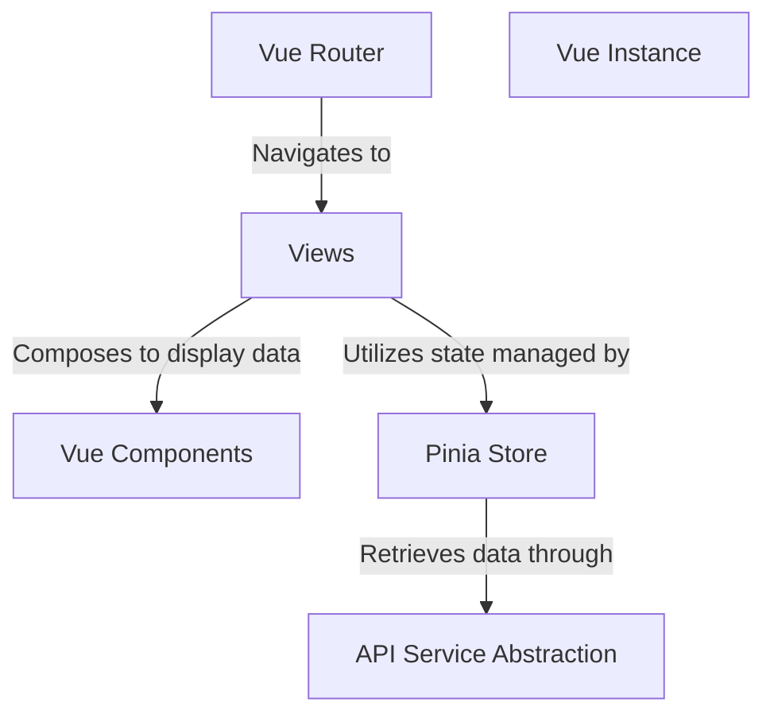

# Tutorial: 20250707_1829_code-vue-js-frontend-sample-project

The Vue application fetches and displays cryptocurrency data. The **Vue Router** directs users to different *Views*, which then use the **Pinia Store** to manage application state. The **Pinia Store** interacts with the *API Service* to retrieve data that is presented in *Vue Components*.

**Source Directory:** `C:\_jd_programming\python\11_sourceLens_project\sourceLens\tests\vue_js_frontend_sample_project`

## Abstraction Relationships

## Chapters

1. [API Service Abstraction](01_api-service-abstraction.md)
2. [Pinia Store](02_pinia-store.md)
3. [Views](03_views.md)
4. [Vue Components](04_vue-components.md)
5. [Vue Instance](05_vue-instance.md)
6. [Vue Router](06_vue-router.md)
7. [Architecture Diagrams](07_diagrams.md)
8. [Code Inventory](08_code_inventory.md)
9. [Project Review](09_project_review.md)

---

*Generated by [SourceLens AI](https://github.com/openXFlow/sourceLensAI) using LLM: `gemini` (cloud) - model: `gemini-2.0-flash` | Language Profile: `Python`*