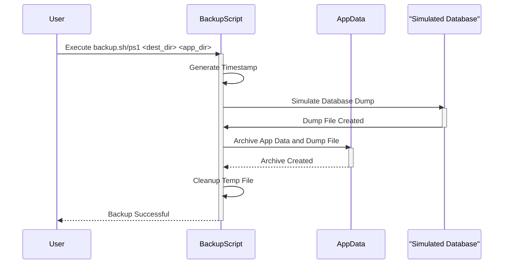

> Previously, we looked at the [Project Overview](index.md).

# Chapter 1: Backup Script
Let's begin exploring this concept. This chapter dives into the backup script, a crucial component for data protection within our application. We'll examine its purpose, how it operates, and the code behind it.
**Why a Backup Script?**
Imagine you're meticulously crafting a Lego masterpiece. A sudden table bump could scatter the bricks, potentially losing hours of work. A backup script is like taking a photograph of your Lego creation at regular intervals. If disaster strikes, you have a recent image to rebuild from, minimizing data loss. In our context, the "Lego creation" represents our application's data and simulated database. The backup script automates the process of creating these "photographs" or backups, ensuring we can recover our application in case of unforeseen issues.
**Key Concepts Breakdown**
The backup script handles several core tasks:
1.  **Timestamping:** Attaching a unique timestamp to each backup file ensures we can easily identify and manage different backup versions. This allows us to restore to a specific point in time.
2.  **Archiving and Compression:**  Combining all the relevant data and the database (simulated in this project) into a single archive file (`.tar.gz` on Linux, `.zip` on Windows) and then compressing it significantly reduces storage space and simplifies the backup process.
3.  **Data Source:** In this sample project, the application data is located in a designated directory, and the database is *simulated* by a simple file. In a real-world scenario, this would involve dumping the actual database content using tools like `mysqldump` or similar utilities for other databases.
4.  **Platform Independence:** The project attempts to provide similar backup capabilities using `bash` on Linux and `powershell` on Windows. While the commands differ significantly, the underlying goal remains the same.
5.  **Destination Directory:** This is the location where the backup files will be stored.
**How It Works**
The backup script takes two arguments: the destination directory for the backup and the source directory containing the application's data. It then performs the following steps:
1.  Generates a timestamp to create a unique filename for the backup archive.
2.  Simulates a database dump to a temporary file.
3.  Creates a compressed archive (`.tar.gz` or `.zip`) containing the application's data and the database dump (simulated).
4.  Cleans up the temporary database dump file.
Let's illustrate the backup process with a simple sequence diagram:

This diagram shows the flow of the backup process: the user initiates the script, the script interacts with application data and the simulated database to create an archive, and then cleans up temporary files before notifying the user of success.
**Code Examples**
Here's a key excerpt from the `backup.sh` script demonstrating the archive creation on Linux:
```python
--- File: linux/backup.sh ---
echo "--- Creating archive ---"
tar -czf "$BACKUP_FILE" -C "$(dirname "$APP_SOURCE")" "$(basename "$APP_SOURCE")" -C "/tmp" "$(basename "$DB_DUMP_FILE")"
```
*Explanation:*
*   `tar -czf`:  The `tar` command is used for archiving files.  `-c` creates an archive, `-z` compresses it with gzip, and `-f` specifies the archive filename.
*   `"$BACKUP_FILE"`:  The path to the backup archive being created.
*   `-C "$(dirname "$APP_SOURCE")"`: Changes the directory to the parent directory of the application source.
*   `"$(basename "$APP_SOURCE")"`:  Specifies the application source directory itself (relative to its parent).
*   `-C "/tmp"`: Changes the directory to `/tmp`.
*   `"$(basename "$DB_DUMP_FILE")"`: Specifies the database dump file (relative to `/tmp`).
And here is the Powershell archive creation:
```python
--- File: windows/backup.ps1 ---
Add-Type -AssemblyName System.IO.Compression.FileSystem
if (Test-Path $backupFilePath) { Remove-Item $backupFilePath }
[System.IO.Compression.ZipFile]::CreateFromDirectory($AppSource, $backupFilePath)
```
*Explanation:*
*   `Add-Type -AssemblyName System.IO.Compression.FileSystem`: Imports the .NET library for ZIP file manipulation.
*   `if (Test-Path $backupFilePath) { Remove-Item $backupFilePath }`: Removes any previously existing backup with the same name.
*   `[System.IO.Compression.ZipFile]::CreateFromDirectory($AppSource, $backupFilePath)`: Creates the zip archive from the source folder to the destination file.
These code snippets illustrate how the script packages the application data and database (simulated) into a compressed archive, forming the core of the backup functionality.
**Relationships & Cross-Linking**
This backup script utilizes concepts covered in earlier chapters, such as [Shell Scripting Fundamentals (Bash/PowerShell)](01_shell-scripting-fundamentals-bash-powershell.md) for its overall structure and command usage, and [Environment Variables](02_environment-variables.md) (although not explicitly used in this example) for configuring backup destinations in a more dynamic way.
**Conclusion**
The backup script is a critical component of our application, ensuring data protection and enabling recovery in case of failures. It automates the process of creating compressed archives of our data and simulated database, utilizing timestamping for version control and cleanup for efficient storage management. This concludes our look at this topic.

> Next, we will examine [Deployment Script](02_deployment-script.md).


---

*Generated by [SourceLens AI](https://github.com/openXFlow/sourceLensAI) using LLM: `gemini` (cloud) - model: `gemini-2.0-flash` | Language Profile: `Python`*