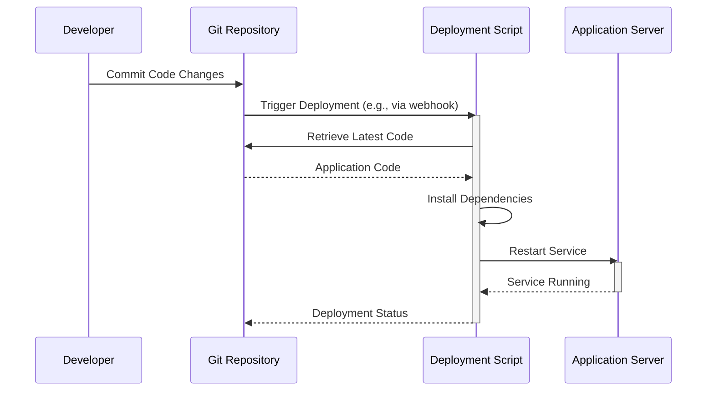

> Previously, we looked at [Backup Script](01_backup-script.md).

# Chapter 2: Deployment Script
Let's begin exploring this concept. In this chapter, we'll delve into the deployment script, a crucial element in automating the process of getting your application code from a repository to a live environment.
**Why do we need a deployment script?**
Imagine manually copying files to a server, installing dependencies, and restarting services every time you make a change to your application. Tedious, right? A deployment script automates these steps, saving time, reducing errors, and ensuring consistency across deployments. Think of it as a recipe that the server follows to update itself with the latest version of your application. It's like having a personal chef who knows exactly how to prepare your favorite dish, every single time.
**Key Concepts**
At its core, a deployment script typically handles the following tasks:
1.  **Code Retrieval:** Fetches the latest code from a version control system (like Git). This ensures that the deployment process always uses the most up-to-date version of the application.
2.  **Dependency Installation:** Installs all the necessary libraries and packages that the application needs to run. This ensures that the application has all the tools it requires to function correctly.
3.  **Service Restart:** Restarts the application service to load the new code and dependencies. This activates the updated application.
4.  **Configuration:** Applies necessary configurations, environment variables, etc.
**Usage / How it Works**
The deployment script is usually executed on the target server (the machine where your application runs). It can be triggered manually or automatically through a Continuous Integration/Continuous Deployment (CI/CD) pipeline. The script performs the steps outlined above, transforming the server from its current state to the desired state with the latest application code.
Here's a simple sequence diagram illustrating the deployment process:

This diagram shows how a developer commits code, which triggers the deployment script to retrieve the code, install dependencies, and restart the application server.
**Code Examples**
Below are simplified examples of deployment scripts for Linux (Bash) and Windows (Batch). These examples are included in the `linux/deploy.sh` and `windows/deploy.bat` files in the project.
```python
--- File: linux/deploy.sh ---
#!/bin/bash
#
# deploy.sh - Deploys the application from a Git repository.
set -e
APP_DIR=$1  # Application directory (passed as argument)
GIT_REPO=$2 # Git repository URL (passed as argument)
if [ -z "$APP_DIR" ]; then
    echo "Error: Application directory not specified."
    exit 1
fi
echo "--- Deploying to $APP_DIR ---"
if [ -d "$APP_DIR/.git" ]; then
    echo "Git repository found. Pulling latest changes..."
    cd "$APP_DIR"
    git pull origin main # Get latest version from the 'main' branch
else
    echo "Cloning new repository from $GIT_REPO..."
    git clone "$GIT_REPO" "$APP_DIR" # Clone the repository to app dir
    cd "$APP_DIR"
fi
echo "--- Installing dependencies ---"
# Example for a Node.js app
# npm install --production
# Example for a Python app
# pip install -r requirements.txt
echo "Simulating dependency installation."
echo "--- Restarting application service ---"
# sudo systemctl restart my-app.service
echo "Simulating service restart."
echo "Deployment successful."
exit 0
```
This Linux script takes the application directory and Git repository URL as arguments.  It checks if the application directory already contains a Git repository. If so, it pulls the latest changes. Otherwise, it clones the repository. Finally, it simulates dependency installation and service restart.
```python
--- File: windows/deploy.bat ---
@echo off
REM deploy.bat - Simple deployment script for Windows.
set APP_DIR="C:\inetpub\wwwroot\my_app"
echo --- Deploying to %APP_DIR% ---
if not exist %APP_DIR% (
    echo Creating directory %APP_DIR%
    mkdir %APP_DIR%
)
echo Simulating file copy...
REM xcopy /E /I /Y "path\to\source" %APP_DIR%
echo Simulating application pool restart...
REM C:\Windows\System32\inetsrv\appcmd.exe recycle apppool /apppool.name:"MyAppPool"
echo Deployment finished.
```
This Windows script sets the application directory and simulates file copying and application pool restart.  The `REM` keyword is used for comments in Batch scripts.
**Relationships to other chapters**
The deployment script utilizes concepts discussed in [Shell Scripting Fundamentals (Bash/PowerShell)](01_shell-scripting-fundamentals-bash-powershell.md), [Environment Variables](02_environment-variables.md) (for sensitive data like API keys), and [Git Version Control](03_git-version-control.md) to function correctly. It also complements the [Backup Script](04_backup-script.md) by ensuring that the application can be restored to a working state in case of a failure. Finally, its execution can be orchestrated using a [Makefile Orchestration](07_makefile-orchestration.md) to streamline the entire process.
**Conclusion**
A deployment script is a vital tool for automating the deployment process, saving time and effort while ensuring consistency. By retrieving code, installing dependencies, and restarting services, it simplifies the process of updating your application.
This concludes our look at this topic.

> Next, we will examine [Environment Variables](03_environment-variables.md).


---

*Generated by [SourceLens AI](https://github.com/openXFlow/sourceLensAI) using LLM: `gemini` (cloud) - model: `gemini-2.0-flash` | Language Profile: `Python`*