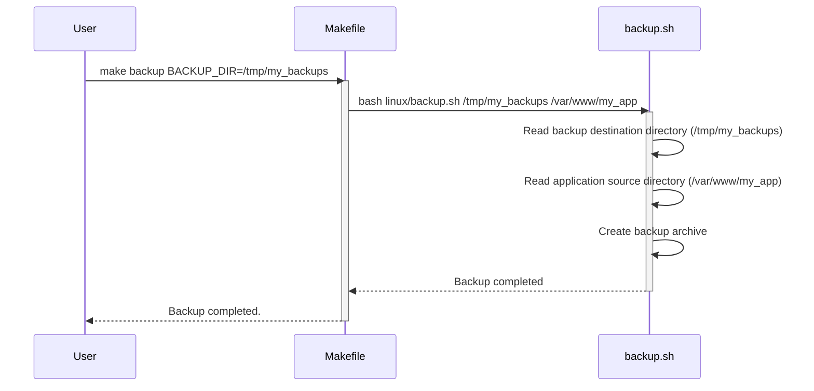

> Previously, we looked at [Deployment Script](02_deployment-script.md).

# Chapter 3: Environment Variables
Let's begin exploring this concept. This chapter explains the role of environment variables in the `20250708_1421_code-shell-scripting-sample-project`. We'll cover why they're used, how they work, and how they're utilized within our scripts.
**Why Environment Variables?**
Imagine you're building a house. Instead of hardcoding the address on every single blueprint and document, you'd likely have a separate, easily changeable field for the address. Environment variables are similar – they're like global configuration settings for your scripts.
The primary purpose of environment variables is to provide a flexible and configurable way to manage application settings without having to modify the core code of the scripts themselves. This is especially useful when:
*   **Different Environments:** You need to run the same script in different environments (development, testing, production) with different configurations.
*   **Sensitive Information:** You want to avoid hardcoding sensitive information like passwords or API keys directly in the scripts.
*   **Easy Customization:** You want to allow users to easily customize the behavior of the script without needing to understand the code.
In our project, environment variables like `APP_DIR`, `BACKUP_DIR`, and `GIT_REPO` serve as these global settings, defining locations for application files, backup destinations, and the Git repository URL.
**Key Concepts**
*   **Variable Definition:** An environment variable is a name-value pair that exists outside the script's code.
*   **Scope:** Environment variables are accessible to the script and any child processes it spawns.
*   **Overriding:**  You can often override environment variables temporarily for a single script execution.
*   **Security:** Storing sensitive information as environment variables can be *more* secure than hardcoding, but they should still be handled with care.
**How They Work in Our Project**
Our project uses environment variables primarily in the shell scripts, but also within the Makefile to define settings. The scripts access these variables using the `$VARIABLE_NAME` syntax in Bash (or `%VARIABLE_NAME%` in PowerShell). The Makefile passes these values directly to the shell scripts.
For example, let's look at the `linux/backup.sh` script:
```python
--- File: linux/backup.sh ---
#!/bin/bash
#
# backup.sh - Creates a backup of specified directories and a database.
set -e
BACKUP_DEST=$1
APP_SOURCE=$2
TIMESTAMP=$(date +"%Y%m%d_%H%M%S")
BACKUP_FILE="$BACKUP_DEST/app_backup_$TIMESTAMP.tar.gz"
DB_DUMP_FILE="/tmp/db_dump_$TIMESTAMP.sql"
if [ -z "$BACKUP_DEST" ] || [ -z "$APP_SOURCE" ]; then
    echo "Usage: $0 <backup_destination_dir> <app_source_dir>"
    exit 1
fi
echo "--- Backing up database ---"
# mysqldump -u user -p'password' my_database > $DB_DUMP_FILE
echo "Simulating database dump to $DB_DUMP_FILE"
touch $DB_DUMP_FILE
echo "--- Creating archive ---"
tar -czf "$BACKUP_FILE" -C "$(dirname "$APP_SOURCE")" "$(basename "$APP_SOURCE")" -C "/tmp" "$(basename "$DB_DUMP_FILE")"
echo "--- Cleaning up temporary files ---"
rm -f $DB_DUMP_FILE
echo "Backup created successfully at $BACKUP_FILE"
exit 0
```
In the `backup.sh` script, `BACKUP_DEST` and `APP_SOURCE` are *passed as arguments* from the Makefile.  These values are originally defined as variables within the Makefile:
```python
--- File: Makefile ---
# Makefile for orchestrating server tasks on Linux
# Variables
APP_DIR := /var/www/my_app
BACKUP_DIR := /var/backups
GIT_REPO := https://github.com/example/my-app.git
.PHONY: all backup deploy monitor clean
all: deploy
# Create a backup of the application and database
backup:
    @echo "Starting backup process..."
    @bash linux/backup.sh $(BACKUP_DIR) $(APP_DIR)
    @echo "Backup completed."
```
The Makefile then *passes* these variables as arguments to the `backup.sh` script. While not directly accessing the environment as such inside the shell script itself, we still need to define the variables in the Makefile. This indirection provides us with the flexibility to override values from the command line when invoking `make`.
**Usage and Overriding**
You can override environment variables temporarily when running `make`. For example:
```bash
make backup BACKUP_DIR=/tmp/my_backups
```
This would execute the `backup` target, but use `/tmp/my_backups` as the value for `BACKUP_DIR` instead of the default `/var/backups` defined in the Makefile. This change affects only the current `make` execution.
**Diagram of Variable Passing:**

The diagram above illustrates how the user triggers the backup process via the `make` command. The `BACKUP_DIR` variable is overridden in the command, passed to the `Makefile`, and then passed *as an argument* to `backup.sh`. The `backup.sh` script then proceeds to create the backup using the specified destination and source directories.
We recommend reading [Shell Scripting Fundamentals (Bash/PowerShell)](01_shell-scripting-fundamentals-bash-powershell.md) for a recap on shell scripting best practices if you're not comfortable with the shell scripting syntax. Also, [Makefile Orchestration](07_makefile-orchestration.md) dives deeper into Makefile structure and functions.
This concludes our look at this topic.

> Next, we will examine [Git Version Control](04_git-version-control.md).


---

*Generated by [SourceLens AI](https://github.com/openXFlow/sourceLensAI) using LLM: `gemini` (cloud) - model: `gemini-2.0-flash` | Language Profile: `Python`*