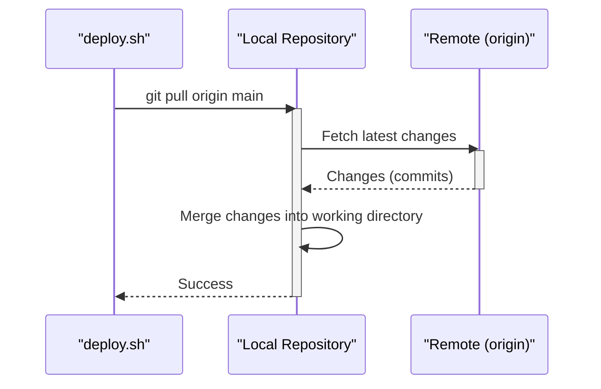

> Previously, we looked at [Environment Variables](03_environment-variables.md).

# Chapter 4: Git Version Control
Let's begin exploring this concept. This chapter explains the basics of Git version control and how it's used in the `20250708_1421_code-shell-scripting-sample-project`, specifically within the deployment script. Understanding Git is crucial for deploying and managing updates to your application.
**Why Git?**
Imagine you're working on a document, and you want to keep track of every change you make. You could manually save different versions, but that's messy and inefficient. Git does this automatically for code projects. It's like a time machine for your code, allowing you to revert to previous states, track changes, and collaborate with others without stepping on each other's toes.
In our project, Git allows the deployment script to fetch the latest version of the application code from a remote repository. Without Git, deploying updates would be a manual, error-prone process of copying files.
**Key Concepts:**
*   **Repository (Repo):** A directory containing all the project files and the entire history of changes. It's where Git stores all the information it needs to manage your project.
*   **Clone:** Creating a local copy of a remote repository on your computer.
*   **Pull:** Fetching the latest changes from a remote repository and merging them into your local copy.
*   **Commit:** Saving changes to the local repository. Think of it as a snapshot of your project at a specific point in time.
*   **Branch:** An independent line of development. Allows you to work on new features or bug fixes without affecting the main codebase. The `main` branch is typically the primary branch.
*   **Remote:** A pointer to another copy of your repository, typically hosted on a service like GitHub or GitLab. `origin` is the default name for the remote repository you cloned from.
**How Git is Used in the Deployment Script:**
The deployment script (`deploy.sh`) uses Git to retrieve the application code. Here's the relevant part of the script:
```python
--- File: linux/deploy.sh ---
#!/bin/bash
#
# deploy.sh - Deploys the application from a Git repository.
# ... (other code)
if [ -d "$APP_DIR/.git" ]; then
    echo "Git repository found. Pulling latest changes..."
    cd "$APP_DIR"
    git pull origin main
else
    echo "Cloning new repository from $GIT_REPO..."
    git clone "$GIT_REPO" "$APP_DIR"
    cd "$APP_DIR"
fi
# ... (other code)
```
**Explanation:**
1.  **Check for Existing Repository:** The script first checks if a Git repository already exists in the application directory (`$APP_DIR`). It does this by looking for the `.git` directory, which is the heart of a Git repository.
2.  **Pull if Exists:** If a Git repository is found, the script assumes that the application has been deployed before. It then uses the `git pull origin main` command to fetch the latest changes from the `main` branch of the remote repository (`origin`) and merge them into the local copy.
3.  **Clone if Not Exists:** If a Git repository does *not* exist, the script assumes that this is the first time the application is being deployed. It uses the `git clone "$GIT_REPO" "$APP_DIR"` command to create a local copy of the repository specified by the `$GIT_REPO` variable. This clones the entire repository into the application directory.
4.  **Change Directory:** Regardless of whether the repository was cloned or pulled, the script then changes the current directory to the application directory (`cd "$APP_DIR"`).
**Example: Cloning a Repository**
To illustrate the `git clone` command, let's assume the application's Git repository is located at `https://github.com/your-username/your-repo.git` and you want to deploy the application to the `/opt/app` directory.  You would run the `deploy.sh` script like this:
```bash
./deploy.sh /opt/app https://github.com/your-username/your-repo.git
```
This would clone the repository into `/opt/app`.
**Example: Pulling Latest Changes**
If the repository already exists in `/opt/app`, running the same command will instead execute `git pull origin main` to update the code.
**Sequence Diagram for `git pull`**
This diagram illustrates the flow of the `git pull` command within the deployment script.

The `deploy.sh` script initiates the `git pull` operation on the local repository. This operation fetches any new commits from the remote repository (`origin`) and merges them into the current branch (typically `main`) in the local repository.
**Relationship to Other Chapters:**
This chapter builds upon the concepts introduced in [Shell Scripting Fundamentals (Bash/PowerShell)](01_shell-scripting-fundamentals-bash-powershell.md) by demonstrating how shell scripts can interact with Git. The Git repository URL might be stored as an [Environment Variable](02_environment-variables.md), making it configurable.
**Important Git Commands (Beyond Clone and Pull):**
While `clone` and `pull` are the primary commands used in the deployment script, it's helpful to understand a few more basic Git commands:
*   `git status`: Shows the current status of the repository, including any modified or untracked files.
*   `git add <file>`: Adds a file to the staging area, preparing it to be committed.
*   `git commit -m "Your commit message"`: Commits the changes in the staging area to the local repository.
*   `git push origin <branch>`: Pushes the committed changes from the local repository to the remote repository.
This concludes our look at this topic.

> Next, we will examine [Makefile Orchestration](05_makefile-orchestration.md).


---

*Generated by [SourceLens AI](https://github.com/openXFlow/sourceLensAI) using LLM: `gemini` (cloud) - model: `gemini-2.0-flash` | Language Profile: `Python`*