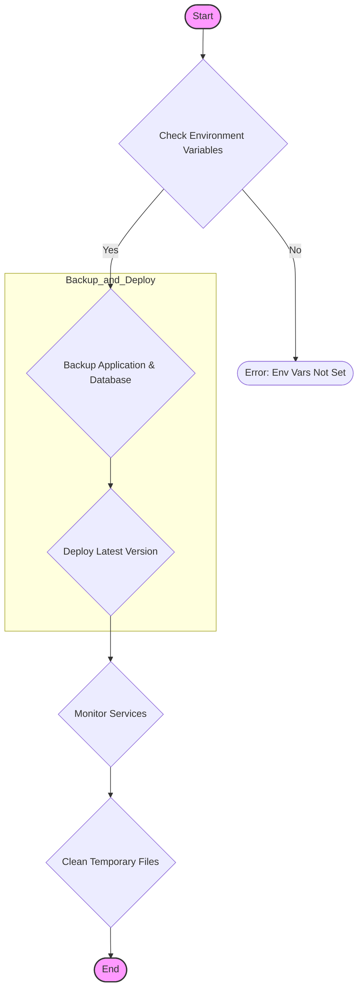

> Previously, we looked at [Git Version Control](04_git-version-control.md).

# Chapter 5: Makefile Orchestration
Let's begin exploring this concept. This chapter will guide you through understanding and using the `Makefile` in this project to automate tasks related to backup, deployment, and monitoring. Think of it as your mission control for managing server operations with simple commands.
**Why Use a Makefile?**
Imagine you need to run a series of shell scripts in a specific order every time you deploy a new version of your application. You could manually type each command, but that's prone to errors and time-consuming. A `Makefile` is like a recipe book for your computer. It defines a set of rules, where each rule specifies a command to execute. This simplifies complex tasks into single-line commands. It's automation and convenience at its best! It's an abstraction layer, simplifying the interaction with shell scripts.
**Key Concepts**
*   **Targets:** These are the names of the tasks you want to perform (e.g., `backup`, `deploy`, `monitor`).
*   **Dependencies:** A target can depend on other targets. This means that before a target is executed, its dependencies are executed first. We don't explicitly use dependencies heavily in *this* project's `Makefile`, but it's a fundamental concept.
*   **Commands:** These are the actual shell commands that are executed when a target is invoked. They are typically shell scripts.
*   **Variables:** You can define variables in a `Makefile` to store values that are used in multiple commands. This makes the `Makefile` more readable and maintainable.
**How it Works**
The `make` utility reads the `Makefile` and executes the targets you specify. For example, if you run `make deploy`, the `make` utility will find the `deploy` target in the `Makefile` and execute the commands associated with that target.
**Code Example**
Here's the `Makefile` used in this project:
```python
--- File: Makefile ---
# Makefile for orchestrating server tasks on Linux
# Variables
APP_DIR := /var/www/my_app
BACKUP_DIR := /var/backups
GIT_REPO := https://github.com/example/my-app.git
.PHONY: all backup deploy monitor clean
all: deploy
# Create a backup of the application and database
backup:
    @echo "Starting backup process..."
    @bash linux/backup.sh $(BACKUP_DIR) $(APP_DIR)
    @echo "Backup completed."
# Deploy the latest version of the application
deploy:
    @echo "Starting deployment..."
    @bash linux/deploy.sh $(APP_DIR) $(GIT_REPO)
    @echo "Deployment finished."
# Monitor the status of required services
monitor:
    @echo "Monitoring services..."
    @bash linux/monitor.sh
clean:
    @echo "Cleaning up temporary files..."
    @rm -f /tmp/app_*.log
```
Let's break down a few lines:
*   `APP_DIR := /var/www/my_app`: This defines a variable named `APP_DIR` and sets its value to the application directory.
*   `.PHONY: all backup deploy monitor clean`: This declares that `all`, `backup`, `deploy`, `monitor`, and `clean` are phony targets. A phony target is a target that does not represent a file. This ensures that the target is always executed, even if a file with the same name exists.
*   `backup:`: This defines the `backup` target.
*   `@bash linux/backup.sh $(BACKUP_DIR) $(APP_DIR)`: This is the command that is executed when the `backup` target is invoked. It runs the `linux/backup.sh` script with the specified arguments. The `@` symbol suppresses the echoing of the command to the console.
**Example Usage**
1.  **Backup:** To create a backup of your application, run the command `make backup` in your terminal from the project's root directory (where the `Makefile` is located).
2.  **Deploy:** To deploy the latest version of your application, run the command `make deploy`.
3.  **Monitor:** To monitor the services, run the command `make monitor`.
4.  **Clean:** To clean up temporary files, run the command `make clean`.
5.  **All:** The `all` target is defined as `all: deploy`. Therefore, when you run `make`, it executes the `deploy` command.
**Makefile Workflow Visualization**

This flowchart shows the typical workflow orchestrated by the `Makefile`.  It starts by checking the environment variables.  If they are correctly configured, it proceeds with backing up, deploying, monitoring, and cleaning up.
**Relationships & Cross-Linking**
This `Makefile` relies heavily on the shell scripts covered in the following chapters:
*   [Backup Script](04_backup-script.md)
*   [Deployment Script](05_deployment-script.md)
*   [Monitoring Script](06_monitoring-script.md)
It also utilizes [Environment Variables](02_environment-variables.md) to ensure the shell scripts have the required parameters.
**Conclusion**
By using a `Makefile`, we simplify complex operations into single-line commands. This makes it easier to manage and maintain our application. This concludes our look at this topic.

> Next, we will examine [Monitoring Script](06_monitoring-script.md).


---

*Generated by [SourceLens AI](https://github.com/openXFlow/sourceLensAI) using LLM: `gemini` (cloud) - model: `gemini-2.0-flash` | Language Profile: `Python`*