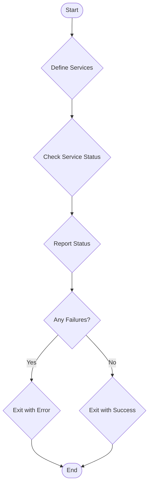

> Previously, we looked at [Makefile Orchestration](05_makefile-orchestration.md).

# Chapter 6: Monitoring Script
Let's begin exploring this concept. This chapter focuses on the monitoring script, which is designed to automatically check the health and operational status of critical system services.
**Why a Monitoring Script?**
Imagine a doctor constantly checking a patient's vital signs. The monitoring script serves a similar purpose for your system. It's a proactive way to detect problems early, before they escalate into major outages. Without a monitoring script, you might only discover a service is down when users complain, leading to downtime and potential data loss. A well-designed monitoring script helps ensure high availability and reliability. It's a safety net for your system.
**Key Concepts**
The monitoring script, in essence, performs the following steps:
1.  **Defines Services:** Specifies which services are critical and need to be checked.
2.  **Checks Status:** Periodically queries each service to determine if it is running.
3.  **Reports Status:** Logs the status of each service (running or not running).
4.  **Alerts on Failure:** If any service is down, it can trigger alerts (not covered in this basic version, but easily added) and exits with a non-zero error code.
5.  **Exits Cleanly on Success:** If all services are up, it exits with a zero error code.
**How it Works**
The monitoring script iterates through a predefined list of services. For each service, it uses operating system-specific tools to determine its status. In Linux, `systemctl` is commonly used. In Windows, `Get-Service` in PowerShell is the equivalent. The script then aggregates the results and reports any failures.
**Code Examples**
Here's how the monitoring script is implemented in both Linux (Bash) and Windows (PowerShell) environments:
```python
--- File: linux/monitor.sh ---
#!/bin/bash
#
# monitor.sh - Checks the status of critical services.
SERVICES_TO_CHECK=("nginx" "postgresql" "my-app.service")
HAS_ERROR=0
echo "--- Monitoring System Services ---"
for service in "${SERVICES_TO_CHECK[@]}"; do
    # systemctl is-active --quiet "$service"
    # Faking the check for this example
    if (( RANDOM % 5 == 0 )); then # Randomly fail one service
        echo "🔴 STATUS: $service is INACTIVE."
        HAS_ERROR=1
    else
        echo "✅ STATUS: $service is ACTIVE."
    fi
done
if [ $HAS_ERROR -eq 1 ]; then
    echo "Error: One or more services are down!"
    exit 1
else
    echo "All services are running normally."
    exit 0
```
This `monitor.sh` script (designed for Linux) checks the status of `nginx`, `postgresql`, and `my-app.service`.  Note that `systemctl is-active` is commented out and replaced by a random failure condition (`RANDOM % 5 == 0`). This is for demonstration purposes.  In a real-world scenario, you would uncomment the `systemctl` line to perform an actual service status check. The script sets `HAS_ERROR` to 1 if any service is inactive, causing the script to exit with a non-zero status code (1).
```python
--- File: windows/monitor.ps1 ---
# monitor.ps1 - Checks the status of Windows services.
$services = @("W3SVC", "MSSQLSERVER") # IIS and SQL Server example names
$allRunning = $true
Write-Host "--- Monitoring Windows Services ---"
foreach ($serviceName in $services) {
    $service = Get-Service -Name $serviceName -ErrorAction SilentlyContinue
    if ($service -and $service.Status -eq "Running") {
        Write-Host "✅ STATUS: $serviceName is Running."
    } else {
        Write-Host "🔴 STATUS: $serviceName is NOT running or does not exist." -ForegroundColor Red
        $allRunning = $false
    }
}
if (-not $allRunning) {
    Write-Error "One or more critical services are stopped."
    exit 1
}
Write-Host "All critical services are running."
```
The `monitor.ps1` script (for Windows) does the same, but using PowerShell. It checks the status of the `W3SVC` (IIS) and `MSSQLSERVER` (SQL Server) services. It iterates through the services and uses `Get-Service` to retrieve their status. If any service is not running, it sets `$allRunning` to `$false` and exits with a non-zero status code (1).
**Workflow Diagram**
Below is a simplified Mermaid flowchart illustrating the monitoring script's basic workflow:

This diagram provides a visual overview of the script's execution flow, starting with defining the services to monitor, checking their statuses, reporting those statuses, and finally exiting with an appropriate status code depending on whether any failures were detected.
**Relationship to Other Scripts**
The monitoring script is often used in conjunction with the [Deployment Script](05_deployment-script.md). After a deployment, the monitoring script can be used to verify that all services have started correctly. It can also be integrated with the [Backup Script](04_backup-script.md) to ensure that backups are only performed when all services are running.
**Conclusion**
The monitoring script is a vital component for maintaining system stability and detecting issues early. It's a simple yet powerful tool that can significantly reduce downtime and improve overall system reliability. This concludes our look at this topic.

> Next, we will examine [Shell Scripting Fundamentals (Bash/PowerShell)](07_shell-scripting-fundamentals-bash-powershell.md).


---

*Generated by [SourceLens AI](https://github.com/openXFlow/sourceLensAI) using LLM: `gemini` (cloud) - model: `gemini-2.0-flash` | Language Profile: `Python`*