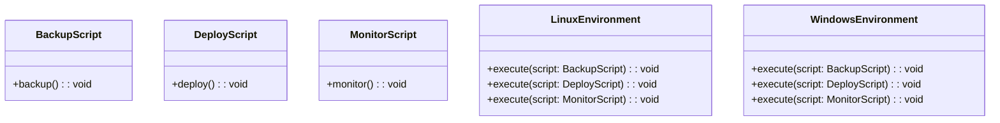
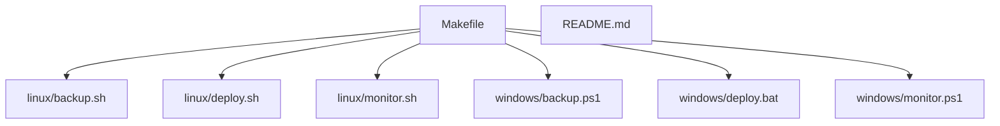
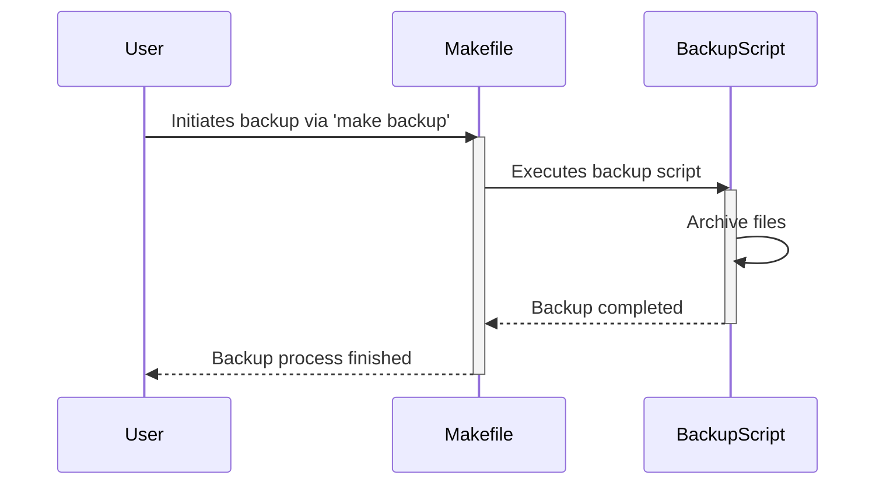
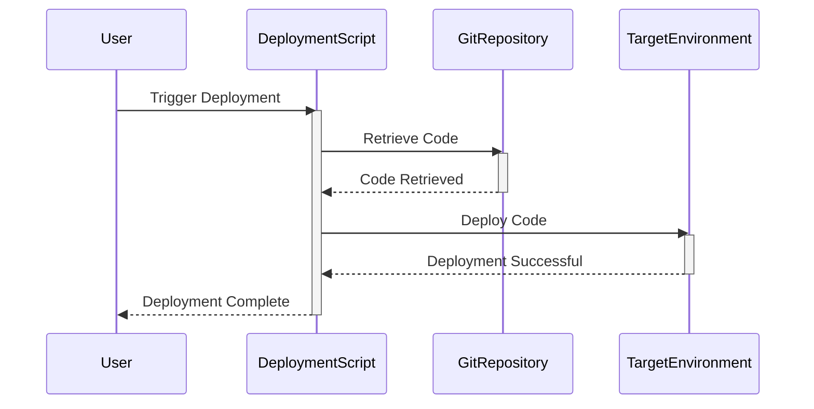
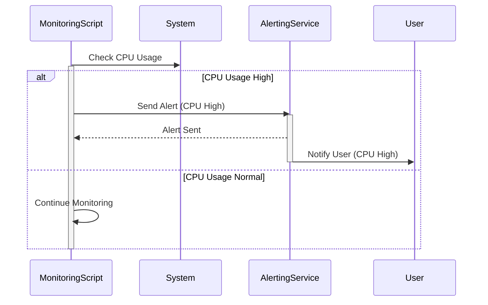
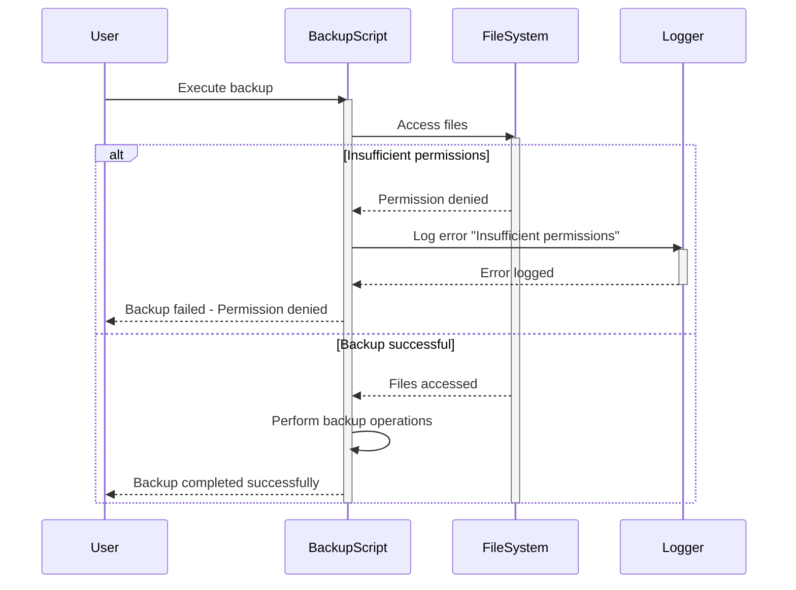

> Previously, we looked at [Shell Scripting Fundamentals (Bash/PowerShell)](07_shell-scripting-fundamentals-bash-powershell.md).

# Chapter 8: Architecture Diagrams
## Class Diagram
Key classes and their relationships in **20250708_1421_code-shell-scripting-sample-project**.

## Package Dependencies
High-level module and package structure of **20250708_1421_code-shell-scripting-sample-project**.

## Sequence Diagrams
These diagrams illustrate various interaction scenarios, showcasing operations between components for specific use cases.
### User initiates the backup script via the Makefile, triggering file archiving.

### The deployment script retrieves code from Git and deploys it to a target environment.

### The monitoring script detects a high CPU usage and sends an alert.

### The backup script fails due to insufficient permissions and logs an error.

> Next, we will examine [Code Inventory](09_code_inventory.md).

---

*Generated by [SourceLens AI](https://github.com/openXFlow/sourceLensAI) using LLM: `gemini` (cloud) - model: `gemini-2.0-flash` | Language Profile: `Python`*