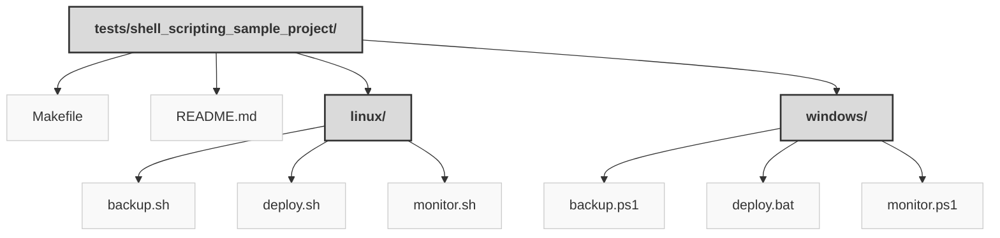

> Previously, we looked at [Architecture Diagrams](08_diagrams.md).

# Chapter 9: Code Inventory
## File Structure

## File Descriptions Summary
*   **`Makefile`**: Makefile for orchestrating server tasks on Linux
*   **`README.md`**: Server Automation Scripts
*   **`backup.sh`**: !/bin/bash
*   **`deploy.sh`**: !/bin/bash
*   **`monitor.sh`**: !/bin/bash
*   **`backup.ps1`**: backup.ps1 - Creates a backup archive on Windows.
*   **`deploy.bat`**: @echo off
*   **`monitor.ps1`**: monitor.ps1 - Checks the status of Windows services.
---
## Detailed File Content
No detailed structural information could be generated for the files based on the selected parser.

> Next, we will examine [Project Review](10_project_review.md).

---

*Generated by [SourceLens AI](https://github.com/openXFlow/sourceLensAI) using LLM: `gemini` (cloud) - model: `gemini-2.0-flash` | Language Profile: `Python`*