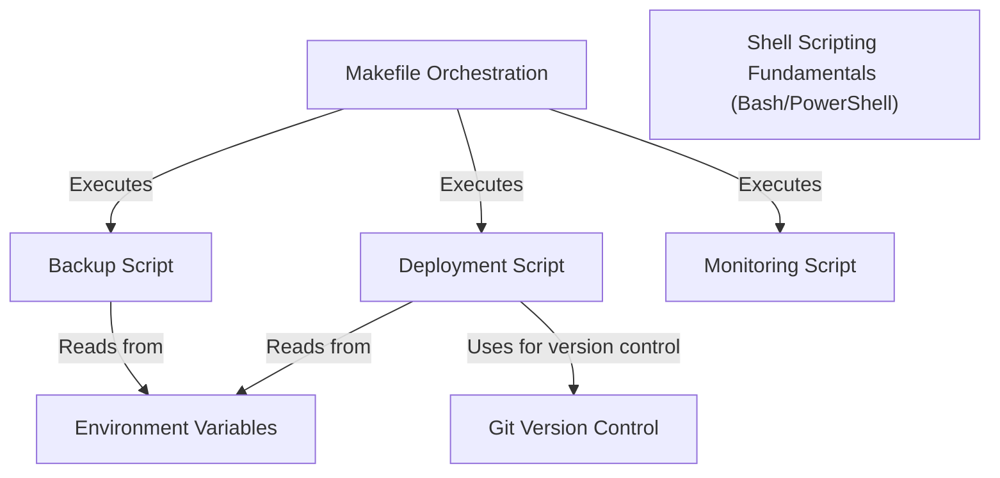

# Tutorial: 20250708_1421_code-shell-scripting-sample-project

The project uses a **Makefile Orchestration** to trigger various scripts for backup, deployment, and monitoring. These scripts rely on *Environment Variables* for configuration and utilize *Shell Scripting Fundamentals* for automation. The *Deployment Script* specifically interacts with Git for version control.

**Source Directory:** `C:\_jd_programming\python\11_sourceLens_project\sourceLens\tests\shell_scripting_sample_project`

## Abstraction Relationships

## Chapters

1. [Backup Script](01_backup-script.md)
2. [Deployment Script](02_deployment-script.md)
3. [Environment Variables](03_environment-variables.md)
4. [Git Version Control](04_git-version-control.md)
5. [Makefile Orchestration](05_makefile-orchestration.md)
6. [Monitoring Script](06_monitoring-script.md)
7. [Shell Scripting Fundamentals (Bash/PowerShell)](07_shell-scripting-fundamentals-bash-powershell.md)
8. [Architecture Diagrams](08_diagrams.md)
9. [Code Inventory](09_code_inventory.md)
10. [Project Review](10_project_review.md)

---

*Generated by [SourceLens AI](https://github.com/openXFlow/sourceLensAI) using LLM: `gemini` (cloud) - model: `gemini-2.0-flash` | Language Profile: `Python`*