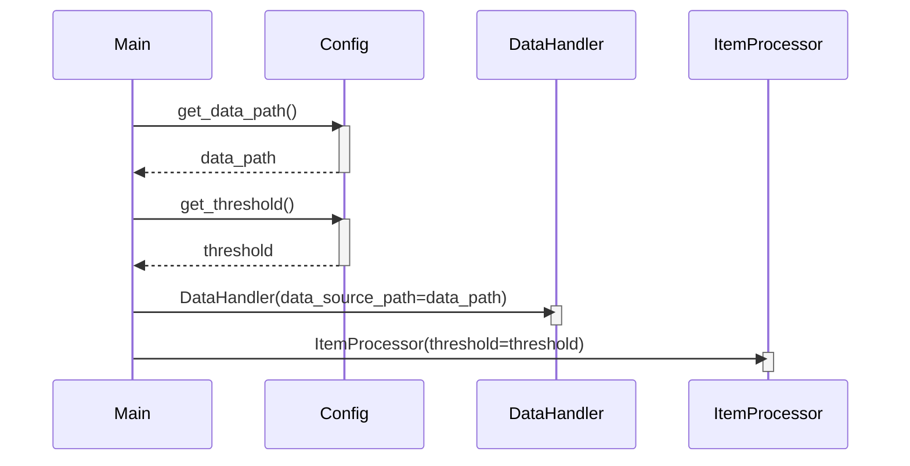

Previously, we looked at the [Project Overview](index.md).

# Chapter 1: Configuration Management
Let's begin exploring this concept. This chapter will introduce you to configuration management within the `python_sample_project` project, explaining what it is, why it's important, and how it's implemented in our codebase.
### What is Configuration Management?
Configuration management is all about managing application settings in a structured and centralized way. Think of it like a control panel for your application. Just as a control panel allows you to adjust settings on your computer without altering the underlying operating system, configuration management allows you to change application behavior without modifying the code itself.
For instance, in our project, we might need to specify the location of our data file (`DATA_FILE_PATH`), or define a threshold value (`PROCESSING_THRESHOLD`) used for data processing. Configuration management provides a way to manage these settings separately from the core logic of the application.
### Why is it Important?
There are several reasons why configuration management is a crucial aspect of software development:
*   **Separation of Concerns:** It cleanly separates configuration from code. This means that configuration changes do not require code changes, and vice versa.
*   **Flexibility and Adaptability:** It enables easy deployment of the application in different environments (e.g., development, testing, production) with varying settings.  Imagine deploying your application to a test server that uses a smaller dataset – you can configure the `DATA_FILE_PATH` accordingly without altering any of the core application logic.
*   **Maintainability:** Centralized configuration makes it easier to understand and modify application settings.  You know exactly where to go to change a specific setting, rather than hunting through the codebase.
*   **Consistency:** It ensures consistent application behavior by providing a single source of truth for configuration values.
### Configuration in `python_sample_project`
In `python_sample_project`, we use a dedicated module, `config.py`, to store configuration settings.
Here's a look at the key elements:
*   **Constants:** We define configuration values as constants using the `typing.Final` type hint. This indicates that these values are intended to be set once and not changed during runtime.
*   **Getter Functions:**  We provide functions (e.g., `get_data_path()`, `get_threshold()`) to access these configuration values. This allows for more complex configuration logic if needed (e.g., reading from environment variables).
```python
--- File: config.py ---
"""Configuration settings for the Sample Project 2."""
from typing import Final
# --- Constants for Configuration ---
DATA_FILE_PATH: Final[str] = "data/items.json"
PROCESSING_THRESHOLD: Final[int] = 100
LOG_LEVEL: Final[str] = "INFO"
def get_data_path() -> str:
    """Return the configured path for the data file."""
    print(f"Config: Providing data file path: {DATA_FILE_PATH}")
    return DATA_FILE_PATH
def get_threshold() -> int:
    """Return the configured processing threshold."""
    print(f"Config: Providing processing threshold: {PROCESSING_THRESHOLD}")
    return PROCESSING_THRESHOLD
# End of tests/sample_project2/config.py
```
### How it Works: Usage in `main.py`
The `main.py` script imports the `config` module and uses its functions to retrieve configuration values. This ensures that the application components use the configured settings.
```python
--- File: main.py ---
"""Main execution script for Sample Project 2."""
import logging
from typing import TYPE_CHECKING
from . import config
from .data_handler import DataHandler
from .item_processor import ItemProcessor
if TYPE_CHECKING:
    from .models import Item
def run_processing_pipeline() -> None:
    """Execute the main data processing pipeline."""
    logger: logging.Logger = logging.getLogger(__name__)
    logger.info("Starting Sample Project 2 processing pipeline...")
    try:
        # 1. Initialize components using configuration
        data_path: str = config.get_data_path()
        threshold: int = config.get_threshold()
        data_handler = DataHandler(data_source_path=data_path)
        item_processor = ItemProcessor(threshold=threshold)
        # ... rest of the pipeline ...
    except FileNotFoundError as e:
        logger.critical("Configuration error: Data file path not found. %s", e, exc_info=True)
    except OSError as e:
        logger.critical(
            "An OS or I/O error occurred during pipeline execution: %s",
            e,
            exc_info=True,
        )
    except (ValueError, TypeError, AttributeError, KeyError) as e:
        logger.critical("A runtime error occurred during pipeline execution: %s", e, exc_info=True)
    # Note: No generic `except Exception as e:` to comply with strict BLE001.
    # Any other unhandled exceptions will terminate the program.
    finally:
        logger.info("Sample Project 2 processing pipeline finished.")
# End of tests/sample_project2/main.py
```
This setup promotes modularity.  If, for example, you want to use a different data source, you only need to modify the `DATA_FILE_PATH` in `config.py` (or extend the `get_data_path` to check for environment variables). The rest of the application remains unchanged.
Here is a diagram illustrating this flow:

The diagram illustrates the main application querying the configuration module for key settings, and then using those settings to initialize other components such as the `DataHandler` and `ItemProcessor`.
### Relationships to Other Components
The configuration settings directly impact how other modules in the project function:
*   The `DataHandler` ([Data Handling](03_data-handling.md)) uses the `DATA_FILE_PATH` from `config.py` to determine where to load and save data.
*   The `ItemProcessor` ([Item Processing](04_item-processing.md)) uses the `PROCESSING_THRESHOLD` from `config.py` to determine which items to process.
*   The logging level defined in `config.py` (e.g., `LOG_LEVEL`) is used by the [Logging](05_logging.md) module to control the verbosity of log messages.
This concludes our look at this topic.

Next, we will examine [Data Model (Item)](02_data-model-item.md).


---

*Generated by [SourceLens AI](https://github.com/darijo2yahoocom/sourceLensAI) using LLM: `gemini` (cloud) - model: `gemini-2.0-flash` | Language Profile: `python`*