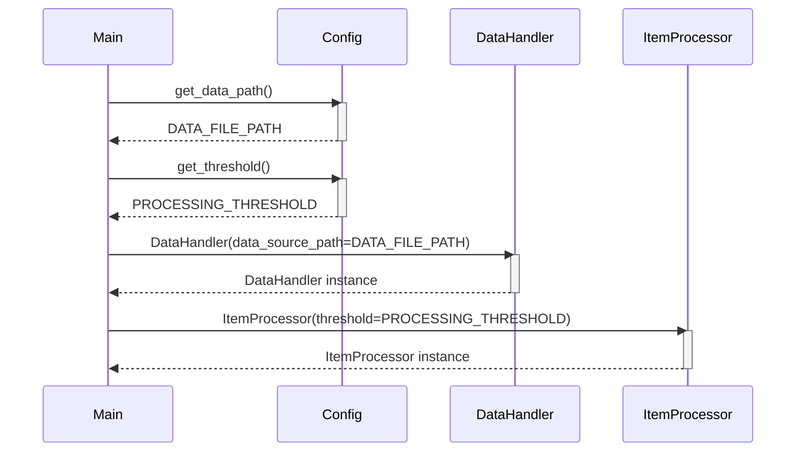

Previously, we looked at the [Project Overview](index.md).

# Chapter 1: Configuration Management
Let's begin exploring this concept. In this chapter, we'll dive into how the `python_sample_project` manages its configuration settings. Our goal is to understand how it loads and provides application settings.
Imagine a complex machine with many dials and knobs. Configuration management is like a centralized control panel for our software, allowing us to adjust its behavior without changing the code directly. It's a crucial part of building maintainable and adaptable applications.
Why is configuration management important?
*   **Flexibility:** It allows us to easily change settings for different environments (development, testing, production) without modifying the code itself.
*   **Maintainability:** Centralized configuration makes it easier to find and modify settings.
*   **Readability:** Configuration values are stored in a separate location, making the core code cleaner and easier to understand.
In `python_sample_project`, configuration management is handled by the `config.py` file. This file acts as a central repository for all the application's settings.
Here's a breakdown of the key concepts:
*   **Constants:** Configuration values are stored as constants (using `typing.Final`). This indicates that these values are intended to be read-only and should not be changed during runtime.
*   **Functions:** Functions are provided to access these constants, potentially encapsulating more complex logic for retrieving the final configuration value.
*   **Centralized Access:** Other modules import the `config` module to access the configuration settings.
How does it work?
1.  **Definition:** Configuration values are defined as constants in `config.py`.
2.  **Access:** Other modules call functions like `config.get_data_path()` or `config.get_threshold()` to retrieve these values.
3.  **Usage:** The retrieved configuration values are then used to initialize components and control the application's behavior.
Here's a snippet of code from `config.py`:
```python
--- File: config.py ---
"""Configuration settings for the Sample Project 2.
This module stores configuration values used by other parts of the application,
such as file paths or processing parameters.
"""
from typing import Final
# --- Constants for Configuration ---
# Simulate a path to a data file (used by DataHandler)
DATA_FILE_PATH: Final[str] = "data/items.json"
# A processing parameter (used by ItemProcessor)
PROCESSING_THRESHOLD: Final[int] = 100
# Example setting for logging level (could be used by main)
LOG_LEVEL: Final[str] = "INFO"
def get_data_path() -> str:
    """Return the configured path for the data file.
    Returns:
        str: The path string for the data file.
    """
    # In a real app, this might involve more complex logic,
    # like checking environment variables first.
    print(f"Config: Providing data file path: {DATA_FILE_PATH}")
    return DATA_FILE_PATH
def get_threshold() -> int:
    """Return the configured processing threshold.
    Returns:
        int: The configured processing threshold.
    Returns:
        int: The integer threshold value.
    """
    print(f"Config: Providing processing threshold: {PROCESSING_THRESHOLD}")
    return PROCESSING_THRESHOLD
# End of tests/sample_project2/config.py
```
As you can see, the `DATA_FILE_PATH` and `PROCESSING_THRESHOLD` are defined as constants. The `get_data_path()` and `get_threshold()` functions provide a way to access these values. In a more complex application, these functions might contain logic to read values from environment variables, command-line arguments, or configuration files.
Now, let's see how these configuration values are used in `main.py`:
```python
--- File: main.py ---
"""Main execution script for Sample Project 2.
Orchestrates the loading, processing, and saving of data items using
configuration settings and dedicated handler/processor classes.
"""
import logging
from typing import TYPE_CHECKING
# Use relative imports for components within this package
from . import config
from .data_handler import DataHandler
from .item_processor import ItemProcessor
if TYPE_CHECKING:
    from .models import Item  # Import the Item model for type hinting
def setup_main_logging() -> None:
    """Set up basic logging for the main script execution."""
    # Simple console logging for demonstration
    logging.basicConfig(
        level=getattr(logging, config.LOG_LEVEL.upper(), logging.INFO),
        format="%(asctime)s - %(name)s - %(levelname)s - %(message)s",
    )
    # Suppress excessive logging from libraries if needed (optional)
    # logging.getLogger("some_library").setLevel(logging.WARNING)
def run_processing_pipeline() -> None:
    """Execute the main data processing pipeline."""
    logger: logging.Logger = logging.getLogger(__name__)  # Get logger instance for this function
    logger.info("Starting Sample Project 2 processing pipeline...")
    try:
        # 1. Initialize components using configuration
        data_path: str = config.get_data_path()
        threshold: int = config.get_threshold()
        data_handler = DataHandler(data_source_path=data_path)
        item_processor = ItemProcessor(threshold=threshold)
        # 2. Load data
        items_to_process: list[Item] = data_handler.load_items()
        if not items_to_process:
            logger.warning("No items loaded from data source. Exiting pipeline.")
            return
        logger.info("Successfully loaded %d items.", len(items_to_process))
        # 3. Process data items
        processed_items: list[Item] = []
        failed_items: list[Item] = []
        for item in items_to_process:
            logger.debug("Passing item to processor: %s", item)
            success: bool = item_processor.process_item(item)
            if success:
                processed_items.append(item)
            else:
                logger.error("Failed to process item: %s", item)
                failed_items.append(item)  # Keep track of failed items if needed
        logger.info(
            "Processed %d items successfully, %d failed.",
            len(processed_items),
            len(failed_items),
        )
        # 4. Save processed data
        save_success: bool = data_handler.save_items(items_to_process)
        if save_success:
            logger.info("Processed items saved successfully.")
        else:
            logger.error("Failed to save processed items.")
    except FileNotFoundError as e:
        logger.critical("Configuration error: Data file path not found. %s", e, exc_info=True)
    except OSError as e:
        # Catches other OS-related errors (broader I/O issues beyond file not found)
        logger.critical(
            "An OS or I/O error occurred during pipeline execution: %s",
            e,
            exc_info=True,
        )
    except (ValueError, TypeError, AttributeError, KeyError) as e:
        # Catches common data processing or programming errors
        logger.critical("A runtime error occurred during pipeline execution: %s", e, exc_info=True)
    # Note: No generic `except Exception as e:` to comply with strict BLE001.
    # Any other unhandled exceptions will terminate the program.
    finally:
        logger.info("Sample Project 2 processing pipeline finished.")
# Standard Python entry point
if __name__ == "__main__":
    setup_main_logging()
    run_processing_pipeline()
# End of tests/sample_project2/main.py
```
Notice how `data_path` and `threshold` are obtained by calling `config.get_data_path()` and `config.get_threshold()`, respectively. These values are then used to initialize the `DataHandler` and `ItemProcessor` classes. Also observe how the `LOG_LEVEL` is retrieved for logging configuration.
Here's a simplified sequence diagram that illustrates this process:

The diagram shows how the `Main` module interacts with the `Config` module to retrieve the configuration values and then uses these values to initialize the `DataHandler` and `ItemProcessor` classes.
Configuration is also used for setting up logging, which is explored more deeply in [Logging](04_logging.md). The `DATA_FILE_PATH` config setting is used by the [Data Handling](03_data-handling.md) module to load data. The processing threshold impacts the behavior of the [Item Processing](05_item-processing.md) module.
This concludes our look at this topic.

Next, we will examine [Data Model (Item)](02_data-model-item.md).


---

*Generated by [SourceLens AI](https://github.com/darijo2yahoocom/sourceLensAI) using LLM: `gemini` (cloud) - model: `gemini-2.0-flash` | Language Profile: `Python`*