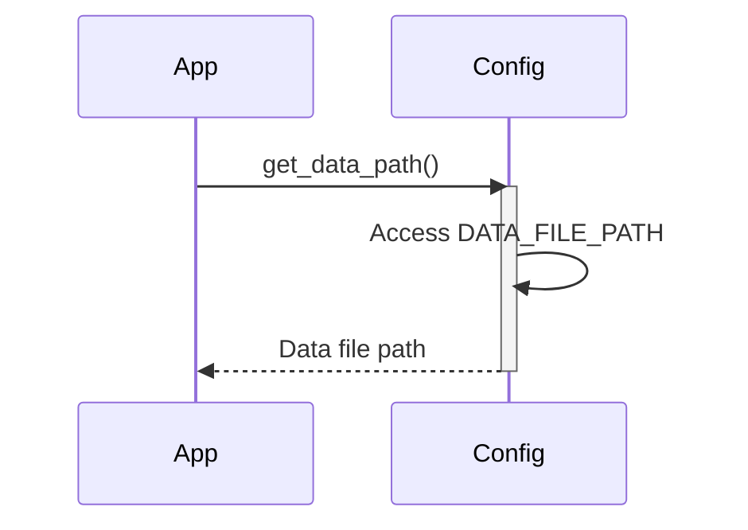

Previously, we looked at the [Project Overview](index.md).

# Chapter 1: Configuration Management
Let's begin exploring this concept. The goal of this chapter is to understand how to manage configuration settings in a Python application, ensuring that the application behaves consistently and predictably across different environments.
Why do we need configuration management? Imagine you're building a house. You wouldn't want to hardcode the color of the walls or the type of flooring directly into the foundation, right? These are things that might change depending on the owner's preferences or the availability of materials. Similarly, in software, we need a way to manage settings like file paths, database credentials, and processing thresholds, which might vary depending on whether the application is running on a development machine, a testing server, or a production environment.
Configuration management helps us to externalize these settings from the core application logic. This means that we can change the application's behavior without modifying the code itself, making it more flexible and maintainable. It's like having a central control panel for your application's settings.
**Key Concepts:**
*   **Settings:** These are the individual configuration values, such as a file path, a numerical threshold, or a boolean flag.
*   **Configuration Source:** This is where the settings are stored. It could be a file (like a JSON or INI file), environment variables, a database, or a combination of these.
*   **Access Mechanism:** This is how the application retrieves the settings from the configuration source. This typically involves a dedicated module or class that encapsulates the logic for loading and providing the settings.
**How it Works:**
At a high level, configuration management involves the following steps:
1.  **Defining Settings:** Identifying the settings that need to be configurable.
2.  **Choosing a Configuration Source:** Selecting a suitable way to store the settings.
3.  **Loading Settings:** Reading the settings from the configuration source into the application.
4.  **Providing Access:** Making the settings available to other parts of the application in a convenient and consistent way.
**Code Example:**
Here's a simple example of a configuration module in Python:
```python
--- File: config.py ---
"""Configuration settings for the Sample Project 2.
This module stores configuration values used by other parts of the application,
such as file paths or processing parameters.
"""
from typing import Final
# --- Constants for Configuration ---
# Simulate a path to a data file (used by DataHandler)
DATA_FILE_PATH: Final[str] = "data/items.json"
# A processing parameter (used by ItemProcessor)
PROCESSING_THRESHOLD: Final[int] = 100
# Example setting for logging level (could be used by main)
LOG_LEVEL: Final[str] = "INFO"
def get_data_path() -> str:
    """Return the configured path for the data file.
    Returns:
        str: The path string for the data file.
    """
    # In a real app, this might involve more complex logic,
    # like checking environment variables first.
    print(f"Config: Providing data file path: {DATA_FILE_PATH}")
    return DATA_FILE_PATH
def get_threshold() -> int:
    """Return the configured processing threshold.
    Returns:
        int: The configured processing threshold.
    """
    print(f"Config: Providing processing threshold: {PROCESSING_THRESHOLD}")
    return PROCESSING_THRESHOLD
# End of tests/sample_project2/config.py
```
In this example, `DATA_FILE_PATH` and `PROCESSING_THRESHOLD` are configuration settings.  The `get_data_path` and `get_threshold` functions provide access to these settings. In a more complex application, these functions might read the settings from a file or environment variables, adding a layer of abstraction and flexibility.
**Relationships & Cross-Linking**
Later on, we'll see how these configuration settings are used in other modules, such as the [Data Handling](03_data-handling.md) and [Item Processing](04_item-processing.md) modules. We will also see how the [Logging](05_logging.md) module can use a configuration setting to determine the appropriate logging level.
**Simple configuration fetching**

This sequence diagram shows how the application interacts with the `Config` module to retrieve the data file path. First, the application calls `get_data_path()`. The `Config` module then accesses the `DATA_FILE_PATH` constant and returns the path to the application.
This concludes our look at this topic.

Next, we will examine [Data Model (Item)](02_data-model-item.md).


---

*Generated by [SourceLens AI](https://github.com/darijo2yahoocom/sourceLensAI) using LLM: `gemini` (cloud) - model: `gemini-2.0-flash` | Language Profile: `python`*