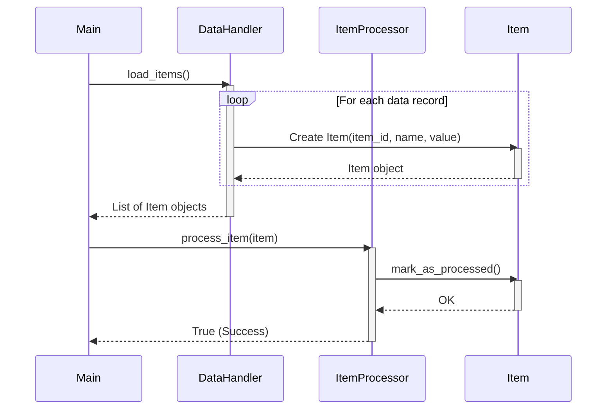

Previously, we looked at [Configuration Management](01_configuration-management.md).

# Chapter 2: Data Model (Item)
Let's begin exploring this concept. This chapter aims to explain the structure of our `Item` object, which serves as the fundamental data unit within our project.
### Why Do We Need a Data Model?
Imagine you're building a house. Before you start laying bricks, you need a blueprint – a detailed plan that specifies the size, shape, and materials for each room. Similarly, in software development, a data model acts as a blueprint for the data our application handles. It defines the structure, type, and relationships of the data elements.
In our case, the `Item` data model represents a single unit of data that our application will process. It ensures that all items have a consistent structure, making it easier to work with them throughout the application.
### The `Item` Data Model: A Closer Look
We're using a Python `dataclass` to define our `Item` object. Dataclasses are a convenient way to create classes that primarily store data. They automatically generate methods like `__init__`, `__repr__`, and `__eq__`, which are commonly needed for data-holding objects.
Here's a breakdown of the `Item` dataclass:
-   `item_id: int`: A unique integer identifier for each item. Think of it as a product ID in a store.
-   `name: str`: The name of the item, providing a human-readable label.
-   `value: float`: A numerical value associated with the item. This could represent the price, weight, or any other relevant measurement.
-   `processed: bool = field(default=False)`: A boolean flag that indicates whether the item has been processed. It defaults to `False`, meaning that all new items start in an unprocessed state. The `field(default=False)` part specifies a default value for the attribute and is important for dataclasses.
### How the `Item` Model Works
The `Item` model allows us to encapsulate the data related to an item into a single object. We can then pass these `Item` objects between different parts of our application, knowing that they all have the same structure and attributes.
Here's how we might create an `Item` object:
```python
from dataclasses import dataclass, field
@dataclass
class Item:
    item_id: int
    name: str
    value: float
    processed: bool = field(default=False)
    def mark_as_processed(self: "Item") -> None:
        print(f"Model Item {self.item_id}: Marking '{self.name}' as processed.")
        self.processed = True
    def __str__(self: "Item") -> str:
        status: str = "Processed" if self.processed else "Pending"
        return f"Item(ID={self.item_id}, Name='{self.name}', Value={self.value:.2f}, Status={status})"
# Creating an Item instance
my_item = Item(item_id=123, name="Example Item", value=99.99)
# Printing item data
print(my_item)
# Mark as processed
my_item.mark_as_processed()
# Print again
print(my_item)
```
This code will output:
```text
Item(ID=123, Name='Example Item', Value=99.99, Status=Pending)
Model Item 123: Marking 'Example Item' as processed.
Item(ID=123, Name='Example Item', Value=99.99, Status=Processed)
```
The `Item` class also includes a `mark_as_processed` method. This method is used to update the `processed` flag to `True`, indicating that the item has been processed.
It's important to note the `__str__` method which dictates how the Item object is represented when printed. This allows for easy debugging and logging within the application.
### Usage in the Project
The `Item` model is used in several parts of our project, as you can see in the provided code snippets.
-   In `data_handler.py`, the `DataHandler` loads data from a source (simulated in this example) and creates `Item` objects.
-   In `item_processor.py`, the `ItemProcessor` receives `Item` objects and performs some processing logic on them.
-   In `main.py`, the main application orchestrates the loading, processing, and saving of `Item` objects using the `DataHandler` and `ItemProcessor`.
Here's a simple sequence diagram illustrating the creation and processing of an `Item`:

This diagram shows how `Main` interacts with `DataHandler` to load items, the internal loop inside `DataHandler` to create multiple `Item` instances, and then how `ItemProcessor` processes each `Item`.
### Relationships to Other Chapters
This chapter directly relates to the following chapters:
-   [Data Handling](03_data-handling.md): The `DataHandler` class is responsible for loading and saving `Item` objects.
-   [Item Processing](05_item-processing.md): The `ItemProcessor` class processes `Item` objects based on certain rules.
-   [Main Application Orchestration](06_main-application-orchestration.md): The `main.py` script orchestrates the entire process, including loading, processing, and saving `Item` objects.
This concludes our look at this topic.

Next, we will examine [Data Handling](03_data-handling.md).


---

*Generated by [SourceLens AI](https://github.com/darijo2yahoocom/sourceLensAI) using LLM: `gemini` (cloud) - model: `gemini-2.0-flash` | Language Profile: `Python`*