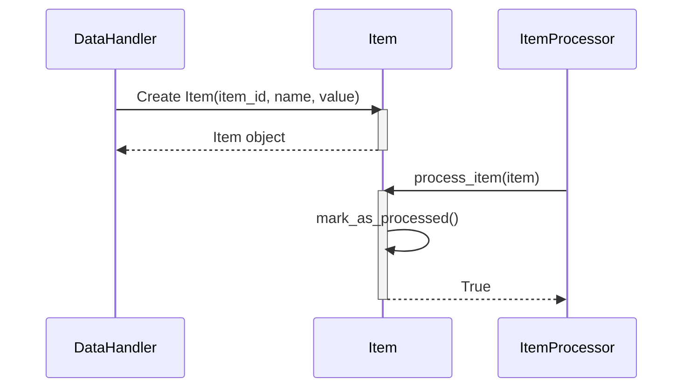

Previously, we looked at [Configuration Management](01_configuration-management.md).

# Chapter 2: Data Model (Item)
Let's begin exploring this concept. The goal of this chapter is to understand how data is structured within the `python_sample_project` using the `Item` data model.
**Why a Data Model?**
Imagine you're building a house. You wouldn't just start throwing bricks and wood together randomly, right? You'd need a blueprint, a plan that defines the rooms, their sizes, and how they connect. A data model is like that blueprint for your program's data. It defines the structure and types of information your program will work with.
In our case, the `Item` data model represents a single "item" that our program processes. Think of it as a product, a record, or any other discrete piece of information. Having a well-defined data model helps us to:
*   **Organize Data:** Ensure data is consistent and easy to manage.
*   **Improve Code Readability:** Make it clear what data is being used and how.
*   **Enable Type Safety:** Catch errors early on by enforcing data types.
**Introducing the `Item` Dataclass**
In `python_sample_project`, we use a Python `dataclass` called `Item` to define our data model.  Dataclasses, introduced in Python 3.7, provide a convenient way to create classes that are primarily used to store data. They automatically generate useful methods like `__init__`, `__repr__` (for string representation), and `__eq__` (for comparing objects), saving us a lot of boilerplate code.
**Key Attributes of an `Item`:**
The `Item` dataclass has the following attributes:
*   `item_id` (int): A unique identifier for each item.  Think of this as a product ID or a database key.
*   `name` (str): The name of the item. This could be the product name, description, etc.
*   `value` (float): A numerical value associated with the item. This might represent the price, quantity, or some other relevant metric.
*   `processed` (bool): A flag indicating whether the item has been processed by our application. It defaults to `False`.
**How it Works: Creating and Using `Item` Objects**
To create an `Item` object, you simply instantiate the `Item` class and provide values for the `item_id`, `name`, and `value` attributes. The `processed` attribute will default to `False`. Let's look at an example in the `data_handler.py` file.
```python
--- File: data_handler.py ---
# ... (previous lines omitted)
# Simulate reading data
simulated_data: list[dict[str, str | int | float]] = [
    {"item_id": 1, "name": "Gadget Alpha", "value": 150.75},
    {"item_id": 2, "name": "Widget Beta", "value": 85.0},
    {"item_id": 3, "name": "Thingamajig Gamma", "value": 210.5},
    {"item_id": 4, "name": "Doohickey Delta", "value": 55.2},
]
items: list[Item] = []
for data_dict in simulated_data:
    try:
        # Validate required keys before creating Item
        if all(k in data_dict for k in ("item_id", "name", "value")):
            item = Item(
                item_id=int(data_dict["item_id"]),
                name=str(data_dict["name"]),
                value=float(data_dict["value"]),
                # 'processed' defaults to False in Item dataclass
            )
            items.append(item)
        # ... (rest of the code omitted)
```
In this code snippet, the `DataHandler` reads simulated data (in a real application, it would load it from a file or database). It then creates `Item` objects from this data using the `Item` constructor. Notice how we provide the `item_id`, `name`, and `value`. The `processed` flag is automatically set to `False`.
Once an `Item` object is created, you can access its attributes using dot notation (e.g., `item.item_id`, `item.name`, `item.value`).  The `models.py` file also defines a `mark_as_processed()` method, which sets the `processed` attribute to `True`:
```python
--- File: models.py ---
@dataclass
class Item:
    # ... (attributes omitted)
    def mark_as_processed(self: "Item") -> None:
        """Set the processed flag to True."""
        print(f"Model Item {self.item_id}: Marking '{self.name}' as processed.")
        self.processed = True
```
Here's a simplified sequence diagram showing how an `Item` is created and marked as processed:

This diagram illustrates the `DataHandler` creating an `Item`, then the `ItemProcessor` calling the `mark_as_processed()` method, changing the Item's state.
The `__str__` method in the `Item` dataclass provides a user-friendly string representation of the `Item` object.  This is useful for logging and debugging, as we see in the `DataHandler` when saving items.
The `Item` dataclass serves as a central data structure throughout the application. It's used in the [Data Handling](03_data-handling.md) chapter to load and save data, and in the [Item Processing](04_item-processing.md) chapter to perform operations on individual items. The [Main Application Pipeline](06_main-application-pipeline.md) orchestrates the entire process.
This concludes our look at this topic.

Next, we will examine [Data Handling](03_data-handling.md).


---

*Generated by [SourceLens AI](https://github.com/darijo2yahoocom/sourceLensAI) using LLM: `gemini` (cloud) - model: `gemini-2.0-flash` | Language Profile: `python`*