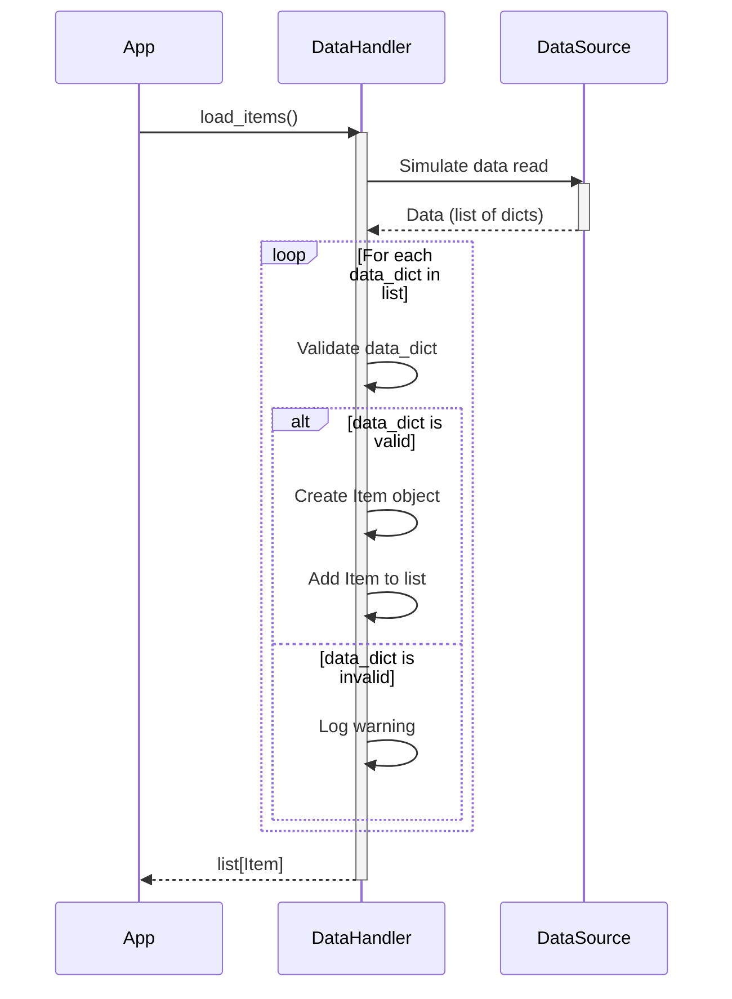

Previously, we looked at [Data Model (Item)](02_data-model-item.md).

# Chapter 3: Data Handling
Let's begin exploring this concept. In this chapter, we'll learn how our application manages data, specifically focusing on loading data into `Item` objects and saving them back.
Why do we need a dedicated data handling component? Imagine a factory that produces cars. One department brings in all the raw materials (steel, glass, tires), while another department takes the finished cars and ships them out. Our `DataHandler` plays a similar role. It's responsible for getting data *into* our application and getting processed data *out*, without the rest of the application needing to worry about where the data comes from or where it's going. This separation of concerns makes our code cleaner and easier to maintain.
The `DataHandler` class in our project simulates reading and writing data from a data source, which could be a file, a database, or an API. For simplicity, we're using a hardcoded list of dictionaries as our data source in this example.
Here's a breakdown of the key parts of the `DataHandler`:
*   **Initialization (`__init__`)**: The `DataHandler` is initialized with the path to the data source. While we're not actually reading from a file in this example, this sets the stage for a real-world scenario where the data source would be a file path or database connection string.
*   **Loading Items (`load_items`)**: This method simulates reading data from the data source and converting it into `Item` objects. It iterates through a list of dictionaries, each representing an item, and creates an `Item` object from each dictionary.  It also includes basic validation to ensure that the required keys are present in the dictionary before attempting to create an `Item`.  If errors occur during `Item` creation, it logs warnings instead of crashing.
*   **Saving Items (`save_items`)**: This method simulates saving the processed `Item` objects back to the data source. In a real application, this would involve writing the data to a file or database. For our simulation, it simply logs the data being "saved".
Here's how the `load_items` method works, visualized with a sequence diagram:

This diagram illustrates how the `load_items` method receives a request from the application, simulates reading data, validates each data entry, creates `Item` objects, and returns a list of `Item` objects back to the application.
Let's look at the relevant code snippets:
```python
from .models import Item  # Import Item model using relative import
import logging
logger: logging.Logger = logging.getLogger(__name__)
class DataHandler:
    """Manage loading and saving Item data."""
    _data_source: str
    def __init__(self: "DataHandler", data_source_path: str) -> None:
        """Initialize the DataHandler with the path to the data source."""
        self._data_source = data_source_path
        logger.info("DataHandler initialized for source: %s", self._data_source)
    def load_items(self: "DataHandler") -> list[Item]:
        """Simulate loading items from the data source."""
        logger.info("Simulating loading items from %s...", self._data_source)
        # Simulate reading data
        simulated_data: list[dict[str, str | int | float]] = [
            {"item_id": 1, "name": "Gadget Alpha", "value": 150.75},
            {"item_id": 2, "name": "Widget Beta", "value": 85.0},
            {"item_id": 3, "name": "Thingamajig Gamma", "value": 210.5},
            {"item_id": 4, "name": "Doohickey Delta", "value": 55.2},
        ]
        items: list[Item] = []
        for data_dict in simulated_data:
            try:
                # Validate required keys before creating Item
                if all(k in data_dict for k in ("item_id", "name", "value")):
                    item = Item(
                        item_id=int(data_dict["item_id"]),
                        name=str(data_dict["name"]),
                        value=float(data_dict["value"]),
                        # 'processed' defaults to False in Item dataclass
                    )
                    items.append(item)
                else:
                    logger.warning(
                        "Skipping invalid data dictionary during load: %s",
                        data_dict,
                    )
            except (ValueError, TypeError) as e:
                logger.warning("Error creating Item object from data %s: %s", data_dict, e)
        logger.info("Loaded %d items.", len(items))
        return items
    def save_items(self: "DataHandler", items: list[Item]) -> bool:
        """Simulate saving processed items back to the data source."""
        logger.info("Simulating saving %d items to %s...", len(items), self._data_source)
        # Simulate writing data - replace with actual file writing if needed
        for item in items:
            # Example: Could convert Item back to dict and write to JSON
            logger.debug("Saving item: %s", item)
        logger.info("Finished simulating save operation.")
        return True  # Simulate success
```
This code defines the `DataHandler` class and its methods. The `load_items` method creates a list of `Item` objects from a simulated data source, and the `save_items` method simulates saving the `Item` objects to the data source. Note the use of logging to track the progress of the data loading and saving operations.  Also important is the relative import: `from .models import Item`, which references the `Item` class defined in the [Data Model (Item)](02_data-model-item.md) chapter. We configured the `DataHandler` in the [Configuration Management](01_configuration-management.md) chapter, using a string to denote the "data source".
The `DataHandler` provides a crucial abstraction layer. The code that processes the `Item` objects, which we'll discuss in the [Item Processing](04_item-processing.md) chapter, doesn't need to know where the data comes from or where it's going. It simply receives a list of `Item` objects, processes them, and then asks the `DataHandler` to save the updated list. This makes the code more modular, testable, and maintainable.
This concludes our look at this topic.

Next, we will examine [Item Processing](04_item-processing.md).


---

*Generated by [SourceLens AI](https://github.com/darijo2yahoocom/sourceLensAI) using LLM: `gemini` (cloud) - model: `gemini-2.0-flash` | Language Profile: `python`*