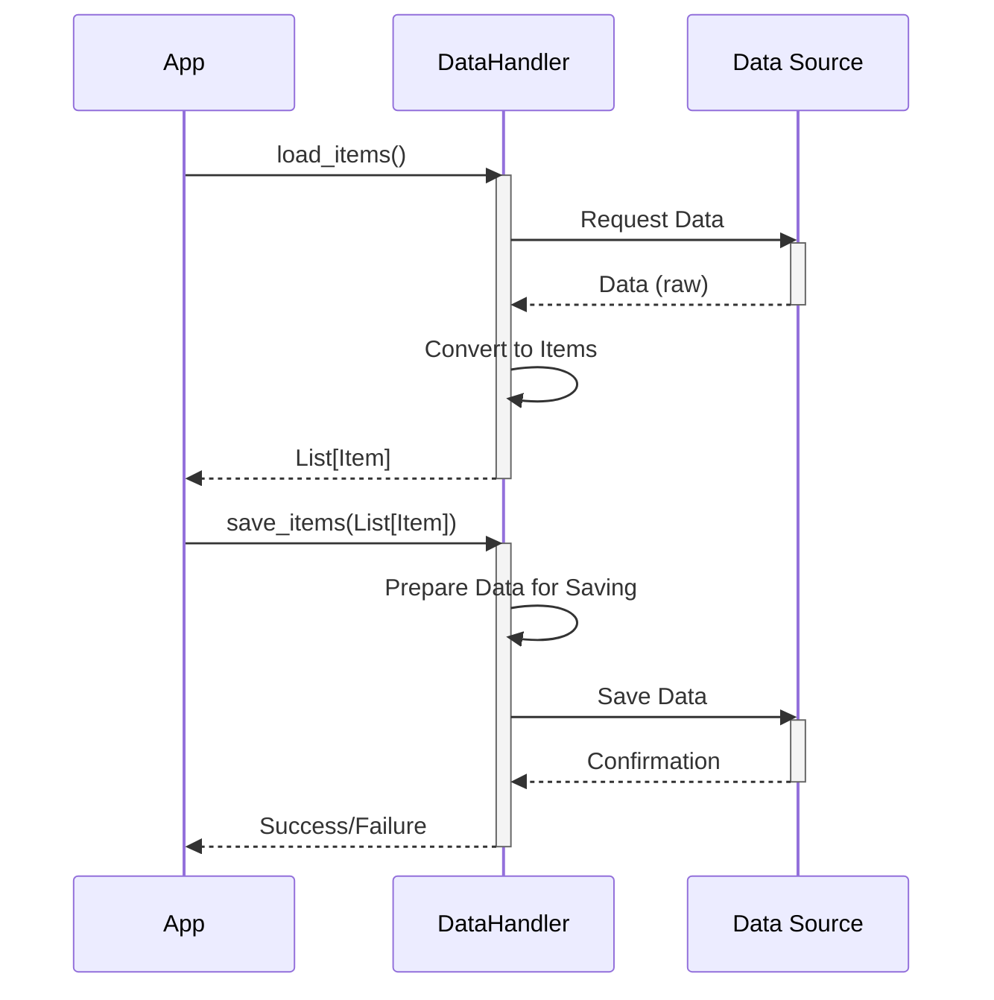

Previously, we looked at [Data Model (Item)](02_data-model-item.md).

# Chapter 3: Data Handling
Let's begin exploring this concept. The goal of this chapter is to understand how the `python_sample_project` handles the loading and saving of data, and how this process is abstracted using the `DataHandler` class.
**Why Data Handling?**
Imagine a chef who needs to prepare a meal. The ingredients (data) might come from different sources: a local farm (database), a nearby market (API), or even their own garden (files). The chef doesn't want to worry about the *details* of fetching each ingredient – they just want them ready to use. Similarly, in our project, the "Data Handling" component abstracts away the complexities of accessing and storing data. It provides a simplified interface for the rest of the application to work with data items, regardless of where they come from or how they are stored. This keeps the other parts of the application focused on processing the data, not on the intricate details of data access.
**Key Concepts: Abstraction with the `DataHandler`**
The core of the data handling in `python_sample_project` is the `DataHandler` class. It's responsible for:
*   **Loading Data:** Retrieving data items from a specified source.
*   **Saving Data:** Storing processed data items back to the source.
*   **Abstraction:** Hiding the underlying data access mechanisms (e.g., file reading, database queries) from the rest of the application.
**Usage / How it Works**
The `DataHandler` is initialized with a `data_source_path`, which specifies where the data is located (e.g., a file path). The `load_items()` method then simulates fetching the data, converting it into `Item` objects (defined in [Data Model (Item)](02_data-model-item.md)), and returning a list of these items. The `save_items()` method simulates saving the processed `Item` objects back to the data source.
Here's a simple sequence diagram to illustrate the interaction:

The diagram shows how the application interacts with the `DataHandler` to load and save items, while the `DataHandler` interacts with the actual data source.
**Code Examples**
Here are the key parts of the `DataHandler` class:
```python
import logging
# Import Item model using relative import
from .models import Item
# Use standard logging
logger: logging.Logger = logging.getLogger(__name__)
class DataHandler:
    """Manage loading and saving Item data."""
    _data_source: str
    def __init__(self: "DataHandler", data_source_path: str) -> None:
        """Initialize the DataHandler with the path to the data source."""
        self._data_source = data_source_path
        logger.info("DataHandler initialized for source: %s", self._data_source)
    def load_items(self: "DataHandler") -> list[Item]:
        """Simulate loading items from the data source."""
        logger.info("Simulating loading items from %s...", self._data_source)
        # Simulate reading data - replace with actual file reading if needed
        simulated_data: list[dict[str, str | int | float]] = [
            {"item_id": 1, "name": "Gadget Alpha", "value": 150.75},
            {"item_id": 2, "name": "Widget Beta", "value": 85.0},
        ]
        items: list[Item] = []
        for data_dict in simulated_data:
            # ... (rest of the load_items() logic) ...
        logger.info("Loaded %d items.", len(items))
        return items
    def save_items(self: "DataHandler", items: list[Item]) -> bool:
        """Simulate saving processed items back to the data source."""
        logger.info("Simulating saving %d items to %s...", len(items), self._data_source)
        # Simulate writing data - replace with actual file writing if needed
        for item in items:
            logger.debug("Saving item: %s", item)
        logger.info("Finished simulating save operation.")
        return True
```
In a real-world application, the `load_items()` method would contain code to read from a file, database, or API. Similarly, the `save_items()` method would write the data back to the appropriate source.  In the current example, the data loading and saving are *simulated*.
The `DataHandler` utilizes configuration values as discussed in [Configuration Management](01_configuration-management.md).
**Example in `main.py`**
The `main.py` script orchestrates the data handling process:
```python
    # 1. Initialize components using configuration
    data_path: str = config.get_data_path()
    threshold: int = config.get_threshold()
    data_handler = DataHandler(data_source_path=data_path)
    # 2. Load data
    items_to_process: list[Item] = data_handler.load_items()
```
This snippet demonstrates how the `DataHandler` is initialized using the configured data path and then used to load items for processing. The loaded items are then passed to the `ItemProcessor` class, which we'll explore in [Item Processing](04_item-processing.md).
This concludes our look at this topic.

Next, we will examine [Item Processing](04_item-processing.md).


---

*Generated by [SourceLens AI](https://github.com/darijo2yahoocom/sourceLensAI) using LLM: `gemini` (cloud) - model: `gemini-2.0-flash` | Language Profile: `python`*