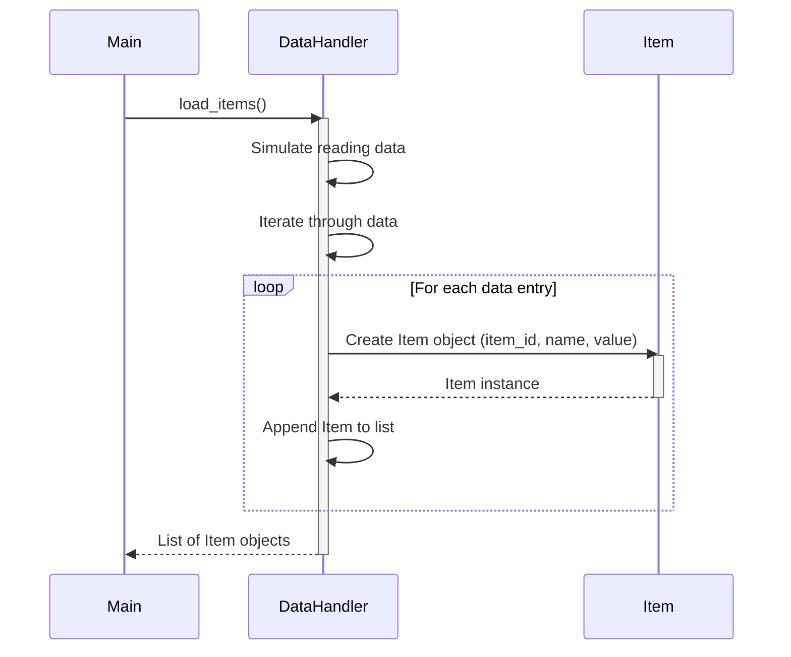

Previously, we looked at [Data Model (Item)](02_data-model-item.md).

# Chapter 3: Data Handling
Let's begin exploring this concept. The goal of this chapter is to understand how the `python_sample_project` loads and saves data. We will examine the `DataHandler` class and its role in abstracting data access.
**Why Data Handling?**
Imagine a restaurant. The chef (your application) needs ingredients (data) to cook a meal (perform processing). Instead of directly going to the farm (the raw data source) and fetching each vegetable, the chef relies on the pantry (the `DataHandler`). The pantry is responsible for storing the ingredients and providing them to the chef when needed. It also takes the prepared dishes (processed data) and stores them properly.
In software, a data handler provides an abstraction layer between your application's core logic and the underlying data source (which could be a file, database, API, or, in our case, a simulated data source). This abstraction offers several benefits:
*   **Simplified access:** Your application doesn't need to know *how* the data is stored, only *how* to ask for it.
*   **Flexibility:** You can change the data source (e.g., from a CSV file to a database) without modifying the core application logic, as long as the `DataHandler` adapts to the change.
*   **Testability:** You can easily mock or stub the `DataHandler` during testing, allowing you to isolate and test other parts of your application without relying on a real data source.
**Key Concepts: The `DataHandler` Class**
The `DataHandler` class in `data_handler.py` is responsible for encapsulating data access logic. It has two main methods:
*   `load_items()`: Simulates loading data items from the configured data source. It returns a list of `Item` objects, which we discussed in [Data Model (Item)](02_data-model-item.md).
*   `save_items()`: Simulates saving the (potentially modified) `Item` objects back to the data source.
**How it Works**
1.  **Initialization:** The `DataHandler` is initialized with the path to the data source (e.g., a file path) in the `__init__` method. This path is stored for later use.
2.  **Loading Data:** The `load_items()` method is called to retrieve the data. In our simplified example, it returns a pre-defined list of dictionaries, which are then converted into `Item` objects. Real-world implementations would read the data from a file, database, or API.
3.  **Saving Data:** The `save_items()` method is called to persist the processed data. Again, in our example, this is a simulation. A real implementation would write the data back to the data source.
**Code Example: Initialization**
The following code snippet shows how the `DataHandler` is initialized in `main.py`:
```python
--- File: main.py ---
data_path: str = config.get_data_path()
data_handler = DataHandler(data_source_path=data_path)
```
This demonstrates how the `DataHandler` instance is created using the `data_path` obtained from the [Configuration Management](01_configuration-management.md).
**Code Example: Loading Items**
The `load_items()` method simulates reading item data and creating `Item` objects.
```python
--- File: data_handler.py ---
def load_items(self: "DataHandler") -> list[Item]:
    """Simulate loading items from the data source.
    ...
    """
    # Simulate reading data
    simulated_data: list[dict[str, str | int | float]] = [
        {"item_id": 1, "name": "Gadget Alpha", "value": 150.75},
        {"item_id": 2, "name": "Widget Beta", "value": 85.0},
        {"item_id": 3, "name": "Thingamajig Gamma", "value": 210.5},
        {"item_id": 4, "name": "Doohickey Delta", "value": 55.2},
    ]
    items: list[Item] = []
    for data_dict in simulated_data:
        try:
            # Validate required keys before creating Item
            if all(k in data_dict for k in ("item_id", "name", "value")):
                item = Item(
                    item_id=int(data_dict["item_id"]),
                    name=str(data_dict["name"]),
                    value=float(data_dict["value"]),
                    # 'processed' defaults to False in Item dataclass
                )
                items.append(item)
            else:
                logger.warning(
                    "Skipping invalid data dictionary during load: %s",
                    data_dict,
                )
        except (ValueError, TypeError) as e:
            logger.warning("Error creating Item object from data %s: %s", data_dict, e)
    return items
```
The example highlights the conversion of raw data into `Item` objects using the `Item` data model defined in [Data Model (Item)](02_data-model-item.md).  The `try...except` block handles potential data validation and conversion errors gracefully.
**Code Example: Saving Items**
```python
--- File: data_handler.py ---
def save_items(self: "DataHandler", items: list[Item]) -> bool:
    """Simulate saving processed items back to the data source.
    ...
    """
    # Simulate writing data
    for item in items:
        # Example: Could convert Item back to dict and write to JSON
        logger.debug("Saving item: %s", item)
    return True  # Simulate success
```
Currently, the `save_items` method simply logs the items being "saved". In a real application, this would involve writing the data to a file or database.
**Data Loading Sequence**
The following diagram illustrates the `load_items` process using a sequence diagram:

The diagram illustrates the flow: `Main` (from `main.py`) calls `DataHandler` to `load_items`. The `DataHandler` simulates reading data and iteratively creates `Item` objects. Finally, it returns a list of these objects to `Main`.
This concludes our look at this topic.

Next, we will examine [Logging](04_logging.md).


---

*Generated by [SourceLens AI](https://github.com/darijo2yahoocom/sourceLensAI) using LLM: `gemini` (cloud) - model: `gemini-2.0-flash` | Language Profile: `Python`*