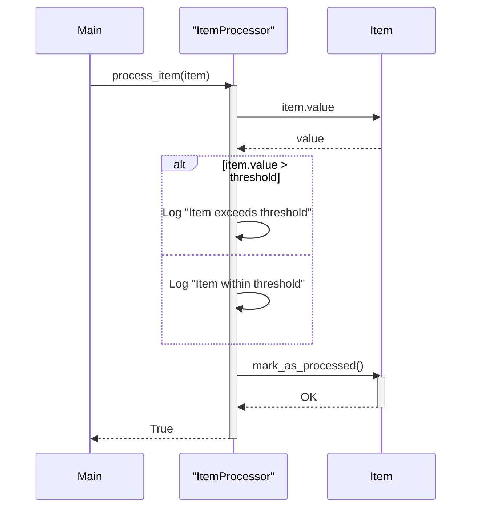

Previously, we looked at [Data Handling](03_data-handling.md).

# Chapter 4: Item Processing
Let's begin exploring this concept. This chapter aims to explain how the `ItemProcessor` component works in the `python_sample_project`, focusing on its role in applying business logic to individual data items.
### Purpose and Motivation
Think of the `ItemProcessor` as a quality control inspector on an assembly line. The assembly line, in our case, is the data pipeline. The inspector (the `ItemProcessor`) examines each item coming down the line (each `Item` object) and makes decisions based on pre-defined criteria (the threshold).
Without the `ItemProcessor`, we would lack a central place to enforce rules and perform operations on our data. The logic would be scattered throughout the code, making it difficult to maintain and test. The `ItemProcessor` encapsulates this logic, making it reusable and testable.
### Key Concepts Breakdown
The `ItemProcessor` class revolves around a few core ideas:
*   **Encapsulation:** It bundles the item processing logic into a single, manageable unit.
*   **Configuration:** It is initialized with a `threshold` value, allowing us to customize its behavior.
*   **Item Processing Logic:** The `process_item` method contains the rules and operations to be applied to each item. In this simplified example, it compares the item's value against the threshold.
*   **Logging:** It uses the `logging` module to record its actions and any issues encountered. This provides visibility into the processing pipeline.
### Usage / How it Works
The `ItemProcessor` is designed to be used as follows:
1.  **Initialization:** An `ItemProcessor` object is created, passing in a `threshold` value. This sets up the processing rules.
2.  **Item Processing:** The `process_item` method is called for each `Item` object that needs to be processed.
3.  **Logic Application:** Inside the `process_item` method, the logic is applied, determining if an item meets the defined criteria. This often results in certain actions taken or flags set on the item.
4.  **Result:** The method returns `True` if the item was processed successfully, `False` otherwise. Error conditions are logged.
### Code Example
Here's a snippet of how the `ItemProcessor` is used within the `main.py` script:
```python
--- File: main.py ---
item_processor = ItemProcessor(threshold=threshold)
for item in items_to_process:
    success = item_processor.process_item(item)
    if success:
        processed_items.append(item)
    else:
        failed_items.append(item)
```
This code iterates through a list of `Item` objects and uses the `ItemProcessor` to process each one. Based on the outcome, the item is added to either the `processed_items` or `failed_items` list.
### Sequence Diagram
The following diagram illustrates the interaction between the main application, the `ItemProcessor`, and an `Item` object:

This diagram shows how the `Main` application calls the `process_item` method of the `ItemProcessor`. The `ItemProcessor` then interacts with the `Item` object to retrieve its value and mark it as processed. Based on whether the item's value exceeds the threshold, different messages are logged.
### Relationships & Cross-Linking
The `ItemProcessor` depends on the `Item` data model defined in [Data Model (Item)](02_data-model-item.md). It also utilizes the configuration settings described in [Configuration Management](01_configuration-management.md) to determine the processing threshold. The `DataHandler`, covered in [Data Handling](03_data-handling.md), loads and saves the `Item` objects that the `ItemProcessor` works with. Finally, the processed information can be logged, as described in [Logging](05_logging.md).
### Conclusion
The `ItemProcessor` is a crucial component of the `python_sample_project` because it encapsulates the core business logic for processing individual data items. By centralizing this logic, we improve the maintainability, reusability, and testability of our code.
This concludes our look at this topic.

Next, we will examine [Logging](05_logging.md).


---

*Generated by [SourceLens AI](https://github.com/darijo2yahoocom/sourceLensAI) using LLM: `gemini` (cloud) - model: `gemini-2.0-flash` | Language Profile: `python`*