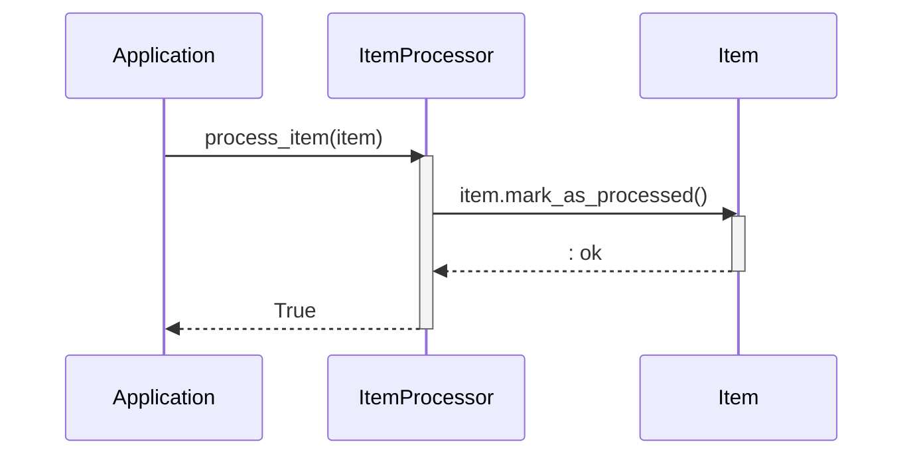

Previously, we looked at [Data Handling](03_data-handling.md).

# Chapter 4: Item Processing
Let's begin exploring this concept. The goal of this chapter is to understand how individual `Item` objects are processed within our system, including the application of business rules based on a configurable threshold.
**Why Item Processing?**
Imagine you're sorting packages at a delivery center. Some packages might need special handling because they're fragile or oversized. Item processing is like that special handling – it's where we take each `Item` and decide what to do with it based on its properties and our business rules. It allows us to separate the logic of *what* data we have (the `Item` itself) from *what* we do with it. Without this separation, our main application code could become cluttered and difficult to maintain.
**Key Concepts Breakdown**
The `ItemProcessing` revolves around:
*   **Threshold:** A pre-defined value used as a benchmark. Items exceeding this threshold might trigger specific actions (e.g., flagging them for review or applying discounts).
*   **Business Rules:** These are the specific instructions applied to each `Item`. They can range from simple comparisons (like checking if the item's value is above the threshold) to more complex calculations or data transformations.
*   **Item State Modification:** After processing, the `Item`'s state might be updated (e.g., marked as "processed").
**Usage / How it Works**
The `ItemProcessor` class has the following structure:
1.  **Initialization:**  The `ItemProcessor` is created with a `threshold` value. This threshold determines how items are processed.
2.  **Processing:** The `process_item` method takes an `Item` object as input.
3.  **Rule Application:**  Inside `process_item`, business rules are applied. In our simple example, it checks if the `Item`'s value is greater than the configured `threshold`.
4.  **State Update:**  The `Item`'s state is modified. In this case, the `Item` is marked as processed.
**Code Example**
Here's a look at the core of the `ItemProcessor` class:
```python
"""Contain the logic for processing Item objects in Sample Project 2."""
import logging
# Import Item model using relative imports
from .models import Item
# Use standard logging
logger: logging.Logger = logging.getLogger(__name__)
class ItemProcessor:
    """Process individual Item objects based on configured rules."""
    _threshold: int
    def __init__(self: "ItemProcessor", threshold: int) -> None:
        """Initialize the ItemProcessor with a processing threshold.
        Args:
            threshold (int): The numerical threshold used in the processing
                logic. Items with a value above this threshold might be
                handled differently.
        """
        self._threshold = threshold
        logger.info("ItemProcessor initialized with threshold: %d", self._threshold)
    def process_item(self: "ItemProcessor", item: Item) -> bool:
        """Process a single item.
        Mark the item as processed and apply logic based on the threshold.
        In this example, it simply logs whether the item's value exceeds
        the threshold.
        Args:
            item (Item): The Item object to process.
        Returns:
            bool: True if processing was successful, False otherwise.
        """
        if not isinstance(item, Item):
            logger.error(
                "Invalid object passed to process_item. Expected Item, got %s.",
                type(item).__name__,
            )
            return False
        logger.debug(
            "Processing item ID: %d, Name: '%s', Value: %.2f",
            item.item_id,
            item.name,
            item.value,
        )
        # Apply some simple logic based on the threshold
        if item.value > self._threshold:
            logger.info(
                "Item '%s' (ID: %d) value %.2f exceeds threshold %d.",
                item.name,
                item.item_id,
                item.value,
                self._threshold,
            )
            # Potential place for different actions based on threshold
        else:
            logger.info(
                "Item '%s' (ID: %d) value %.2f is within threshold %d.",
                item.name,
                item.item_id,
                item.value,
                self._threshold,
            )
        # Mark the item as processed using its own method
        item.mark_as_processed()
        # Simulate successful processing
        return True
```
**Simplified Sequence Diagram**
Here's a sequence diagram illustrating the call flow during item processing:

This diagram shows how the Application calls the `ItemProcessor` to process an item. The `ItemProcessor` then interacts with the `Item` to mark it as processed, before returning a success status to the Application.
**Relationships & Cross-Linking**
The `ItemProcessor` relies on the [Data Model (Item)](02_data-model-item.md) to represent the items being processed. It also uses the [Logging](05_logging.md) module to record its activities and any errors that occur.  The `threshold` used by the `ItemProcessor` is likely read through [Configuration Management](01_configuration-management.md).
This concludes our look at this topic.

Next, we will examine [Logging](05_logging.md).


---

*Generated by [SourceLens AI](https://github.com/darijo2yahoocom/sourceLensAI) using LLM: `gemini` (cloud) - model: `gemini-2.0-flash` | Language Profile: `python`*