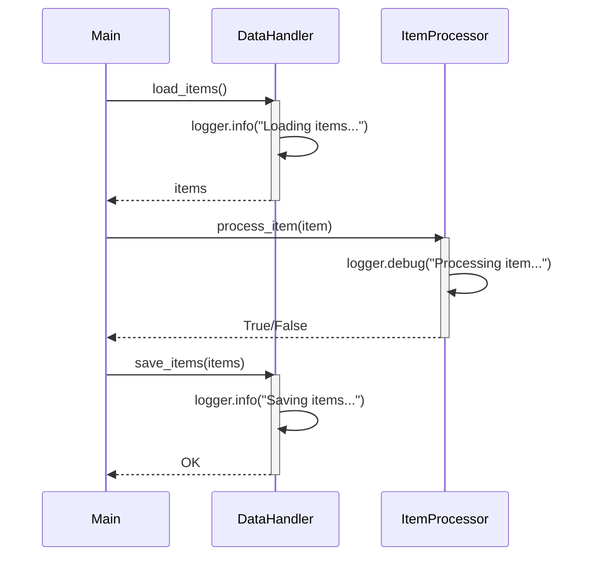

Previously, we looked at [Data Handling](03_data-handling.md).

# Chapter 4: Logging
Let's begin exploring this concept. The goal of this chapter is to understand how logging is implemented in `python_sample_project` and how it aids in debugging, monitoring, and understanding the application's behavior.
## Why Logging?
Imagine you're baking a cake, and something goes wrong. Without a recipe (and maybe some notes from past attempts), you're left guessing what happened. Logging in software is like keeping that recipe with detailed notes. It records events, errors, and other relevant information as your program runs. This record is invaluable for:
*   **Debugging:** Pinpointing the source of errors.
*   **Monitoring:** Tracking the application's health and performance.
*   **Auditing:** Recording important events for security and compliance purposes.
## Key Concepts
This project uses Python's built-in `logging` module. Here's a breakdown of the key concepts:
*   **Loggers:** The entry point for logging messages. Each module or class typically has its own logger.
*   **Log Levels:** Severity levels assigned to log messages (e.g., DEBUG, INFO, WARNING, ERROR, CRITICAL). These help filter messages based on importance.
*   **Handlers:** Determine where log messages are sent (e.g., console, file).
*   **Formatters:** Define the structure of log messages (e.g., timestamp, level, message).
## Usage and How it Works
The `logging` module provides a flexible way to record events during program execution. In our project, we use it like this:
1.  **Get a Logger:** Each module gets its own logger instance using `logging.getLogger(__name__)`. `__name__` is a special Python variable that holds the name of the current module.
2.  **Log Messages:** Use methods like `logger.info()`, `logger.debug()`, `logger.warning()`, `logger.error()`, and `logger.critical()` to record messages at different severity levels. The first argument is the log message, and you can use string formatting to include variables.
3. **Configuration:** The log level is configured in `main.py` during setup.
Here's a simple example:
```python
import logging
logger: logging.Logger = logging.getLogger(__name__)
def my_function(value: int) -> None:
    logger.debug("my_function called with value: %s", value)  # Debug information
    if value < 0:
        logger.error("Value is negative: %s", value)       # Error message
    else:
        logger.info("Value is positive: %s", value)        # Informational message
```
In this example, we create a logger instance for the current module and then log a message at the `DEBUG` level when the function is called. We also log messages at the `ERROR` and `INFO` levels depending on the input value.
## Code Examples
Let's look at some code examples from `python_sample_project` to see how logging is used in practice.
Here's how logging is used in `data_handler.py`:
```python
--- File: data_handler.py ---
import logging
# Use standard logging
logger: logging.Logger = logging.getLogger(__name__)
class DataHandler:
    def __init__(self: "DataHandler", data_source_path: str) -> None:
        self._data_source = data_source_path
        logger.info("DataHandler initialized for source: %s", self._data_source)
    def load_items(self: "DataHandler") -> list[Item]:
        logger.info("Simulating loading items from %s...", self._data_source)
        # ... (rest of the function)
    def save_items(self: "DataHandler", items: list[Item]) -> bool:
        logger.info("Simulating saving %d items to %s...", len(items), self._data_source)
        # ... (rest of the function)
--- File: data_handler.py ---
```
And here's how logging is used in `item_processor.py`:
```python
--- File: item_processor.py ---
import logging
# Use standard logging
logger: logging.Logger = logging.getLogger(__name__)
class ItemProcessor:
    def __init__(self: "ItemProcessor", threshold: int) -> None:
        self._threshold = threshold
        logger.info("ItemProcessor initialized with threshold: %d", self._threshold)
    def process_item(self: "ItemProcessor", item: Item) -> bool:
        if not isinstance(item, Item):
            logger.error(
                "Invalid object passed to process_item. Expected Item, got %s.",
                type(item).__name__,
            )
            return False
        # ... (rest of the function)
--- File: item_processor.py ---
```
Finally, let's examine how logging is set up in `main.py`:
```python
--- File: main.py ---
import logging
def setup_main_logging() -> None:
    """Set up basic logging for the main script execution."""
    # Simple console logging for demonstration
    logging.basicConfig(
        level=getattr(logging, config.LOG_LEVEL.upper(), logging.INFO),
        format="%(asctime)s - %(name)s - %(levelname)s - %(message)s",
    )
--- File: main.py ---
```
This code configures the basic logging settings, including the log level and message format. The `config.LOG_LEVEL` variable, which we discussed in [Configuration Management](01_configuration-management.md), determines the minimum severity level of messages that will be displayed.
## Example Scenario
Let's look at a simplified scenario where logging helps us understand the flow:

This sequence diagram illustrates the flow of control and how different components interact, while logging provides insights into the internal operations of each component.
## Relationships and Cross-Linking
Logging is closely related to [Configuration Management](01_configuration-management.md), as the log level is often configured through configuration files. It also plays a crucial role in understanding the behavior of the [Data Handling](03_data-handling.md) and [Item Processing](05_item-processing.md) components.
## Conclusion
In this chapter, we learned about logging in `python_sample_project` and how it helps in debugging, monitoring, and understanding the application's behavior. We examined the key concepts of loggers, log levels, handlers, and formatters, and we saw how logging is used in different parts of the project.
This concludes our look at this topic.

Next, we will examine [Item Processing](05_item-processing.md).


---

*Generated by [SourceLens AI](https://github.com/darijo2yahoocom/sourceLensAI) using LLM: `gemini` (cloud) - model: `gemini-2.0-flash` | Language Profile: `Python`*